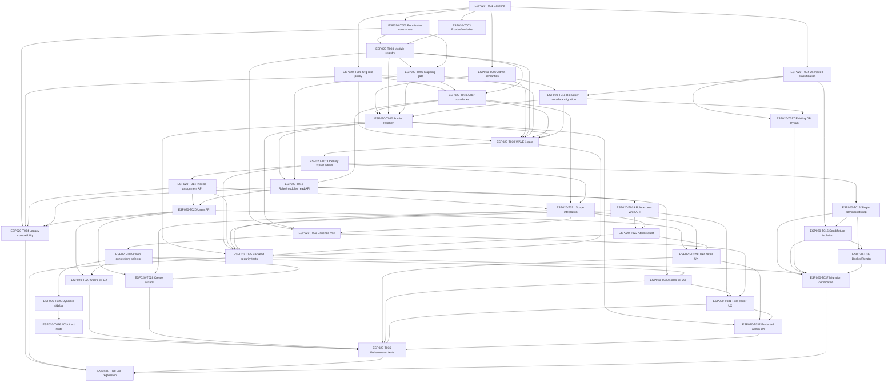

# ESP-020 — Task Breakdown

Estado: **WAVE 1 IMPLEMENTED / WAVE 2+ NOT IMPLEMENTED / D01–D10 APPROVED**

Convenciones:

- `S/M/L/XL` es complejidad relativa, no tiempo.
- Una tarea puede crear código solo durante la futura fase de implementación.
- Cada tarea debe dejar tests y evidencia antes de marcarse completa.
- WAVE 1 puede modificar únicamente sus archivos y metadata aprobados; WAVE 2+
  no está autorizada por este cierre.

Decisiones D01–D10 aprobadas el 2026-09-15. La siguiente matriz es autoritativa
para trazabilidad; el DAG y las waves al final de este documento prevalecen sobre
cualquier dependencia histórica que haya quedado en el texto de una tarea.

## 0.1 Recalculated task status

| ID | Estado posterior a decisiones | Motivo resumido |
|---|---|---|
| T001 | UNCHANGED | Baseline requerido para reproducibilidad |
| T002 | UPDATED | Lifecycle ACTIVE/LEGACY/ORPHAN/RETIRED aprobado |
| T003 | UPDATED | Module inventory cerrado sin decisión pendiente |
| T004 | UPDATED | Provenance mínima y clean/existing path aprobados |
| T005 | CANCELLED_BY_APPROVED_DECISION | D01–D10 ya fueron aprobadas |
| T006 | UPDATED | Policy organization–role estructural, no configurable |
| T007 | UPDATED | MTD_ADMIN metadata + ALLOW_ALL aprobados |
| T008 | UPDATED | Registry incluye lifecycle y actor metadata |
| T009 | UPDATED | Gate exige mapping completo de ACTIVE |
| T010 | UPDATED | Actor boundaries no configurables |
| T011 | UPDATED | Una migration aditiva incluye role metadata + provenance |
| T012 | UPDATED | Resolver ALLOW_ALL explícito sin role_permissions artificiales |
| T013 | UPDATED | Invariantes transaccionales y last-admin |
| T014 | UPDATED | Asignaciones nuevas validan policy; histórico se preserva |
| T015 | UPDATED | Bootstrap clean-install converge a un único admin |
| T016 | UPDATED | Fixtures/runtime seeds separados sin cleanup silencioso |
| T017 | UPDATED | Existing DB usa clasificación, dry-run y confirmación |
| T018 | UNCHANGED | Read APIs dependen del registry final |
| T019 | UPDATED | Solo roles predefinidos y concurrency segura |
| T020 | UPDATED | Preserva multi-organización |
| T021 | UPDATED | Mantiene semántica ESP-015 exacta |
| T022 | UPDATED | Audit atómico para mutaciones aprobadas |
| T023 | UPDATED | Read model incluye organización activa/módulos |
| T024 | UPDATED | Selector explícito y header coherente |
| T025 | UNCHANGED | Sidebar deriva del read model |
| T026 | UNCHANGED | Forbidden UX no sustituye backend |
| T027 | UNCHANGED | User list |
| T028 | UPDATED | UX solo ofrece roles predefinidos/compatibles |
| T029 | UPDATED | Provenance informativa, no autoridad |
| T030 | UPDATED | Roles protegidos/configurables según D01/D02 |
| T031 | UPDATED | No edita boundaries ni legacy en UX normal |
| T032 | UPDATED | Admin protegido y last-admin UX |
| T033 | UPDATED | Reset production bloqueado; deployment single-admin |
| T034 | UPDATED | Legacy compatibility solo con consumer real |
| T035 | UPDATED | Matriz de seguridad para D01–D08 |
| T036 | UNCHANGED | Tests web/contratos |
| T037 | UPDATED | Certificación clean/existing sin cleanup destructivo |
| T038 | UPDATED | Regresión explícita ESP-015…ESP-019 |
| T039 | NEW | Gate automatizado específico de WAVE 1 |

`TOTAL_TASKS_BEFORE=38` · `TOTAL_TASKS_AFTER=39`  
`MERGED_TASKS=none` · `SPLIT_TASKS=none`  
`CANCELLED_TASKS=T005` · `PRODUCT_DECISIONS_PENDING=0`

## 1. Tasks

### ESP020-T001 — Freeze current-state baseline

**OBJECTIVE**  
Convertir el audit actual en baseline versionado para comparar cada cambio.

**DEPENDENCIES**  
Ninguna.

**FILES / MODULES LIKELY AFFECTED**  
`.agent/specs/*ESP-020*`, `packages/database/migrations`, `apps/api/src`,
`apps/web`, `tests`.

**IMPLEMENTATION STEPS**

1. Confirmar commit/base branch y migración máxima `0051`.
2. Ejecutar inventario estático de roles, permisos, rutas y seeds.
3. Registrar divergencias sin corregirlas.

**DOMAIN INVARIANTS**  
No cambiar autorización ni datos; el audit es solo lectura.

**TESTS REQUIRED**  
Revisión documental; `git diff --check`; reproducibilidad del inventario.

**ACCEPTANCE CRITERIA**  
Existe baseline con referencias concretas y gaps clasificados.

**RISKS**  
Audit incompleto; mitigar con búsqueda de consumidores y revisión cruzada.

**ESTIMATED COMPLEXITY**  
M

**PARALLELIZABLE**  
NO

### ESP020-T002 — Validate permission consumers

**OBJECTIVE**  
Determinar qué permissions activos protegen endpoints reales, cuáles son legacy y
cuáles están huérfanos.

**DEPENDENCIES**  
`ESP020-T001`.

**FILES / MODULES LIKELY AFFECTED**  
`packages/database/migrations/*.sql`, `apps/api/src`, `apps/web`,
`ESP-020-permission-inventory.md`.

**IMPLEMENTATION STEPS**

1. Extraer `permissions` activos hasta `0051`.
2. Localizar `requirePermission`, strings y navigation checks.
3. Clasificar `ACTIVE`, `LEGACY`, `ORPHAN`, `RETIRED`.
4. Obtener aprobación para cada excepción.

**DOMAIN INVARIANTS**  
No retirar ni renombrar permission codes.

**TESTS REQUIRED**  
Script/gate que falle ante permission consumer sin clasificación.

**ACCEPTANCE CRITERIA**  
100% de códigos activos tienen owner, módulo, acción, boundary y estado.

**RISKS**  
Consumer dinámico no localizado; mitigar con scan estático y tests de API.

**ESTIMATED COMPLEXITY**  
L

**PARALLELIZABLE**  
AFTER `ESP020-T001`

### ESP020-T003 — Audit routes and module candidates

**OBJECTIVE**  
Derivar el catálogo de módulos desde rutas, controllers y permisos reales.

**DEPENDENCIES**  
`ESP020-T001`.

**FILES / MODULES LIKELY AFFECTED**  
`apps/web/app`, `apps/web/components/navigation/nav-config.ts`,
`apps/api/src/*/*.controller.ts`, `packages/contracts`.

**IMPLEMENTATION STEPS**

1. Listar rutas Next.js.
2. Asociar controller/endpoint y permission codes.
3. Detectar rutas duplicadas o subsecciones de `/administracion`.
4. Proponer sections, labels, routes y display order.

**DOMAIN INVARIANTS**  
Una ruta no concede autorización; debe existir backend check.

**TESTS REQUIRED**  
Reporte de rutas sin registry y registry sin ruta autorizada.

**ACCEPTANCE CRITERIA**  
Cada módulo candidate tiene evidencia, owner, boundary y mapping; cualquier
excepción queda explícitamente clasificada en el inventario.

**RISKS**  
Confundir una vista con módulo; mitigar separando route/view/action.

**ESTIMATED COMPLEXITY**  
M

**PARALLELIZABLE**  
AFTER `ESP020-T001`

### ESP020-T004 — Classify users and seed sources

**OBJECTIVE**  
Separar clean install, runtime bootstrap, dev fixtures y users
real/unknown sin destrucción.

**DEPENDENCIES**  
`ESP020-T001`.

**FILES / MODULES LIKELY AFFECTED**  
`0000_foundation.sql`, `0005_phase4_operational_notifications.sql`,
`0013_local_auth.sql`, `apps/api/src/identity/bootstrap.service.ts`,
`tests/integration/helpers/auth.ts`, Docker/Render.

**IMPLEMENTATION STEPS**

1. Enumerar cada insert/runtime creator.
2. Definir fingerprint de fixture determinista.
3. Definir `REAL_OR_UNKNOWN` por default.
4. Producir dry-run de acciones sin ejecutar deletes.

**DOMAIN INVARIANTS**  
Nunca borrar user sin clasificación y evidencia.

**TESTS REQUIRED**  
Tests de clasificación idempotente y de no-delete para unknown.

**ACCEPTANCE CRITERIA**  
Cada fuente tiene `KEEP_BOOTSTRAP_ADMIN`, `REMOVE_RUNTIME_SEED`,
`KEEP_TEST_FIXTURE`, `MIGRATE` o `MANUAL_REVIEW`.

**RISKS**  
Fixture reutilizado como user real; mitigar con manual review.

**ESTIMATED COMPLEXITY**  
M

**PARALLELIZABLE**  
AFTER `ESP020-T001`

### ESP020-T005 — Approve product decisions and implementation baseline

**STATUS**  
`CANCELLED_BY_APPROVED_DECISION` — D01–D10 fueron aprobadas antes de iniciar
implementación.

**OBJECTIVE**  
Cerrar las decisiones que cambian modelo, migration o UX.

**DEPENDENCIES**  
`ESP020-T002`, `ESP020-T003`, `ESP020-T004`.

**FILES / MODULES LIKELY AFFECTED**  
`.agent/specs/ESP-020-user-role-module-access-redesign.md`,
`.agent/plans/ESP-020-implementation-plan.md`.

**IMPLEMENTATION STEPS**

No se ejecuta: D01–D10 y el baseline de implementación ya están aprobados y
registrados en la documentación.

**DOMAIN INVARIANTS**  
ESP-015 y compatibility de role codes no pueden quedar implícitas.

**TESTS REQUIRED**  
Checklist de aprobación y validación de dependencias desbloqueadas.

**ACCEPTANCE CRITERIA**  
La tarea queda cancelada sin mutar código ni datos.

**RISKS**  
Construir contra supuesto no aprobado; mitigar gate obligatorio.

**ESTIMATED COMPLEXITY**  
M

**PARALLELIZABLE**  
NO

### ESP020-T006 — Define organization-role compatibility policy

**OBJECTIVE**  
Formalizar qué roles pueden asignarse a cada organización.

**DEPENDENCIES**  
`ESP020-T001`.

**FILES / MODULES LIKELY AFFECTED**  
`packages/domain`, `packages/contracts`, `apps/api/src/identity`,
tests de users/scopes.

**IMPLEMENTATION STEPS**

1. Crear policy pura y typed.
2. Mapear roles legacy compatibles.
3. Definir error de incompatibilidad.
4. Integrar validación antes de insert/reactivate.

**DOMAIN INVARIANTS**  
No `MEDICARTE_OPERATOR` en MTD, no `MTD_ADMIN` fuera de MTD, no crossing
actor boundary por assignment.

**TESTS REQUIRED**  
Matriz positiva/negativa para las cuatro organizaciones y READ_ONLY.

**ACCEPTANCE CRITERIA**  
API rechaza toda combinación no válida y no cambia la fila.

**RISKS**  
Bloquear datos históricos legítimos; separar new assignment de migration.

**ESTIMATED COMPLEXITY**  
M

**PARALLELIZABLE**  
AFTER `ESP020-T001`

### ESP020-T007 — Define explicit admin metadata and allow-all policy

**OBJECTIVE**  
Reemplazar el allow-all implícito por una semántica comprobable conservando
`MTD_ADMIN`.

**DEPENDENCIES**  
`ESP020-T001`.

**FILES / MODULES LIKELY AFFECTED**  
`packages/database/src/schema.ts`, role migration, `packages/domain`,
`apps/api/src/common/request-scope.ts`.

**IMPLEMENTATION STEPS**

1. Definir `is_system_admin`/managed metadata.
2. Definir `system_allowed` en registry.
3. Definir labels y role-protected behavior.
4. Documentar compatibility con `isFoundationAdmin`.

**DOMAIN INVARIANTS**  
Admin es role assignment en MTD, no user flag ni username.

**TESTS REQUIRED**  
Resolver allow-all con permiso nuevo; admin no usa point grants.

**ACCEPTANCE CRITERIA**  
La semántica funciona sin insertar una fila manual por cada permiso futuro.

**RISKS**  
Allow-all accidental para capability no aprobada; exigir registry gate.

**ESTIMATED COMPLEXITY**  
L

**PARALLELIZABLE**  
AFTER `ESP020-T001`

### ESP020-T008 — Implement canonical module/action registry

**OBJECTIVE**  
Crear la única fuente compartida de labels, routes, sections, actions y
permission mappings.

**DEPENDENCIES**  
`ESP020-T002`, `ESP020-T003`.

**FILES / MODULES LIKELY AFFECTED**  
`packages/contracts/src/access-registry.ts`, contracts tests,
temporary web/API adapters.

**IMPLEMENTATION STEPS**

1. Definir types strict.
2. Registrar todos los módulos auditados.
3. Registrar actions locales y mappings.
4. Marcar structural/configurable/systemAllowed.

**DOMAIN INVARIANTS**  
Registry no autoriza por sí solo; backend debe verificar DB/policy.

**TESTS REQUIRED**  
Schema tests, duplicate code/route/action tests, strict TypeScript.

**ACCEPTANCE CRITERIA**  
API y Web pueden importar el mismo registry sin catálogos duplicados.

**RISKS**  
Registry incompleto; bloquear con T009.

**ESTIMATED COMPLEXITY**  
L

**PARALLELIZABLE**  
AFTER `ESP020-T002`, `ESP020-T003`

### ESP020-T009 — Add permission mapping and orphan gate

**OBJECTIVE**  
Evitar que permission codes o actions queden sin correspondencia.

**DEPENDENCIES**  
`ESP020-T002`, `ESP020-T008`.

**FILES / MODULES LIKELY AFFECTED**  
`packages/contracts`, `packages/domain`, scripts/tests, CI config.

**IMPLEMENTATION STEPS**

1. Comparar DB inventory, backend consumers y registry.
2. Emitir `ORPHAN`, `LEGACY`, `RETIRED`, `STRUCTURAL`.
3. Fallar en código nuevo si falta mapping aprobado.

**DOMAIN INVARIANTS**  
No permiso activo invisible para el sistema de revisión.

**TESTS REQUIRED**  
Positive complete mapping y negative orphan mapping.

**ACCEPTANCE CRITERIA**  
GATE W1 reporta 100% mapping y excepciones explícitas.

**RISKS**  
Romper permisos legacy; mantener compatibility list durante transición.

**ESTIMATED COMPLEXITY**  
M

**PARALLELIZABLE**  
AFTER `ESP020-T008`

### ESP020-T010 — Implement actor-boundary policy

**OBJECTIVE**  
Centralizar límites MTD/Medicarte/OLP/Compensar fuera de la UI.

**DEPENDENCIES**  
`ESP020-T006`, `ESP020-T008`, `ESP020-T009`.

**FILES / MODULES LIKELY AFFECTED**  
`packages/domain`, `apps/api/src`, role/access contracts.

**IMPLEMENTATION STEPS**

1. Definir boundary predicates.
2. Declarar actions estructurales.
3. Usar policy en assignment y role editor.
4. Rechazar crossing actor.

**DOMAIN INVARIANTS**  
OLP no recibe datos clínicos; Medicarte no recibe administración MTD; MTD-only
modules no se habilitan por checkbox.

**TESTS REQUIRED**  
Cross-actor negative tests y positive role matrix.

**ACCEPTANCE CRITERIA**  
No path genérico de roles puede romper una boundary.

**RISKS**  
Duplicar lógica en controllers; policy única y adapters delgados.

**ESTIMATED COMPLEXITY**  
L

**PARALLELIZABLE**  
AFTER `ESP020-T006`, `ESP020-T009`

### ESP020-T011 — Add role and user metadata migration

**OBJECTIVE**  
Persistir metadata mínima de role protegido y provenance de usuario conforme a
D01 y D06.

**DEPENDENCIES**  
`ESP020-T004`, `ESP020-T007`.

**FILES / MODULES LIKELY AFFECTED**  
`packages/database/src/schema.ts`, nueva migration, migrate tests.

**IMPLEMENTATION STEPS**

1. Añadir campos aditivos/default seguro en roles y users.
2. Marcar solo `MTD_ADMIN` como system admin/managed.
3. Inicializar usuarios sin evidencia como `UNKNOWN`.
4. Verificar FKs y rollback forward.

**DOMAIN INVARIANTS**  
No perder role_permissions, assignments ni users.

**TESTS REQUIRED**  
Clean migration, existing DB migration, unique/default/metadata tests.

**ACCEPTANCE CRITERIA**  
Migration idempotente vía migrator, admin metadata y provenance comprobables.

**RISKS**  
Migration destructiva; solo additive y dry-run.

**ESTIMATED COMPLEXITY**  
M

**PARALLELIZABLE**  
AFTER `ESP020-T007`

### ESP020-T012 — Implement admin capability resolver

**OBJECTIVE**  
Resolver `ALLOW_ALL` mediante role metadata + registry.

**DEPENDENCIES**  
`ESP020-T007`, `ESP020-T008`, `ESP020-T009`, `ESP020-T010`, `ESP020-T011`.

**FILES / MODULES LIKELY AFFECTED**  
`apps/api/src/identity/access.service.ts`, `packages/domain`,
`request-scope.ts`.

**IMPLEMENTATION STEPS**

1. Resolver admin en MTD.
2. Expandir `system_allowed` actions.
3. Mantener permissions array compatible.
4. Derivar `isAdministrator` y global scope.

**DOMAIN INVARIANTS**  
Admin global no usa point grants; actor boundaries de assignments siguen vigentes.

**TESTS REQUIRED**  
Admin all modules/actions, non-admin no escalation, new registry action.

**ACCEPTANCE CRITERIA**  
Admin accede a todo target sin role_permissions manuales nuevas.

**RISKS**  
Olvidar permission check en endpoint legacy; regression scan/API tests.

**ESTIMATED COMPLEXITY**  
L

**PARALLELIZABLE**  
NO; AFTER `ESP020-T011`

### ESP020-T013 — Implement identity mutation service and last-admin lock

**OBJECTIVE**  
Centralizar mutations de users/roles con invariancia transaccional del último
administrador.

**DEPENDENCIES**  
`ESP020-T006`, `ESP020-T007`, `ESP020-T011`.

**FILES / MODULES LIKELY AFFECTED**  
`apps/api/src/identity/users.service.ts`, new domain/service,
database transaction helpers.

**IMPLEMENTATION STEPS**

1. Encapsular activate/deactivate/assign/revoke/role change.
2. Tomar advisory transaction lock.
3. Lockear filas de admins.
4. Mutar y contar en la misma tx.
5. Revalidar antes de commit.

**DOMAIN INVARIANTS**  
Siempre queda un admin MTD activo y usable; self-lockout prohibido.

**TESTS REQUIRED**  
Last admin sequential + two concurrent deactivations/revocations/role changes.

**ACCEPTANCE CRITERIA**  
Ninguna combinación concurrente deja cero admins.

**RISKS**  
Deadlock; lock key/order documentado y test de retry.

**ESTIMATED COMPLEXITY**  
XL

**PARALLELIZABLE**  
NO

### ESP020-T014 — Make assignment API precise and compatible

**OBJECTIVE**  
Revocar/cambiar una asignación concreta y validar compatibility.

**DEPENDENCIES**  
`ESP020-T006`, `ESP020-T013`.

**FILES / MODULES LIKELY AFFECTED**  
`apps/api/src/identity/users.controller.ts`, `users.service.ts`,
`packages/contracts`, web API adapter.

**IMPLEMENTATION STEPS**

1. Añadir role identifier a DELETE/command.
2. Deprecar delete por organización.
3. Integrar compatibility policy.
4. Emitir before/after.

**DOMAIN INVARIANTS**  
No revocar roles hermanos accidentalmente; last-admin check obligatorio.

**TESTS REQUIRED**  
User con múltiples roles; invalid org-role; exact revoke; legacy route behavior.

**ACCEPTANCE CRITERIA**  
La UI y API afectan exactamente la asignación solicitada.

**RISKS**  
Consumidores antiguos; mantener endpoint de compatibilidad con error claro o
semántica segura.

**ESTIMATED COMPLEXITY**  
L

**PARALLELIZABLE**  
AFTER `ESP020-T013`

### ESP020-T015 — Implement single-admin bootstrap

**OBJECTIVE**  
Dejar bootstrap idempotente en un solo admin configurable.

**DEPENDENCIES**  
`ESP020-T011`, `ESP020-T013`.

**FILES / MODULES LIKELY AFFECTED**  
`apps/api/src/identity/bootstrap.service.ts`,
`packages/config/src/index.ts`, `.env.example`, tests.

**IMPLEMENTATION STEPS**

1. Mantener una sola target admin.
2. Reusar lock transaccional/advisory.
3. No overwrite password.
4. No loggear secreto.
5. Emitir audit `ADMIN_BOOTSTRAPPED`.

**DOMAIN INVARIANTS**  
Convergencia a una cuenta; existing password wins.

**TESTS REQUIRED**  
Clean DB one admin, redeploy idempotent, no overwrite, two concurrent instances.

**ACCEPTANCE CRITERIA**  
Bootstrap repetido y paralelo deja exactamente un admin usable.

**RISKS**  
Races entre bootstrap y UI; compartir lock/invariant service.

**ESTIMATED COMPLEXITY**  
L

**PARALLELIZABLE**  
AFTER `ESP020-T013`

### ESP020-T016 — Isolate runtime seeds and fixtures

**OBJECTIVE**  
Eliminar creación automática de cuentas demo sin romper tests aislados.

**DEPENDENCIES**  
`ESP020-T004`, `ESP020-T015`.

**FILES / MODULES LIKELY AFFECTED**  
Migrations strategy, bootstrap, `docker-compose.yml`, `render.yaml`,
`.env.example`, test helpers.

**IMPLEMENTATION STEPS**

1. Retirar targets general/auditoría del runtime bootstrap.
2. Separar fixture command/helper.
3. Definir clean-install guarded path.
4. Documentar existing DB no-delete behavior.

**DOMAIN INVARIANTS**  
Roles sin users son válidos; tests no contaminan runtime.

**TESTS REQUIRED**  
Clean install count, normal boot no demo users, isolated fixture cleanup.

**ACCEPTANCE CRITERIA**  
Solo admin se crea automáticamente.

**RISKS**  
Old migration inserts remain for existing DB; use guarded classification, no
blind delete.

**ESTIMATED COMPLEXITY**  
XL

**PARALLELIZABLE**  
AFTER `ESP020-T015`

### ESP020-T017 — Build existing-database dry-run migration

**OBJECTIVE**  
Clasificar y reportar usuarios/assignments existentes sin mutarlos por defecto.

**DEPENDENCIES**  
`ESP020-T004`, `ESP020-T006`, `ESP020-T011`.

**FILES / MODULES LIKELY AFFECTED**  
`packages/database`, migration/runbook scripts, ops docs, tests.

**IMPLEMENTATION STEPS**

1. Snapshot rows and counts.
2. Classify deterministic fixtures/bootstrap/unknown.
3. Report incompatible assignments and admin count.
4. Add explicit apply mode with confirmation if approved.

**DOMAIN INVARIANTS**  
Unknown/real users, scopes and audit history are preserved.

**TESTS REQUIRED**  
Dry-run non-mutating; fixture-only apply; mixed real+fixture safety.

**ACCEPTANCE CRITERIA**  
Existing DB migration has evidence before any destructive action.

**RISKS**  
False fixture classification; default `MANUAL_REVIEW`.

**ESTIMATED COMPLEXITY**  
XL

**PARALLELIZABLE**  
AFTER `ESP020-T011`; can run parallel with `T012–T016`

### ESP020-T018 — Implement roles and modules read APIs

**OBJECTIVE**  
Exponer role cards, access matrix metadata y modules sin secrets.

**DEPENDENCIES**  
`ESP020-T008`, `ESP020-T009`, `ESP020-T010`, `ESP020-T012`.

**FILES / MODULES LIKELY AFFECTED**  
`apps/api/src`, `packages/contracts`, OpenAPI schemas.

**IMPLEMENTATION STEPS**

1. Add `GET /roles`, role detail/access and `GET /modules`.
2. Return labels/actions/mappings safe for admin UI.
3. Enforce admin capability and organization.

**DOMAIN INVARIANTS**  
Read model no concede access; protected role visible as read-only.

**TESTS REQUIRED**  
Admin 200, non-admin 403, no secrets, complete registry response.

**ACCEPTANCE CRITERIA**  
Web no longer necesita hardcoded role/module catalog.

**RISKS**  
Expose internal retired permissions; redact technical codes in normal view.

**ESTIMATED COMPLEXITY**  
L

**PARALLELIZABLE**  
AFTER `ESP020-T012`

### ESP020-T019 — Implement role access write API

**OBJECTIVE**  
Editar `role_permissions` por module/action con guardas y concurrencia.

**DEPENDENCIES**  
`ESP020-T013`, `ESP020-T018`.

**FILES / MODULES LIKELY AFFECTED**  
API role controller/service/repository, contracts, DB transaction helpers.

**IMPLEMENTATION STEPS**

1. Accept module/action IDs, not arbitrary permission codes.
2. Translate through registry.
3. Reject structural/protected/boundary violations.
4. Write atomically with version/ETag.
5. Audit before/after.

**DOMAIN INVARIANTS**  
No admin role edit; no unknown permission; no boundary escalation.

**TESTS REQUIRED**  
Allow/deny matrix, stale version 409, concurrent writes, audit atomicity.

**ACCEPTANCE CRITERIA**  
Role access changes persist only through validated mappings.

**RISKS**  
Global role affects many users; show impact and use optimistic concurrency.

**ESTIMATED COMPLEXITY**  
XL

**PARALLELIZABLE**  
NO; AFTER `ESP020-T018`

### ESP020-T020 — Evolve users API and detail read model

**OBJECTIVE**  
Completar user list/detail/edit contract para la UX target.

**DEPENDENCIES**  
`ESP020-T014`, `ESP020-T018`.

**FILES / MODULES LIKELY AFFECTED**  
`users.controller.ts`, `users.service.ts`, contracts, OpenAPI.

**IMPLEMENTATION STEPS**

1. Add GET detail/pagination/filter metadata.
2. Return labels and role summaries.
3. Preserve password reset response safety.
4. Use domain service for mutations.

**DOMAIN INVARIANTS**  
No password/hash/JWT in response; organization filter is enforced backend.

**TESTS REQUIRED**  
CRUD, 403/404, multi-org, no secret payload, immediate deactivation.

**ACCEPTANCE CRITERIA**  
API supplies every field required by users UX.

**RISKS**  
N+1 assignments/audit; use bounded joins/batched queries.

**ESTIMATED COMPLEXITY**  
L

**PARALLELIZABLE**  
AFTER `ESP020-T014`, `ESP020-T018`

### ESP020-T021 — Integrate point scope and global admin semantics

**OBJECTIVE**  
Mantener ESP-015 al conectar users UX/role access con point scopes.

**DEPENDENCIES**  
`ESP020-T010`, `ESP020-T013`, `ESP020-T014`.

**FILES / MODULES LIKELY AFFECTED**  
`OperationalAccessScopeService`, `AccessService`, point scope controllers,
`packages/domain`, contracts.

**IMPLEMENTATION STEPS**

1. Validate role belongs to MEDICARTE for explicit scope.
2. Make `/me` point access organization-specific.
3. Preserve MTD global/no artificial grants.
4. Keep transactional `FOR SHARE` revalidation.

**DOMAIN INVARIANTS**  
RBAC AND scope; Medicarte fail-closed; transfers source AND destination.

**TESTS REQUIRED**  
ESP-015 regression, invalid role/org, global admin no grants, point IDOR.

**ACCEPTANCE CRITERIA**  
No module editor change bypasses point scope.

**RISKS**  
Existing hardcoded UUID/legacy data; config lookup and migration report.

**ESTIMATED COMPLEXITY**  
L

**PARALLELIZABLE**  
AFTER `ESP020-T014`

### ESP020-T022 — Make identity/access audit atomic

**OBJECTIVE**  
Asegurar que user/role/module/scope changes and audit commit together.

**DEPENDENCIES**  
`ESP020-T013`, `ESP020-T014`, `ESP020-T019`, `ESP020-T021`.

**FILES / MODULES LIKELY AFFECTED**  
Identity/access services, `audit_events`, contracts/tests.

**IMPLEMENTATION STEPS**

1. Pasar tx handle al audit writer.
2. Definir before/after safe metadata.
3. Emitir events target.
4. Mantener login best-effort documentado.

**DOMAIN INVARIANTS**  
No successful access mutation sin audit event.

**TESTS REQUIRED**  
Audit rollback when write fails; event payload secret scan; event names.

**ACCEPTANCE CRITERIA**  
Identity/access mutation y audit son una unidad transaccional.

**RISKS**  
Pool/transaction misuse; integration tests against PostgreSQL real.

**ESTIMATED COMPLEXITY**  
L

**PARALLELIZABLE**  
AFTER `ESP020-T019`, `ESP020-T021`

### ESP020-T023 — Enrich `/me` read model

**OBJECTIVE**  
Exponer `isAdministrator`, roles display, accessibleModules/actions y point
access por organización.

**DEPENDENCIES**  
`ESP020-T008`, `ESP020-T009`, `ESP020-T012`, `ESP020-T021`.

**FILES / MODULES LIKELY AFFECTED**  
`AccessService`, `me.controller.ts`, `packages/contracts`, API tests.

**IMPLEMENTATION STEPS**

1. Extend Zod contract additively.
2. Resolve admin and registry mappings server-side.
3. Keep permissions array compatibility.
4. Avoid global point list leakage.

**DOMAIN INVARIANTS**  
Read model is derived from current PostgreSQL state, not session cache.

**TESTS REQUIRED**  
All role profiles, multi-org, admin global, explicit zero grants, no secrets.

**ACCEPTANCE CRITERIA**  
Frontend can render navigation without replicating arbitrary permission rules.

**RISKS**  
Large joins/N+1; aggregate permissions/modules in bounded queries.

**ESTIMATED COMPLEXITY**  
L

**PARALLELIZABLE**  
AFTER `ESP020-T021`

### ESP020-T024 — Add web access contract adapter and org selector

**OBJECTIVE**  
Consumir `/me` target y permitir contexto organizacional explícito.

**DEPENDENCIES**  
`ESP020-T023`.

**FILES / MODULES LIKELY AFFECTED**  
`apps/web/components/layout/role-context.tsx`, auth/session storage,
`api-client.ts`, topbar.

**IMPLEMENTATION STEPS**

1. Replace derived role meta with API labels.
2. Store selected org as UI state only.
3. Send `X-Organization-Id` consistently.
4. Refresh modules/actions after change.

**DOMAIN INVARIANTS**  
Cannot select org not in `/me`; frontend does not authorize.

**TESTS REQUIRED**  
Single/multi-org selection, invalid stored org, permission refresh.

**ACCEPTANCE CRITERIA**  
No automatic ambiguous `MTD` role mapping controls access.

**RISKS**  
Stale sessionStorage; re-fetch `/me` and recover safely.

**ESTIMATED COMPLEXITY**  
L

**PARALLELIZABLE**  
NO; AFTER `ESP020-T023`

### ESP020-T025 — Make sidebar registry-driven

**OBJECTIVE**  
Render grouped navigation only from accessible modules.

**DEPENDENCIES**  
`ESP020-T023`, `ESP020-T024`, `ESP020-T009`.

**FILES / MODULES LIKELY AFFECTED**  
`nav-config.ts`, `sidebar.tsx`, `app-shell.tsx`, web registry adapter.

**IMPLEMENTATION STEPS**

1. Remove role/permission duplicate predicates.
2. Group by registry section/order.
3. Hide empty sections.
4. Preserve route links and active state.

**DOMAIN INVARIANTS**  
Hidden nav is UX only; backend checks remain.

**TESTS REQUIRED**  
Role/module matrix, empty sections, stale module, route labels.

**ACCEPTANCE CRITERIA**  
Sidebar matches `/me.accessibleModules`.

**RISKS**  
Stale frontend cache; invalidation after org switch/profile refresh.

**ESTIMATED COMPLEXITY**  
M

**PARALLELIZABLE**  
AFTER `ESP020-T024`

### ESP020-T026 — Enforce direct-route and 403 UX

**OBJECTIVE**  
Make direct URL denial predictable without confusing it with session expiry.

**DEPENDENCIES**  
`ESP020-T023`, `ESP020-T025`.

**FILES / MODULES LIKELY AFFECTED**  
`app-shell.tsx`, `/acceso-denegado`, `api-client.ts`, route tests.

**IMPLEMENTATION STEPS**

1. Use module access for known routes.
2. Keep backend 403 handling.
3. Distinguish 401 from 403.
4. Add return/change-org affordances.

**DOMAIN INVARIANTS**  
URL direct and API direct both deny unauthorized access.

**TESTS REQUIRED**  
Unauthorized route, unauthorized API, 401 session expiration.

**ACCEPTANCE CRITERIA**  
No 403 logs user out; no direct route bypasses API.

**RISKS**  
Client-side redirect race; backend remains final authority.

**ESTIMATED COMPLEXITY**  
M

**PARALLELIZABLE**  
AFTER `ESP020-T025`

### ESP020-T027 — Implement users list UX

**OBJECTIVE**  
Crear pantalla limpia de usuarios con resumen, filtros y actions seguras.

**DEPENDENCIES**  
`ESP020-T020`, `ESP020-T024`.

**FILES / MODULES LIKELY AFFECTED**  
`apps/web/features/admin`, `apps/web/lib/users-api.ts`, `packages/ui`.

**IMPLEMENTATION STEPS**

1. Replace current dense card/table.
2. Add header, summary, filters, table.
3. Add loading/empty/error/403 states.
4. Link to detail/new.

**DOMAIN INVARIANTS**  
No technical permission list as primary UX.

**TESTS REQUIRED**  
Render states, filters, role labels, no secret columns.

**ACCEPTANCE CRITERIA**  
Table includes user/org/role/state/last access/actions.

**RISKS**  
Large user list/N+1; server-side list contract.

**ESTIMATED COMPLEXITY**  
L

**PARALLELIZABLE**  
AFTER `ESP020-T020`, `ESP020-T024`

### ESP020-T028 — Implement user creation wizard

**OBJECTIVE**  
Crear usuario en pasos información → rol → scope.

**DEPENDENCIES**  
`ESP020-T020`, `ESP020-T021`, `ESP020-T024`.

**FILES / MODULES LIKELY AFFECTED**  
`apps/web/features/admin`, users/scope API clients, UI components.

**IMPLEMENTATION STEPS**

1. Basic info validation.
2. Load compatible roles.
3. Show conditional scope step.
4. Preview and submit atomically.

**DOMAIN INVARIANTS**  
No incompatible org-role; no scope step for global/unrestricted actors.

**TESTS REQUIRED**  
Wizard paths, validation, admin warning, explicit scope, generated password.

**ACCEPTANCE CRITERIA**  
User creation no longer es un formulario gigante ni permite invalid combinations.

**RISKS**  
Password exposure; show once and never persist client-side beyond flow.

**ESTIMATED COMPLEXITY**  
L

**PARALLELIZABLE**  
AFTER `ESP020-T021`, `ESP020-T024`

### ESP020-T029 — Implement user detail/edit and audit UX

**OBJECTIVE**  
Mostrar/edit user, assignments, scopes, security metadata y audit trail.

**DEPENDENCIES**  
`ESP020-T020`, `ESP020-T021`, `ESP020-T022`, `ESP020-T024`.

**FILES / MODULES LIKELY AFFECTED**  
`apps/web/features/admin`, audit API client, UI detail/timeline.

**IMPLEMENTATION STEPS**

1. Build sections and tabs.
2. Add precise assignment actions.
3. Add scope panel with diff confirmation.
4. Add last-admin disabled states.

**DOMAIN INVARIANTS**  
UI cannot override backend last-admin or scope decisions.

**TESTS REQUIRED**  
Admin/self/last-admin states, multi-role revoke, scope diff, audit rendering.

**ACCEPTANCE CRITERIA**  
All permitted user lifecycle actions are discoverable and safe.

**RISKS**  
UI indicates action enabled before backend rejects; reflect server response.

**ESTIMATED COMPLEXITY**  
XL

**PARALLELIZABLE**  
AFTER `ESP020-T022`, `ESP020-T024`

### ESP020-T030 — Implement roles list UX

**OBJECTIVE**  
Mostrar roles predefinidos, modules count, users count y protected status.

**DEPENDENCIES**  
`ESP020-T018`, `ESP020-T024`.

**FILES / MODULES LIKELY AFFECTED**  
`apps/web/features/admin`, roles API client, routes.

**IMPLEMENTATION STEPS**

1. Add `/administracion/roles`.
2. Render cards/table from API.
3. Mark administrator protected.
4. Link configurable roles to editor.

**DOMAIN INVARIANTS**  
No custom role creation in ESP-020.

**TESTS REQUIRED**  
Counts, protected role, 403, empty/error/loading.

**ACCEPTANCE CRITERIA**  
Roles are clearly separated from users.

**RISKS**  
Counts stale after access edit; invalidate/read fresh.

**ESTIMATED COMPLEXITY**  
M

**PARALLELIZABLE**  
AFTER `ESP020-T018`, `ESP020-T024`

### ESP020-T031 — Implement role access editor UX

**OBJECTIVE**  
Editar access module→actions con shortcuts, conflicts y boundary feedback.

**DEPENDENCIES**  
`ESP020-T019`, `ESP020-T023`, `ESP020-T030`.

**FILES / MODULES LIKELY AFFECTED**  
`apps/web/features/admin`, roles API, registry components.

**IMPLEMENTATION STEPS**

1. Render sections/modules/actions.
2. Translate toggles to API module/action payload.
3. Add read-only structural actions.
4. Add Solo lectura/Completo/Limpiar safely.
5. Handle ETag/version conflict.

**DOMAIN INVARIANTS**  
Cannot edit admin; shortcuts cannot cross actor boundaries.

**TESTS REQUIRED**  
Toggle matrix, shortcut filtering, stale version, protected role.

**ACCEPTANCE CRITERIA**  
Admin understands module/actions without permission code list.

**RISKS**  
Global impact unnoticed; show affected users and confirmation.

**ESTIMATED COMPLEXITY**  
XL

**PARALLELIZABLE**  
NO; AFTER `ESP020-T019`, `ESP020-T030`

### ESP020-T032 — Implement protected-admin and last-admin UX

**OBJECTIVE**  
Hacer visibles las invariantes de lockout en all relevant UI.

**DEPENDENCIES**  
`ESP020-T012`, `ESP020-T019`, `ESP020-T029`, `ESP020-T031`.

**FILES / MODULES LIKELY AFFECTED**  
User detail, role editor, confirmations, error mapping.

**IMPLEMENTATION STEPS**

1. Add protected role card.
2. Add disabled/self/last-admin messaging.
3. Map domain errors to actionable copy.
4. Add assign-another-admin CTA.

**DOMAIN INVARIANTS**  
UX never promises an operation backend must reject.

**TESTS REQUIRED**  
Last-admin disable/revoke/role-change paths and alternate admin path.

**ACCEPTANCE CRITERIA**  
No accidental checkbox/action appears capable of removing final admin.

**RISKS**  
Stale admin count; server remains source and UI reloads after mutation.

**ESTIMATED COMPLEXITY**  
M

**PARALLELIZABLE**  
AFTER `ESP020-T031`

### ESP020-T033 — Align Docker, Render and operational runbook

**OBJECTIVE**  
Desplegar bootstrap single-admin sin credenciales hardcoded ni targets extra.

**DEPENDENCIES**  
`ESP020-T015`, `ESP020-T016`.

**FILES / MODULES LIKELY AFFECTED**  
`docker-compose.yml`, `render.yaml`, `.env.example`, deployment docs.

**IMPLEMENTATION STEPS**

1. Remove optional role bootstrap variables.
2. Document secret injection.
3. Verify redeploy/parallel instance behavior.
4. Document manual fixture setup.

**DOMAIN INVARIANTS**  
Production never gets demo accounts by default.

**TESTS REQUIRED**  
Config parse production, compose clean install, Render env audit.

**ACCEPTANCE CRITERIA**  
Deployment config has exactly one bootstrap target and no password literal in
production path.

**RISKS**  
Existing operator depends on old vars; migration/runbook explicit.

**ESTIMATED COMPLEXITY**  
M

**PARALLELIZABLE**  
AFTER `ESP020-T016`

### ESP020-T034 — Compatibility and deprecation of legacy access

**OBJECTIVE**  
Evitar romper clients mientras `view.*` y endpoints antiguos se consolidan.

**DEPENDENCIES**  
`ESP020-T002`, `ESP020-T009`, `ESP020-T014`, `ESP020-T018`, `ESP020-T020`.

**FILES / MODULES LIKELY AFFECTED**  
Legacy consumers, controllers, registry, web adapters, migration docs.

**IMPLEMENTATION STEPS**

1. Mark legacy codes deprecated.
2. Keep compatibility reads where required.
3. Add warnings/metrics.
4. Remove only after consumer evidence.

**DOMAIN INVARIANTS**  
No permission silently becomes broader/narrower without audit.

**TESTS REQUIRED**  
Legacy endpoint permissions and mapping regression.

**ACCEPTANCE CRITERIA**  
No consumer references an unclassified or accidentally deleted code.

**RISKS**  
Hidden legacy clients; keep compatibility window and evidence.

**ESTIMATED COMPLEXITY**  
L

**PARALLELIZABLE**  
AFTER backend APIs; can run with `T027–T032`

### ESP020-T035 — Backend security and concurrency test matrix

**OBJECTIVE**  
Certificar backend authority, boundaries, admin, scopes and races.

**DEPENDENCIES**  
`ESP020-T012`, `ESP020-T013`, `ESP020-T014`, `ESP020-T019`, `ESP020-T021`,
`ESP020-T022`.

**FILES / MODULES LIKELY AFFECTED**  
`tests/integration`, API unit tests, DB test helpers.

**IMPLEMENTATION STEPS**

1. Add admin allow-all tests.
2. Add actor boundary tests.
3. Add last-admin concurrent tests.
4. Add API 403/IDOR/scope tests.
5. Add role access optimistic concurrency.

**DOMAIN INVARIANTS**  
RBAC AND scope must hold for every mutation/read.

**TESTS REQUIRED**  
Complete backend matrix from spec, including ESP-015 regression.

**ACCEPTANCE CRITERIA**  
All security negative tests pass against PostgreSQL.

**RISKS**  
False positives from old fixtures; isolate test DB and clean namespaces.

**ESTIMATED COMPLEXITY**  
XL

**PARALLELIZABLE**  
AFTER backend tasks; parallel with web tasks

### ESP020-T036 — Web and contract test matrix

**OBJECTIVE**  
Certificar sidebar, `/me` consumption, users UX and role editor.

**DEPENDENCIES**  
`ESP020-T023`, `ESP020-T025`, `ESP020-T026`, `ESP020-T027`,
`ESP020-T028`, `ESP020-T029`, `ESP020-T030`, `ESP020-T031`, `ESP020-T032`.

**FILES / MODULES LIKELY AFFECTED**  
`apps/web/**/*.test.ts(x)`, contracts tests.

**IMPLEMENTATION STEPS**

1. Test module filtering/sections.
2. Test org switch.
3. Test users states and wizard.
4. Test role editor shortcuts/conflicts.
5. Test 403 versus 401.

**DOMAIN INVARIANTS**  
Frontend visibility never replaces API authority.

**TESTS REQUIRED**  
Unit/component/contract tests with all role profiles.

**ACCEPTANCE CRITERIA**  
No hardcoded role permission list drives navigation.

**RISKS**  
Tests only mock `/me`; add API contract/integration coverage.

**ESTIMATED COMPLEXITY**  
L

**PARALLELIZABLE**  
AFTER `ESP020-T032`; parallel with `T035`

### ESP020-T037 — Clean install and migration certification

**OBJECTIVE**  
Probar clean runtime y existing DB sin pérdida.

**DEPENDENCIES**  
`ESP020-T015`, `ESP020-T016`, `ESP020-T017`, `ESP020-T033`, `ESP020-T035`.

**FILES / MODULES LIKELY AFFECTED**  
Migration tests, Docker integration, runbooks, database fixtures.

**IMPLEMENTATION STEPS**

1. Apply migrations to empty PostgreSQL.
2. Run bootstrap once/repeated/concurrently.
3. Run dry-run/apply on fixture-only DB.
4. Run mixed real/unknown DB and verify preservation.
5. Verify scopes/audit/roles.

**DOMAIN INVARIANTS**  
Clean count = 1; existing unknown users preserved; no artificial point grants.

**TESTS REQUIRED**  
Clean install, redeploy, concurrent bootstrap, migration preservation.

**ACCEPTANCE CRITERIA**  
No destructive migration path lacks evidence or confirmation.

**RISKS**  
Environment-dependent seed behavior; execute with real Docker PostgreSQL.

**ESTIMATED COMPLEXITY**  
XL

**PARALLELIZABLE**  
NO; certification gate

### ESP020-T038 — Full regression and release certification

**OBJECTIVE**  
Demostrar que ESP-020 no rompe ESP-001…ESP-019 y cumple DoD.

**DEPENDENCIES**  
`ESP020-T034`, `ESP020-T035`, `ESP020-T036`, `ESP020-T037`.

**FILES / MODULES LIKELY AFFECTED**  
CI reports, release checklist, `.agent/plans`.

**IMPLEMENTATION STEPS**

1. Run lint/typecheck/build.
2. Run unit and integration suites.
3. Run gates ESP-001…ESP-019.
4. Run security and migration gates.
5. Publish evidence and unresolved defects.

**DOMAIN INVARIANTS**  
No release with failed auth, scope, actor boundary or migration gate.

**TESTS REQUIRED**  
Full repository test plan and deployment smoke test.

**ACCEPTANCE CRITERIA**  
Definition of Done ESP-020 is evidenced, no hidden product decision remains.

**RISKS**  
Pre-existing format debt obscures diff; report separately, do not bulk-format.

**ESTIMATED COMPLEXITY**  
XL

**PARALLELIZABLE**  
NO

### ESP020-T039 — Implement WAVE 1 integration gate

**STATUS**  
`NEW`

**OBJECTIVE**  
Crear el gate automatizado `tests/integration/gate-esp020-wave1.test.ts`
para certificar el foundation/security model antes de iniciar WAVE 2.

**DEPENDENCIES**  
`ESP020-T006`, `ESP020-T007`, `ESP020-T008`, `ESP020-T009`, `ESP020-T010`,
`ESP020-T011`, `ESP020-T012`.

**FILES / MODULES LIKELY AFFECTED**  
`tests/integration/gate-esp020-wave1.test.ts`, registry tests, domain policy
tests, migration test fixtures.

**IMPLEMENTATION STEPS**

1. Probar cobertura completa de permissions ACTIVE y lifecycle explícito.
2. Probar metadata/ALLOW_ALL de `MTD_ADMIN`.
3. Probar combinaciones válidas e inválidas organization–role.
4. Probar actor boundaries y no privilege escalation.
5. Probar que ESP-015 conserva global MTD, explicit MEDICARTE fail-closed y
   ausencia de grants OLP/COMPENSAR.

**DOMAIN INVARIANTS**  
El gate no puede aceptar registry incompleto, boundary configurable,
administrador basado en user flag o scope global artificial.

**TESTS REQUIRED**  
Los casos anteriores y ejecución contra PostgreSQL de test con la migration
aditiva aplicada.

**ACCEPTANCE CRITERIA**  
El gate pasa automáticamente y deja evidencia legible de cada caso; no modifica
datos productivos ni crea cleanup implícito.

**RISKS**  
Falsos verdes por mocks incompletos; combinar unit tests de policy con integración
real de schema/registry.

**ESTIMATED COMPLEXITY**  
L

**PARALLELIZABLE**  
NO; gate de salida de WAVE 1.

## 2. Dependency DAG



## 3. Critical path

```text
ESP020-T001
→ ESP020-T002
→ ESP020-T008
→ ESP020-T009
→ ESP020-T010
→ ESP020-T012
→ ESP020-T039
→ ESP020-T013
→ ESP020-T015
→ ESP020-T016
→ ESP020-T037
→ ESP020-T038
```

Parallel prerequisite branch:

```text
ESP020-T001
→ ESP020-T004
→ ESP020-T011
→ ESP020-T012
```

La longitud anterior es de planificación, no de tiempo calendario. T005 no forma
parte del DAG porque la aprobación D01–D10 ya ocurrió.

## 4. Parallelizable tasks

Después de `ESP020-T001`:

```text
ESP020-T002, ESP020-T003, ESP020-T004, ESP020-T006, ESP020-T007
```

Después de `ESP020-T002` y `ESP020-T003`:

```text
ESP020-T008
```

Después de registry/policy:

```text
ESP020-T009, ESP020-T010
```

Después de WAVE 1 gate:

```text
ESP020-T013, ESP020-T018, ESP020-T035
```

Después de APIs/read models:

```text
ESP020-T014, ESP020-T019, ESP020-T020, ESP020-T021, ESP020-T023
```

Después de contexto y usuarios:

```text
ESP020-T027, ESP020-T028, ESP020-T029, ESP020-T030
```

## 5. WAVE 1 — Foundations / Security Model

WAVE 1 es el primer bloque implementable posterior al cierre documental. Incluye
únicamente el modelo compartido y sus invariantes; no incluye bootstrap,
mutaciones de usuarios, APIs de roles, `/me`, sidebar ni UI.

Tasks: `T002`, `T003`, `T004`, `T006`, `T007`, `T008`, `T009`, `T010`, `T011`,
`T012`, `T039`. `T001` es el baseline de entrada y `T005` está cancelada.

**Entry criteria**

- D01–D10 incorporadas en todos los documentos afectados;
- permission inventory completo con 79 códigos seeded y lifecycle explícito;
- module inventory completo con rutas, actions y boundaries;
- matriz organization–role definida y policy canónica especificada;
- actor boundaries documentadas;
- migration plan establecido como `MIGRATIONS_EXPECTED=1`;
- branch de implementación aún no creada o basada en el HEAD aceptado de ESP-019.

**Exit criteria**

1. 100% de permissions `ACTIVE` tienen module/action/boundary.
2. No existe permission `ACTIVE` sin mapping.
3. `LEGACY`, `ORPHAN` y `RETIRED` están explícitos y no aparecen en UX normal.
4. El registry no tiene module/action/route duplicado.
5. `MTD_ADMIN` tiene label, metadata protegida y `ALLOW_ALL` explícito.
6. Admin no depende de filas artificiales completas en `role_permissions`.
7. La policy rechaza combinaciones organization–role inválidas y preserva
   histórico inválido para reporte.
8. Actor boundaries no son configurables.
9. Provenance desconocida queda `UNKNOWN` y no concede permisos.
10. ESP-015 conserva las tres semánticas aprobadas.
11. `tests/integration/gate-esp020-wave1.test.ts` pasa.

### GATE W1 — `tests/integration/gate-esp020-wave1.test.ts`

Casos obligatorios: **11**

1. Registry compilable y sin códigos/rutas/actions duplicados.
2. Cobertura 100% de permissions `ACTIVE`.
3. Lifecycle explícito de `ACTIVE/LEGACY/ORPHAN/RETIRED`.
4. `MTD_ADMIN` presenta label Administrador y metadata aprobada.
5. `ALLOW_ALL` incluye una capability nueva `system_allowed`.
6. Admin no requiere nuevas filas manuales de `role_permissions` y mantiene
   scope global.
7. Roles predefinidos/protegidos no permiten custom role.
8. Combinaciones organization–role válidas pasan e inválidas se rechazan.
9. Actor boundary negativa no produce privilege escalation.
10. Provenance `UNKNOWN` no altera autorización y migration es aditiva.
11. MTD global, MEDICARTE explicit/fail-closed y OLP/COMPENSAR sin grants.

## 6. Waves posteriores (solo planificación)

Las siguientes waves no forman parte del prompt de implementación WAVE 1:

- **WAVE 2:** `T013–T023` — identity invariants, bootstrap, APIs, scopes,
  audit y `/me`.
- **WAVE 3:** `T024–T032` — navigation y UX.
- **WAVE 4:** `T033–T034,T037` — deployment, compatibility y migration
  certification.
- **WAVE 5:** `T035–T036` — security/contract certification.
- **WAVE 6:** `T038` — full regression/release certification.

## 7. Task totals

```text
TOTAL_TASKS_BEFORE=38
TOTAL_TASKS_AFTER=39
UPDATED_TASKS=T002,T003,T004,T006,T007,T008,T009,T010,T011,T012,T013,T014,T015,T016,T017,T019,T020,T021,T022,T023,T024,T028,T029,T030,T031,T032,T033,T034,T035,T037,T038
MERGED_TASKS=none
SPLIT_TASKS=none
CANCELLED_TASKS=T005
NEW_TASKS=T039
CRITICAL_PATH=T001,T002,T008,T009,T010,T012,T039,T013,T015,T016,T037,T038
PARALLELIZABLE_TASKS=T002,T003,T004,T006,T007,T009,T010,T013,T018,T035,T014,T019,T020,T021,T023,T027,T028,T029,T030
MIGRATIONS_EXPECTED=1
PRODUCT_DECISIONS_PENDING=0
```

