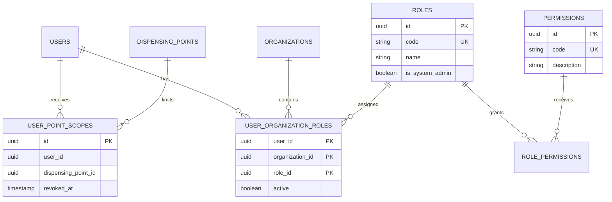
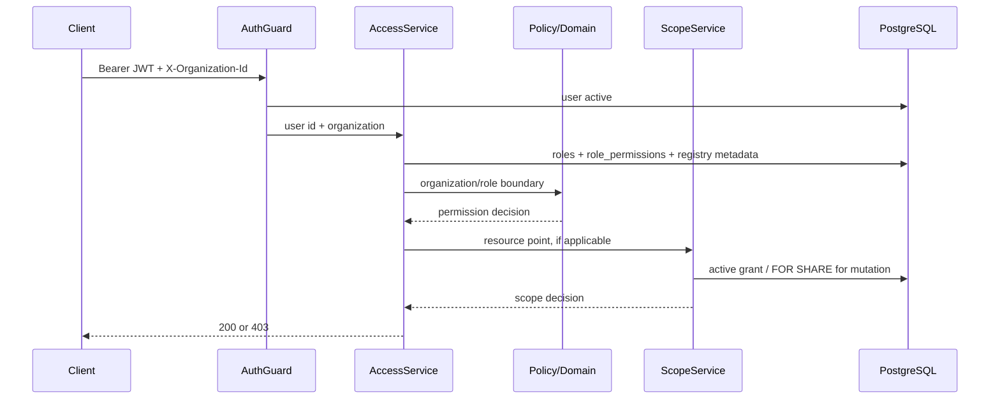
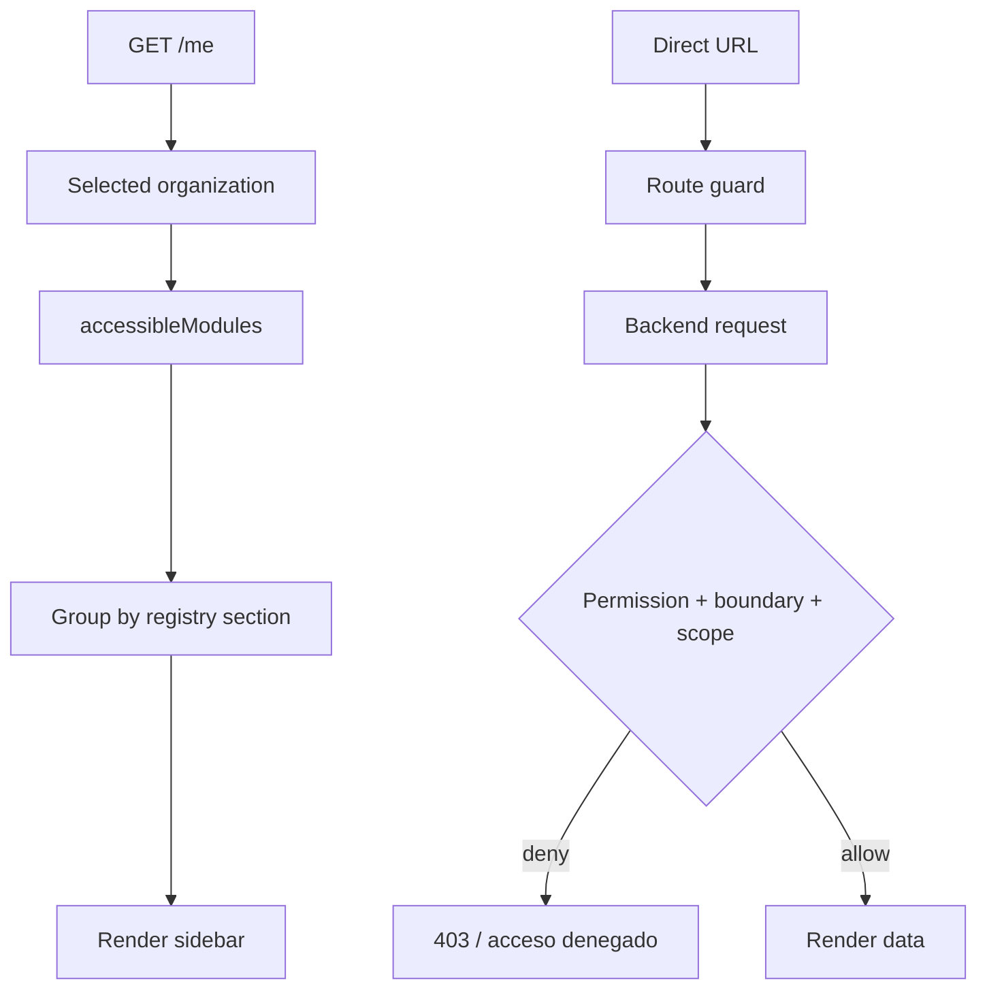

# ESP-020 — Target Architecture

Estado: **DISEÑO TARGET / DECISIONES D01–D10 APPROVED / NO IMPLEMENTADO**

Decisiones aprobadas el 2026-09-15. Este documento es el baseline arquitectónico
para la implementación; no implica modificar schema, datos o aplicaciones en
esta fase.

## 1. Objetivo arquitectónico

Rediseñar la administración de identidad y la experiencia de acceso usando el
RBAC existente, sin crear un segundo sistema de permisos y sin debilitar
ESP-015.

Modelo objetivo:

```text
USER
  ↓ membership
ORGANIZATION
  ↓ role assignment
ROLE
  ↓ role_permissions + module registry mapping
MODULE ACCESS
  ↓ action grants
ALLOWED ACTIONS
  ↓ resource policy
DATA SCOPE
```

Autorización efectiva:

```text
CAN_ACCESS =
ROLE_PERMISSION
AND
ORGANIZATIONAL_BOUNDARY
AND
DATA_SCOPE
```

La segunda y tercera condiciones no se convierten en checkboxes genéricos.

## 2. Definiciones formales

### User

Persona o cuenta autenticable. Tiene identidad, credencial local opcional,
estado activo, metadata de seguridad y membership(s). No contiene la lista de
permisos efectiva.

### Organization

Frontera de tenant/actor. El ID se envía actualmente mediante
`X-Organization-Id`. Una organización determina qué datos y dominios puede
representar un rol.

### Role

Perfil reusable de capacidades. Se asigna mediante
`user_organization_roles`. Un rol no es un usuario y no debe representar un
punto de dispensación.

ESP-020 conserva los códigos internos existentes. El label visible puede ser
`Administrador`, `Operador MTD`, `Auditoría`, `Operador Medicarte`,
`Operador OLP`, `Solo lectura`, etc.

### Permission

Capacidad backend atómica actual, por ejemplo
`patient_schedules.manage`. Continúa siendo la autoridad que protegen los
controllers y servicios.

### Module

Unidad navegable y comprensible para la persona administradora, por ejemplo
`INVENTORY` o `PURCHASE_ORDERS`. No reemplaza un permission. Es una agrupación
de UX y metadata que mapea a permisos existentes.

### Module action

Acción visible dentro de un módulo, por ejemplo `VIEW`, `CREATE`, `REVIEW`,
`TRANSFER` o `EXPORT`. Cada acción tiene uno o más permission codes actuales.
No todos los módulos necesitan la misma lista de acciones.

### Data scope

Conjunto de recursos sobre los que puede operar el actor después de pasar RBAC.
En Medicarte se representa por `user_point_scopes`; en MTD es global por
política. No se combina en la matriz module/action.

## 3. Relaciones de datos target



El atributo `is_system_admin` todavía no existe en el schema. D01 lo aprueba y
debe vivir en `roles`, junto con `is_system_managed`, no en `users`, porque la
semántica de administrador es un perfil asignable, no una propiedad accidental
de una persona.

No se recomienda crear `role_module_access` ni `role_module_actions` mientras
`role_permissions` pueda representar la autorización. El registry se mantiene
como metadata estática versionada; la persistencia de cambios continúa siendo
`role_permissions`.

## 4. Administrador target

### Decisión aprobada — D01=A

Conservar `MTD_ADMIN` como código interno por compatibilidad y añadir metadata
explícita de rol protegido:

```text
code = MTD_ADMIN
label = Administrador
is_system_admin = true
is_system_managed = true
```

No introducir `SYSTEM_ADMIN` en esta fase porque:

- rompería consumidores que consultan `MTD_ADMIN`;
- exigiría migrar tests, guards, reportes y asignaciones;
- no resuelve por sí solo el problema de allow-all;
- aumenta la deuda de compatibilidad sin una ganancia funcional demostrada.

No introducir `isSystemAdmin` en `users`, porque un usuario puede tener varias
organizaciones y roles; la autoridad es la asignación de `MTD_ADMIN` en MTD.

### Semántica `ALLOW_ALL`

`is_system_admin=true` significa que, para la organización MTD:

- el backend considera autorizadas todas las capacidades registradas como
  `system_allowed`;
- no necesita una fila manual por cada permiso futuro;
- la UI muestra “Acceso completo al sistema”;
- el editor muestra el rol como protegido y no editable;
- la resolución sigue ocurriendo en backend y no depende de lo que el frontend
  esconda.

La semántica no significa que un administrador pueda crear una asignación
estructuralmente inválida. El admin puede administrar fronteras permitidas, pero
no convierte un rol de Medicarte en rol MTD mediante checkboxes.

El registry debe declarar qué capacidades son `system_allowed`. Un permission
nuevo no debe quedar accesible por accidente: la migración/registry debe
declararlo explícitamente antes de que el modo allow-all lo resuelva.

### Scope global del administrador

`MTD_ADMIN` en organización `MTD` produce `pointAccess.kind = global`.

No se crean 100 filas de `user_point_scopes`. El acceso global se evalúa por
política en `pointAccessKindFor()` y se conserva el comportamiento de ESP-015.

## 5. Roles target

La decisión D02 fue actualizada el 2026-09-16: se mantienen los roles
predefinidos y se agregan roles personalizados con scopes organizacionales
persistidos:

| Código actual        | Label target       | Organización válida principal            | Tipo                        |
| -------------------- | ------------------ | ---------------------------------------- | --------------------------- |
| `MTD_ADMIN`          | Administrador      | MTD                                      | Protegido, allow-all        |
| `MTD_OPERATOR`       | Operador MTD       | MTD                                      | Predefinido                 |
| `MTD_GENERAL`        | MTD General        | MTD                                      | Predefinido                 |
| `MTD_AUDITORIA`      | Auditoría MTD      | MTD                                      | Predefinido                 |
| `READ_ONLY`          | Solo lectura       | MTD/OLP/COMPENSAR/MEDICARTE según matriz | Predefinido condicionado    |
| `MEDICARTE_OPERATOR` | Operador Medicarte | MEDICARTE                                | Predefinido, point scope    |
| `OLP_OPERATOR`       | Operador OLP       | OLP                                      | Predefinido, actor boundary |
| `COMPENSAR_VIEWER`   | Consulta Compensar | COMPENSAR                                | Predefinido                 |

La UI ajusta el subconjunto configurable de `role_permissions` de roles no
protegidos. Los roles personalizados usan código generado por backend, lifecycle
`active`, scopes en `role_organization_scopes`, boundaries estructurales no
editables y concurrencia optimista. No pueden adquirir `is_system_admin`.

## 6. Module registry canónico

### Ubicación recomendada

Fuente descriptiva canónica:

```text
packages/contracts/src/access-registry.ts
```

Motivo:

- `packages/contracts` ya es compartido por API y Web;
- permite tipos estrictos y validación común;
- el registry contiene labels, rutas y mappings, no secretos;
- API puede importarlo para validar mappings y exponer `/modules`;
- Web puede importarlo para presentación, pero no para autorizar requests.

Reglas sensibles de enforcement:

- `packages/domain` mantiene funciones puras para actor boundaries,
  `pointAccessKind` y acciones estructurales;
- `apps/api` siempre revalida permission, organization y point scope;
- `apps/web` no es fuente de verdad.

No debe haber definiciones divergentes en `nav-config.ts`, `roles.ts`,
`backend-permissions.ts` y `modules.ts`. El frontend puede conservar adapters
temporales, pero el gate de registry debe detectar divergencias.

### Shape conceptual

```ts
type ModuleDefinition = {
  code: string;
  label: string;
  description: string;
  route: string;
  icon: string;
  section: string;
  displayOrder: number;
  actions: readonly ModuleActionDefinition[];
  actorBoundaries: readonly ActorBoundary[];
};

type ModuleActionDefinition = {
  code: string;
  label: string;
  permissionCodes: readonly string[];
  configurable: boolean;
  systemAllowed: boolean;
};
```

Esta forma es conceptual; no se implementa en la fase documental.

### Catálogo derivado del audit

Estos son módulos observados, no una autorización nueva:

| Module code target      | Ruta observada                                                 | Permisos principales                                      | Boundary               |
| ----------------------- | -------------------------------------------------------------- | --------------------------------------------------------- | ---------------------- |
| `DASHBOARD`             | `/`                                                            | `dashboard.read`                                          | Según organización     |
| `PLANNING_PERIODS`      | `/periodos`                                                    | `planning_periods.*`                                      | MTD                    |
| `PATIENT_SCHEDULING`    | `/programacion`                                                | `patient_schedules.*`                                     | MTD/Medicarte + scope  |
| `PROJECTED_DEMAND`      | `/demanda`                                                     | `projected_demand.*`                                      | MTD                    |
| `PURCHASE_ORDERS`       | `/ordenes-compra`                                              | `purchase_orders.*`                                       | MTD                    |
| `OLP_PURCHASE_REVIEW`   | `/logistica-olp`                                               | `purchase_orders.read`, `purchase_orders.review_supplier` | OLP                    |
| `OLP_DELIVERIES`        | `/entregas-olp`                                                | `supplier_deliveries.*`                                   | OLP                    |
| `MEDICARTE_DELIVERIES`  | `/entregas`                                                    | `supplier_deliveries.read`                                | Medicarte              |
| `RECEIPTS`              | `/recepciones`                                                 | `medicarte_receipts.*`                                    | Medicarte + scope      |
| `INVENTORY`             | `/inventario`                                                  | `inventory.read`                                          | MTD/Medicarte + scope  |
| `TRANSFERS`             | `/traslados`                                                   | `stock_transfers.*`                                       | MTD/Medicarte + scope  |
| `PATIENT_APPLICATIONS`  | `/aplicaciones`                                                | `patient_applications.*`                                  | MTD/Medicarte + scope  |
| `OPERATIONAL_OUTCOMES`  | `/resultados-operacionales`                                    | `patient_operational_outcomes.*`                          | MTD/Medicarte + scope  |
| `APPLICATION_AUDITS`    | `/auditorias`                                                  | `application_audits.*`                                    | MTD                    |
| `ANALYTICS`             | `/indicadores`                                                 | `analytics.*`                                             | MTD                    |
| `BULK_IMPORTS`          | `/importaciones`                                               | `bulk_imports.*`                                          | MTD/Medicarte + scope  |
| `OPERATIONAL_INTEGRITY` | `/integridad`                                                  | `reconciliation*`                                         | MTD                    |
| `USERS`                 | `/administracion`                                              | `users.manage`                                            | MTD admin              |
| `ROLES_ACCESS`          | target `/administracion/roles`                                 | target role access API                                    | MTD admin              |
| `POINT_SCOPES`          | `/administracion` → Puntos operativos Medicarte              | `operational_scopes.*`                                    | MTD admin/auditor read |
| `CONFIGURATION`         | No ruta actual auditada                                        | tariff/config permissions                                 | MTD admin              |

`DASHBOARD` debe revisarse contra el actual item `foundation` de
`nav-config.ts`; el label “Base de reconstrucción” no es un nombre funcional
target.

## 7. Acciones y mapping

Las acciones son locales a cada módulo y se mapean a permission codes:

```text
INVENTORY
  VIEW      -> inventory.read

PURCHASE_ORDERS
  VIEW      -> purchase_orders.read
  MANAGE    -> purchase_orders.manage
  REVIEW    -> purchase_orders.review_supplier

RECONCILIATION
  VIEW      -> reconciliation.read
  RUN       -> reconciliation.run
  TRIAGE    -> reconciliation_issues.triage
  COMMENT   -> reconciliation_issues.comment
```

No se crea un enum global que pretenda que `EDIT` tenga idéntico significado en
todos los dominios. El registry permite acciones específicas
`RECEIVE`, `TRANSFER`, `TRIAGE`, `REVIEW`, `RUN`, `CONFIRM`, etc.

## 8. Actor boundaries no configurables

### MTD

- administración de users/roles/access;
- tariff/configuration;
- reconciliación ESP-017/018/019;
- analytics económicos;
- datos clínicos y operativos MTD;
- scope global dentro de la política MTD.

### Medicarte

- programación, entregas, recepción, inventario, transferencias, aplicaciones,
  outcomes e importación según permisos;
- siempre con `user_point_scopes` explícitos;
- no puede recibir por checkbox `users.manage`, roles/access, reconciliación MTD,
  tariff/finanzas ni administración OLP.

### OLP

- purchase-order supplier review;
- entregas y capacidades de proveedor;
- no pacientes, autorización clínica ni administración MTD/Medicarte.

### Compensar

- capacidades históricas de consulta que sobrevivan al mapping;
- no operación interna, OLP privada ni administración MTD.

La decisión aprobada D03=B establece una policy canónica en `packages/domain`
que bloquea asignaciones incompatibles antes de insertar
`user_organization_roles`. La policy no es configurable desde UI/DB. Un rol puede
ser global en la tabla, pero su assignment válido es contextual.

## 9. Authorization request flow



Para toda operación relevante:

```text
permission check
→ actor boundary check
→ resource scope check
→ domain invariants
→ PostgreSQL transaction
```

Nunca:

```text
frontend hidden module -> implicit authorization
```

## 10. Frontend visibility flow



Un módulo ausente de `accessibleModules` no aparece; una URL directa siempre
termina en backend 403 si el usuario no tiene autoridad.

## 11. `/me` target read model

Se recomienda evolucionar el endpoint existente sin duplicarlo:

```json
{
  "id": "uuid",
  "username": "admin",
  "displayName": "Administrador",
  "mustChangePassword": false,
  "isAdministrator": true,
  "organizations": [
    {
      "id": "uuid",
      "code": "MTD",
      "name": "MTD",
      "roles": [{ "code": "MTD_ADMIN", "label": "Administrador" }],
      "permissions": ["users.manage"],
      "accessibleModules": [
        {
          "code": "USERS",
          "route": "/administracion/usuarios",
          "actions": ["VIEW", "MANAGE"]
        }
      ],
      "pointAccess": {
        "kind": "global",
        "accessiblePointIds": []
      }
    }
  ]
}
```

Requisitos:

- no password, hash, JWT ni secrets;
- permissions pueden permanecer para compatibilidad, pero `accessibleModules`
  es el read model de navegación;
- `isAdministrator` debe derivarse del rol protegido, no del username;
- point access debe ser por organización y no una lista global reutilizada para
  todas las organizaciones;
- API recalcula desde PostgreSQL en cada request o con cache invalidable cuya
  autoridad siga siendo PostgreSQL. No usar memoria como autoridad.

## 12. Persistencia y migraciones target

Decisiones aprobadas:

1. no crear `role_module_access`;
2. no crear `role_module_actions`;
3. añadir metadata de role protegido/managed;
4. añadir provenance mínima persistida en users;
5. detectar y reportar assignments inválidos sin cleanup destructivo automático;
6. preservar users, roles, permissions, assignments, scopes y audit history;
7. mantener lifecycle de permissions en registry/código, sin tabla adicional.

`MIGRATIONS_EXPECTED=1`: una migration forward-compatible para
`roles.is_system_admin`, `roles.is_system_managed` y provenance de `users`
con default/backfill seguro `UNKNOWN`. El clean-install cleanup no se ejecuta
silenciosamente dentro de esa migration; se realizará mediante un camino
explícito con clasificación y dry-run.

## 13. Decisiones aprobadas de scope operativo

- **D04=A:** usuarios multi-organización se preservan; la UX usará selector
  explícito y mantendrá `X-Organization-Id`; no se mueve organization a la URL.
- **D05=B:** permissions se clasifican como `ACTIVE`, `LEGACY`, `ORPHAN` o
  `RETIRED`; no se eliminan destructivamente y solo se mantienen compatibility
  consumers reales.
- **D06=B:** provenance no concede permisos ni reemplaza RBAC.
- **D07=A:** MTD es global, MEDICARTE usa grants explícitos fail-closed y
  OLP/COMPENSAR no reciben point grants.
- **D08=B:** identity/access mutations y audit event se confirman en la misma
  transacción; login conserva su semántica best-effort razonable.
- **D09=A:** `reset.ts` se bloquea en `NODE_ENV=production` sin bypass dentro de
  ESP-020.
- **D10=B:** no se editan migrations históricas; existing DB preserva
  `REAL/UNKNOWN` y cleanup requiere clasificación, dry-run y confirmación.
