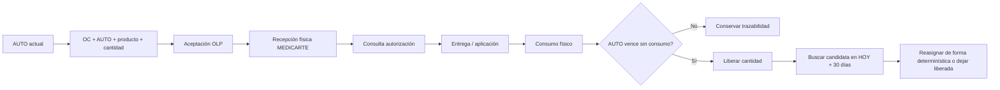

# Especificaciones funcionales y plan de implementación

## Estado de aceptación

| Especificación | Estado                       |
| -------------- | ---------------------------- |
| ESP-001        | ACCEPTED                     |
| ESP-002        | ACCEPTED                     |
| ESP-003        | ACCEPTED                     |
| ESP-004        | ACCEPTED                     |
| ESP-005        | ACCEPTED                     |
| ESP-006        | ACCEPTED                     |
| ESP-007        | ACCEPTED                     |
| ESP-008        | ACCEPTED                     |
| ESP-009        | ACCEPTED                     |
| ESP-010        | ACCEPTED                     |
| ESP-011        | ACCEPTED                     |
| ESP-012        | ACCEPTED                     |
| ESP-013        | ACCEPTED                     |
| ESP-014        | ACCEPTED                     |
| ESP-015        | ACCEPTED                     |
| ESP-016        | ACCEPTED                     |
| ESP-017        | ACCEPTED                     |
| ESP-018        | ACCEPTED                     |
| ESP-019        | IMPLEMENTED / PENDING REVIEW |

### Evidencia de cierre ESP-010

- migration: `0041_esp010_patient_applications.sql`
- Gate A clean install: PASS
- Gate B ESP-009 → ESP-010: PASS
- Gate ESP-010: 30/30 PASS
- Unit suite: 100/100 PASS
- Integration suite: 171/171 PASS
- lint: PASS
- typecheck: PASS
- build: PASS
- git diff --check: PASS
- format:check global reportaba 62 archivos inicialmente.
- 13 pertenecían al diff ESP-010.
- 10 requerían corrección.
- Se corrigieron únicamente esos 10.
- ESP-010 no deja nueva deuda de formato.

TECH-DEBT: Pre-existing repository formatting debt: 52 files fail `format:check` outside ESP-010 scope. Feature branches must not bulk-format unrelated files.

### Evidencia de cierre ESP-012

- migration: `0043_esp012_application_audits.sql`
- ADR: `ADR-035-esp-012-application-audits.md`
- Gate A clean install: PASS (44 migraciones, gate ESP-012 33/33)
- Gate B ESP-011 → ESP-012: PASS (43 → 44, únicamente `0043_esp012_application_audits.sql`)
- Gate ESP-012: 33/33 PASS
- Unit suite: 124/124 PASS
- Integration suite: 236/236 PASS
- lint: PASS
- typecheck: PASS
- build: PASS
- git diff --check: PASS
- format:check se aplicó solo a archivos de ESP-012. No hay nueva deuda de formato.

Medicarte, OLP y Compensar no tienen acceso a auditoría de aplicaciones. `READY_FOR_AUDIT` es derivado. `audit_status` en `authorization_items` es proyección de compatibilidad; la autoridad de `admission_status = READY` es `patient_application_audits`.

### Evidencia de cierre ESP-013

- migration: `0044_esp013_analytics.sql` (permisos `analytics.read` / `analytics.economics.read` e índices analíticos; sin tablas de negocio)
- ADR: `ADR-036-esp-013-operational-economics.md`
- Gate A clean install: PASS (45 migraciones, 0000–0044)
- Gate B ESP-012 → ESP-013: PASS (44 → 45, únicamente `0044_esp013_analytics.sql`)
- Gate ESP-013: 46/46 PASS
- Unit suite: 144/144 PASS
- Integration suite: 282/282 PASS
- lint: PASS
- typecheck: PASS
- build: PASS
- git diff --check: PASS
- format:check se aplicó solo a archivos de ESP-013. No hay nueva deuda de formato.

Analytics es read model. El stock actual no se llama sobrante del período. Tarifa COMPENSAR y costo OLP permanecen separados. La tarifa activa actual no se presenta como tarifa histórica. `appliedSupplierCost` es UNAVAILABLE. `effectivePurchaseCoverage` incluye DRAFT; `requestedQuantity` no. No hay utilidad contable ni reserva de stock. Los endpoints analytics son GET.

### Evidencia de cierre ESP-015

- migration: `0047_esp015_point_scopes.sql`
- ADR: `ADR-038-esp-015-organization-point-access.md`
- Modelo reutilizado: `organizations`, `users`, `user_organization_roles`, `dispensing_points`
- Modelo nuevo: `user_point_scopes` (grants activos únicos; revocados se conservan)
- MTD: scope global por política, sin backfill por punto
- MEDICARTE_OPERATOR: fail-closed, sin grants = cero puntos
- Transfer: source AND destination
- Bulk: preview no reserva; confirm revalida con `FOR SHARE`. Filas `POINT_ACCESS_DENIED` visibles al owner; VALID/SUCCEEDED fuera de scope se ocultan.
- Revocar no reescribe historia; no se inventaron grants
- Gate A: PASS (48 migraciones, 0000–0047)
- Gate B: PASS (ESP-014 + únicamente `0047_esp015_point_scopes.sql`)
- Gate ESP-015: 18/18 PASS (matriz 1–44 cubierta)
- Regression ESP-003/007/008/009/010/011/012/013/014: PASS
- Unit suite: 175/175 PASS
- Integration suite: 315/315 PASS
- lint: PASS
- typecheck: PASS
- build: PASS
- git diff --check: PASS
- format:check se aplicó solo a archivos de ESP-015. No hay nueva deuda de formato.

RBAC y point scope son controles independientes. El frontend no es frontera de seguridad. PostgreSQL sigue siendo source of truth. Sin RESERVED. Sin commit hasta revisión.

### Evidencia de cierre ESP-016

- migration: `0048_esp016_legacy_cutover.sql` (COMMENT ON COLUMN; sin DROP)
- ADR: `ADR-039-esp-016-legacy-cutover.md`
- Registry: `packages/domain/src/legacy-operational-cutover.ts`
- Historical adapter: `LegacyAuthorizationHistoryRepository`
- Compatibility writer: `LegacyCompatibilityProjectionService` (NEW → legacy, misma tx)
- Scan: `scripts/check-legacy-operational-usage.mjs` (`pnpm test` lo ejecuta; FULL_RUNTIME_LEGACY_SCAN + SCANNER_NEGATIVE_TESTS + COMPUTED_MEMBER_LEGACY_SCAN + SCHEMA_ADMISSION_BOUNDARY_SCAN)
- SAFE_TO_DROP_LATER: ninguno
- Gate A: PASS (49 migraciones, 0000–0048)
- Gate B: PASS (ESP-015 + únicamente `0048_esp016_legacy_cutover.sql`)
- Gate ESP-016: 8/8 PASS (`FULL_RUNTIME_LEGACY_SCAN=PASS`, `SCANNER_NEGATIVE_TESTS=PASS`)
- Regression ESP-001/003/004/005/006/007/008/009/010/011/012/013/014/015: PASS
- Unit suite: 193/193 PASS
- Integration suite: 323/323 PASS
- lint: PASS
- typecheck: PASS
- build: PASS
- git diff --check: ver reporte
- format:check se aplicó solo a archivos de ESP-016. No hay nueva deuda de formato.

Los campos legacy ya no controlan decisiones operacionales modernas. Mutarlos no crea lineage. El workflow moderno funciona con esas columnas en NULL. Sin sincronización bidireccional. Sin RESERVED. PostgreSQL sigue siendo source of truth.

### Evidencia de cierre ESP-017

- migration: `0049_esp017_operational_reconciliation.sql`
- ADR: `ADR-040-esp-017-operational-reconciliation.md`
- Catalog: `.agent/specs/esp-017-rule-catalog.md` (generado desde `packages/domain/src/reconciliation-registry.ts`)
- Engine: `apps/api/src/reconciliation/`
- API MTD-only: `POST/GET /reconciliation/runs`, findings, rules
- UI: Integridad operacional (`/integridad`)
- CLI: `pnpm reconciliation:run`
- Gate: `tests/integration/gate-esp017.test.ts`
- Isolation: `REPEATABLE READ READ ONLY`
- Writable tables: `reconciliation_runs`, `reconciliation_findings` only
- No auto-repair, no scheduler, no resolution workflow
- Gate A: PASS (50 migraciones, 0000–0049)
- Gate B: PASS (ESP-016 + únicamente `0049_esp017_operational_reconciliation.sql`)
- Gate ESP-017: 27/27 PASS
- Baseline health: 0 CRITICAL / 0 ERROR sobre slice válido
- Corruption injection: REC-APP-003 y demás detectores específicos PASS
- Regression ESP-003…ESP-016: PASS (350/350 integration)
- Unit suite: 206/206 PASS
- Integration suite: 350/350 PASS
- lint: PASS
- typecheck: PASS
- build: PASS
- git diff --check: PASS
- `pnpm reconciliation:run`: COMPLETED, exit 0, 0 CRITICAL/ERROR
- format:check se aplicó solo a archivos de ESP-017. No hay nueva deuda de formato.

ESP-017 permanece el motor de detección. ESP-018 no reescribe reglas ni run health.

### Evidencia de cierre ESP-018

- migration: `0050_esp018_reconciliation_governance.sql`
- ADR: `ADR-041-esp-018-reconciliation-governance.md`
- Identity: `tenant_id + rule_code + fingerprint`
- Lifecycle: OPEN / ACKNOWLEDGED / RESOLVED / ACCEPTED_RISK
- API: `/reconciliation/issues*`
- UI: `/integridad` pestañas Runs / Issues
- Gate: `tests/integration/gate-esp018.test.ts`
- ACCEPTED_RISK no suprime findings ni cambia CLI/release health
- Governance no muta tablas operacionales
- No scheduler, no alerting externo, no auto-repair
- PostgreSQL sigue siendo source of truth

### Evidencia de cierre ESP-014

- migration: `0045_esp014_bulk_imports.sql` + `0046_esp014_claim_fencing.sql` (claim token/generation/lease; no se reescribe 0045)
- ADR: `ADR-037-esp-014-bulk-operations-export.md`
- Gate A clean install: PASS (47 migraciones, 0000–0046)
- Gate B ESP-013 → ESP-014: PASS (45 → 47, únicamente `0045_esp014_bulk_imports.sql` y `0046_esp014_claim_fencing.sql`)
- Gate ESP-014: 15/15 PASS (matriz de 45 requisitos mapeada)
- Unit suite: 168/168 PASS
- Integration suite: 297/297 PASS
- lint: PASS
- typecheck: PASS
- build: PASS
- git diff --check: PASS
- format:check se aplicó solo a archivos de ESP-014. No hay nueva deuda de formato.

XLSX es transporte. Staging no muta hechos. Preview no reserva. Confirm ejecuta cada fila válida en una transacción: claim fenced + `PatientScheduleService.createInTx(tx)` + mark `SUCCEEDED`. La API individual sigue usando `create()`. PostgreSQL coordina confirmación entre nodos (claim atómico + fencing + lease). El mutex in-memory se eliminó. Partial success es explícito. Retry no reejecuta `SUCCEEDED`. `PATIENT_SCHEDULE_DUPLICATE` genérico permanece error. Export reutiliza ESP-013. `UNAVAILABLE` no se convierte en 0. No hay `RESERVED`. No hay bulk de application/inventory/audit. PostgreSQL sigue siendo source of truth. Sin commit hasta revisión.

### Invariantes consolidadas hasta ESP-010

- `patient_schedule` representa planificación y solo usa `SCHEDULED`, `RESCHEDULED` y `CANCELLED`; no contiene `APPLIED` ni `NOT_APPLIED`.
- La demanda proyectada es materializada y recalculable; no es fuente clínica ni de inventario.
- Las órdenes de compra usan snapshots de demanda y no referencian directamente `authorization_item`.
- OLP reporta cantidades despachadas, lotes y vencimientos; Medicarte confirma recibido, aceptado, rechazado, faltante, lote y vencimiento observado.
- `inventory_movements` es la única fuente de verdad; no hay saldo mutable autoritativo ni `RESERVED`.
- `TRANSFER_OUT` resta en origen y deja el stock en tránsito no utilizable; `TRANSFER_IN` suma en destino.
- Una aplicación `CONFIRMED` representa administración física y cada línea crea un `APPLICATION` negativo.
- La selección de lote es manual; FEFO recomienda y advierte, no selecciona automáticamente.
- No existe reserva previa; confirmar no cambia el schedule a `APPLIED` ni marca consumida la autorización.

### Invariantes ESP-010

- `DRAFT` no reserva stock; `CONFIRMED` consume el ledger.
- La cantidad aplicada coincide con el schedule vigente y `schedule_revision` protege contra drafts obsoletos.
- La autorización se revalida al confirmar y no se permite stock negativo.
- Se permiten múltiples lotes; el override FEFO requiere motivo.
- Una aplicación `CONFIRMED` es inmutable y aplicación y programación son entidades diferentes.

## 1. Objetivo general

Transformar el modelo operativo actual, donde la orden de compra, la entrega de OLP y la aplicación están asociadas directamente a cada `authorization_item`, hacia un modelo en el cual:

**Autorización → programación → demanda proyectada → consolidación → orden de compra → entrega → recepción → inventario → aplicación al paciente.**

La autorización seguirá siendo la unidad clínica y contractual del paciente, pero dejará de ser la unidad logística de abastecimiento.

La unidad de abastecimiento será:

**período + punto físico + código comercial + cantidad.**

La unidad física de inventario será:

**punto físico + código comercial + lote + vencimiento.**

El código comercial será la identidad operativa del producto y presupone coincidencia de principio activo, concentración, forma farmacéutica y presentación.

La plataforma manejará únicamente el inventario generado dentro del proceso MTD → OLP → Medicarte. No sustituirá los sistemas corporativos de inventario, ERP, contabilidad o WMS.

La recepción deberá conservar cantidad, lote, vencimiento y conformidad. Esto es coherente con la Resolución 1403 de 2007, que exige verificar en recepción cantidades, lotes, fechas de vencimiento y condiciones técnicas, y establece rotación priorizando productos próximos a vencer.

---

# ESP-001 — Separación del dominio clínico y logístico

## Objetivo

Eliminar la dependencia estructural entre una autorización individual y la orden de compra, entrega e inventario.

## Requerimiento funcional retirado

`authorization_items` continuará representando la autorización y sus productos autorizados.

No deberá contener la nueva lógica de:

- orden de compra;
- entrega OLP;
- recepción Medicarte;
- inventario;
- lote;
- saldo físico;
- transferencias.

La autorización podrá originar una o varias programaciones, pero ninguna unidad física deberá considerarse propiedad de un paciente antes de su aplicación.

Debe conservarse trazabilidad desde la aplicación final hasta la autorización que originó la necesidad.

## Regla fundamental

Debe ser posible que:

```text
Paciente X → necesita COD001
Paciente Y → necesita COD001

Demanda consolidada → COD001 × 2
```

y posteriormente:

```text
X no asiste → inventario no cambia
Y asiste → inventario -1
```

sin ninguna operación de reasignación X → Y.

## Modelo objetivo preliminar

```text
authorization_items
        │
        ▼
patient_schedules
        │
        ▼
demand_sources
        │
        ▼
projected_demand_lines
```

El flujo logístico continúa independientemente:

```text
projected_demand_lines
        │
        ▼
purchase_order_lines
        │
        ▼
deliveries
        │
        ▼
receipts
        │
        ▼
inventory_movements
```

La aplicación vuelve a unir ambos dominios:

```text
authorization_item
        │
        ▼
patient_application
        │
        ▼
inventory_consumption
```

## Criterios de aceptación

1. Crear una OC no modifica ninguna autorización.
2. Cancelar una programación no modifica directamente ninguna OC emitida.
3. Una recepción genera inventario sin asignarlo a pacientes.
4. Una aplicación identifica posteriormente qué autorización consumió inventario.
5. El histórico anterior permanece consultable.

## Plan de trabajo

### PT-001.1 — Inventario del modelo actual

Tareas:

- Mapear campos actuales de OC, dispensación y aplicación existentes en `authorization_items`.
- Localizar servicios NestJS que leen/escriben esos campos.
- Localizar contratos Zod/TypeScript afectados.
- Localizar componentes Next.js afectados.
- Identificar XLSX que actualmente contienen OC o dispensación por autorización.
- Mapear pruebas F1–F9 afectadas.

### PT-001.2 — Crear modelo TO-BE

Tareas:

- Definir entidades nuevas.
- Definir claves primarias y foráneas.
- Definir invariantes.
- Definir máquinas de estados.
- Añadir modelos al `packages/domain`.
- Añadir contratos a `packages/contracts`.
- Definir ADR del cambio arquitectónico.

### PT-001.3 — Persistencia

Tareas:

- Crear esquema Drizzle.
- Crear índices.
- Crear restricciones `NOT NULL`, `UNIQUE` y `CHECK`.
- Generar migración aditiva.
- Crear repositorios.
- Crear pruebas de persistencia.

Las restricciones deben vivir también en PostgreSQL y no exclusivamente en frontend/API; Drizzle soporta constraints, índices y transacciones para mantener estas invariantes.

---

# ESP-002 — Períodos de planificación

## Objetivo

Crear ventanas operativas sobre las cuales Medicarte programa pacientes y MTD posteriormente consolida la demanda.

## Requerimiento funcional

La operación normal será semanal, pero la duración deberá ser parametrizable.

Un período tendrá:

```text
fecha_inicio
fecha_fin
fecha_limite_programacion
fecha_limite_oc
fecha_esperada_entrega
estado
```

Configuración inicial:

```text
Martes:
cierre esperado programación Medicarte.

Miércoles noche:
OC de MTD.

Jueves:
OLP debe conocer requerimientos.

Lunes siguiente:
medicamento esperado en las sedes.
```

No deberán hardcodearse los nombres de los días como reglas inmutables.

## Estados sugeridos

```text
OPEN
PLANNING_CLOSED
PURCHASING
IN_FULFILLMENT
OPERATIONAL
CLOSED
```

## Regla de cierre

Cerrar un período congela sus cifras de planificación.

**No elimina ni bloquea inventario sobrante.**

## Criterios de aceptación

- Puede crearse un período semanal.
- Puede crearse uno de duración diferente.
- El período identifica claramente fecha de corte.
- Se identifican programaciones extemporáneas.
- Cerrar el período no cambia el inventario.

## Plan de trabajo

### PT-002.1 — Modelo

Tareas:

- Crear `planning_periods`.
- Crear configuración de calendario operacional.
- Implementar validaciones de solapamiento.
- Implementar estados y transiciones.

### PT-002.2 — API

Tareas:

- Crear endpoints de consulta.
- Crear administración MTD de períodos.
- Crear endpoint de cierre.
- Implementar validación de corte.

### PT-002.3 — Frontend

Tareas:

- Crear selector de período.
- Mostrar período actual.
- Mostrar próximas fechas operativas.
- Mostrar visualmente períodos cerrados.
- Alertar programación posterior al corte.

---

# ESP-003 — Programación de pacientes por Medicarte (retirado)

## Objetivo

Este flujo fue retirado. La programación de Medicarte ya no es fuente de demanda.

## Requerimiento funcional

Medicarte ya no programa pacientes. El flujo vigente inicia con el cargue MTD de autorizaciones mediante:

1. carga XLSX de autorizaciones;
2. validación y preview;
3. confirmación del cargue.

Cada programación deberá identificar:

```text
authorization_item
paciente
COD_COMERCIAL
cantidad
punto_aplicacion
fecha_programada
periodo
```

Una autorización puede contener varios productos.

Un paciente puede requerir varias unidades.

## Regla de prioridad

La plataforma calculará proximidad del vencimiento de la autorización.

Debe existir advertencia visual:

```text
CRÍTICA
ALTA
NORMAL
```

La alerta **no reservará inventario ni decidirá automáticamente qué paciente será atendido**.

Medicarte mantiene la decisión operativa.

## Programación extemporánea

Después del corte deberá seleccionarse:

```text
OC complementaria
```

o:

```text
Siguiente período
```

## Criterios de aceptación

- Medicarte puede programar individualmente.
- Puede programar masivamente.
- El sistema rechaza códigos comerciales inválidos.
- La programación genera demanda.
- Modificar fecha/punto conserva histórico.
- Programaciones tardías quedan identificadas.

## Plan de trabajo

### PT-003.1 — Datos históricos

Tareas:

- Conservar `patient_schedules` para trazabilidad histórica.
- No crear nuevas programaciones.

### PT-003.2 — Backend retirado

Tareas:

- El cargue vigente usa `authorization_items` y el staging de importaciones.

### PT-003.3 — Frontend retirado

Tareas:

- La pantalla de programación no se expone a Medicarte.

---

# ESP-004 — Consolidación de demanda proyectada desde autorizaciones

## Objetivo

Transformar las autorizaciones del cargue en una necesidad logística agregada.

## Clave de consolidación

```text
planning_period_id
+ commercial_code
```

## Ejemplo

```text
Paciente A → COD01 × 1
Paciente B → COD01 × 2
Paciente C → COD02 × 1
```

produce:

```text
Sede X / COD01 → 3
Sede X / COD02 → 1
```

## Reglas

La consolidación no crea inventario.

La consolidación no reserva unidades.

Debe mantenerse el lineage que permita saber qué programaciones originaron cada cantidad.

Debe permitirse recalcular mientras la demanda esté abierta.

Al generar una OC, deberá crearse un snapshot que impida que cambios posteriores modifiquen silenciosamente la OC emitida.

## Criterios de aceptación

- N pacientes pueden producir una sola línea consolidada.
- Es posible navegar del consolidado a sus pacientes origen.
- Cambiar programación antes del corte recalcula demanda.
- Cambiar programación después de emitir OC no modifica aquella OC.

## Plan de trabajo

### PT-004.1 — Dominio

Tareas:

- Crear `projected_demand_lines`.
- Crear `demand_sources`.
- Diseñar algoritmo determinista de consolidación.
- Implementar snapshots.

### PT-004.2 — Backend

Tareas:

- Crear servicio de consolidación.
- Implementar reconstrucción idempotente.
- Exponer resumen por período/sede/producto.
- Registrar eventos de auditoría.

### PT-004.3 — Interfaz MTD

Tareas:

- Crear vista Demanda Consolidada.
- Mostrar cantidad.
- Mostrar pacientes origen.
- Mostrar cambios desde última consolidación.
- Mostrar demanda extemporánea.

---

# ESP-005 — Orden de compra consolidada MTD → OLP

## Objetivo

Convertir la demanda consolidada en una OC logística independiente de las autorizaciones.

## Estructura

### Cabecera

```text
purchase_orders
- id
- codigo_oc_mtd
- planning_period_id
- estado
- fecha_emision
- created_by
```

### Líneas

```text
purchase_order_lines
- purchase_order_id
- commercial_code
- dispensing_point_id
- requested_quantity
- accepted_quantity
- supplier_unit_cost
```

Una sola OC podrá contener múltiples productos y múltiples puntos.

## Regla económica

El precio del anexo tarifario:

```text
COMPENSAR → MTD
```

es diferente del precio:

```text
OLP → MTD
```

OLP registra su propio costo unitario.

Nunca deberán almacenarse ambos conceptos en un único campo `precio`.

## Estados sugeridos

```text
DRAFT
ISSUED
UNDER_OLP_REVIEW
ACCEPTED
PARTIALLY_ACCEPTED
IN_FULFILLMENT
PARTIALLY_DELIVERED
DELIVERED
CLOSED
CANCELLED
```

## Regla de aceptación

MTD puede solicitar:

```text
100
```

y OLP aceptar:

```text
85
```

sin requerir segunda aprobación de MTD.

La diferencia deberá ser visible como faltante.

## OC complementaria

Una necesidad tardía o faltante podrá generar otra OC vinculada al mismo período.

## Criterios de aceptación

- La OC no necesita `authorization_item_id`.
- Una OC contiene múltiples sedes.
- Una línea tiene solicitado y aceptado independientemente.
- OLP puede registrar un costo unitario.
- Una reducción de cantidad no bloquea el proceso.
- Se soportan OCs complementarias.

## Plan de trabajo

### PT-005.1 — Persistencia

Tareas:

- Crear `purchase_orders`.
- Crear `purchase_order_lines`.
- Crear constraints de cantidades positivas.
- Crear unique del código OC de MTD.
- Registrar snapshot de demanda origen.

### PT-005.2 — API MTD

Tareas:

- Crear borrador desde consolidado.
- Permitir revisión.
- Permitir código OC MTD.
- Emitir OC.
- Crear OC complementaria.
- Bloquear cambios incompatibles después de emisión.

### PT-005.3 — Interfaz

Tareas:

- Crear módulo Órdenes de Compra.
- Crear vista de cabecera.
- Crear tabla de líneas.
- Mostrar solicitado/aceptado/faltante.
- Mostrar estado general y por línea.

---

# ESP-006 — Validación y abastecimiento por OLP

## Objetivo

Dar a OLP una operación centrada en productos, cantidades, sedes y fechas, sin exposición de pacientes.

## Visibilidad OLP

Puede conocer:

```text
OC
producto
presentación
cantidad solicitada
punto
fecha requerida
cantidad aceptada
precio OLP
entregas
```

No podrá conocer:

```text
nombre paciente
documento paciente
autorización
MIPRES
diagnóstico
información clínica
```

## Requerimiento funcional

OLP podrá:

- consultar OC;
- aceptar cantidades;
- aceptar parcialmente;
- colocar costo unitario;
- programar una o varias entregas;
- registrar entrega parcial;
- finalizar suministro.

## Entregas

Una línea:

```text
COD01 aceptado = 100
```

puede producir:

```text
Entrega 1 = 40
Entrega 2 = 35
Entrega 3 = 25
```

## Plan de trabajo

### PT-006.1 — Modelo

Tareas:

- Crear `deliveries`.
- Crear `delivery_lines`.
- Relacionar con línea OC.
- Permitir entregas parciales.
- Calcular saldo pendiente.

### PT-006.2 — API OLP

Tareas:

- Endpoint de aceptación.
- Endpoint de precio proveedor.
- Endpoint de creación de entrega.
- Endpoint de despacho.
- Validar que no se entregue más de lo permitido salvo regla explícita.

### PT-006.3 — Portal OLP

Tareas:

- Lista de OCs.
- Detalle OC.
- Aceptación por líneas.
- Registro del costo.
- Creación de entregas.
- Consulta de pendientes.

---

# ESP-007 — Recepción operacional Medicarte

## Objetivo

Registrar lo que físicamente recibe Medicarte de cada entrega de OLP.

No sustituirá el acta formal de recepción farmacéutica.

## Datos mínimos

```text
delivery
fecha/hora
punto
commercial_code
cantidad_entregada
cantidad_aceptada
cantidad_rechazada
lote
fecha_vencimiento
conformidad
observación
usuario
```

La Resolución 1403 contempla expresamente inspección de cantidades, lotes, vencimientos y condiciones durante recepción.

## Conformidad

```text
CONFORMING
PARTIALLY_CONFORMING
NON_CONFORMING
```

Ejemplo:

```text
Entregado: 20
Aceptado: 18
Rechazado: 2
```

Solo las 18 unidades aceptadas ingresan al inventario.

## Regla

Cada entrega parcial debe confirmarse individualmente por Medicarte.

## Plan de trabajo

### PT-007.1 — Modelo

Tareas:

- Crear `receipts`.
- Crear `receipt_lines`.
- Permitir múltiples lotes por recepción.
- Implementar cantidades aceptadas/rechazadas.
- Crear catálogo de causas de no conformidad.

### PT-007.2 — Transacción de recepción

Tareas:

- Validar entrega.
- Crear recepción.
- Crear lotes.
- Crear movimientos de inventario.
- Registrar auditoría.
- Ejecutar todo en una transacción PostgreSQL.

### PT-007.3 — Interfaz Medicarte

Tareas:

- Bandeja Entregas pendientes.
- Confirmación total.
- Confirmación parcial.
- Captura de lote/vencimiento.
- Captura de observaciones.

---

# ESP-008 — Inventario operacional y ledger

## Objetivo

Mantener una representación confiable del stock generado exclusivamente por este proceso.

## Principio técnico

No existirá un número editable:

```text
stock = X
```

como fuente primaria.

El saldo se deriva de movimientos.

## Movimientos mínimos

```text
RECEIPT
APPLICATION
TRANSFER_OUT
TRANSFER_IN
DAMAGE
EXPIRATION
RETURN_TO_SUPPLIER
ADJUSTMENT
NON_REUSABLE
```

No existirá:

```text
RESERVED
```

## Identidad del stock

```text
commercial_code
+ point
+ lot
+ expiration_date
```

## Propiedad y custodia

```text
Propiedad: MTD
Custodia física: Medicarte
```

## Sobrantes

Cerrar un período no afecta disponibilidad.

Un producto recibido en semana N puede consumirse en semana N+1.

## Vencimientos

Medicarte escogerá el lote manualmente.

El sistema deberá advertir cuando exista otro lote compatible con vencimiento anterior.

La regulación exige mecanismos para controlar vencimientos y priorizar los medicamentos de vencimiento próximo.

La advertencia no deberá impedir necesariamente la selección, pero la excepción deberá quedar registrada.

## Integridad

Nunca deberá permitirse inventario negativo.

Los cambios de inventario deberán ejecutarse transaccionalmente; Drizzle dispone de transacciones y savepoints apropiados para operaciones que requieren atomicidad.

## Plan de trabajo

### PT-008.1 — Persistencia

Tareas:

- Crear `inventory_lots`.
- Crear `inventory_movements`.
- Definir índices por producto/sede/lote.
- Crear constraints de cantidades.
- Crear referencia al evento origen.

### PT-008.2 — Motor de inventario

Tareas:

- Crear servicio único para movimientos.
- Prohibir modificación directa de saldo.
- Calcular disponibilidad.
- Implementar locking/concurrencia.
- Implementar idempotencia.

### PT-008.3 — FEFO asistido

Tareas:

- Ordenar lotes por vencimiento.
- Señalar lote recomendado.
- Alertar selección diferente.
- Guardar motivo de excepción.

### PT-008.4 — UI

Tareas:

- Vista de inventario por sede.
- Vista por producto.
- Vista por lote.
- Vista de movimientos.
- Alertas de vencimiento.

---

# ESP-009 — Transferencias entre puntos Medicarte

## Objetivo

Permitir reubicar stock sin perder trazabilidad.

## Entidad

```text
stock_transfers
```

Estados:

```text
CREATED
DISPATCHED
RECEIVED
CANCELLED
```

## Regla

Al despachar:

```text
sede A → deja de estar AVAILABLE
```

pero aún no aparece disponible en:

```text
sede B
```

hasta que B confirma recepción.

## Plan de trabajo

### PT-009.1 — Modelo

Tareas:

- Crear transferencia.
- Crear líneas por lote/producto.
- Registrar origen/destino.
- Registrar usuarios y timestamps.

### PT-009.2 — Inventario

Tareas:

- Generar `TRANSFER_OUT`.
- Manejar unidades en tránsito.
- Generar `TRANSFER_IN`.
- Resolver cancelaciones.

### PT-009.3 — Frontend

Tareas:

- Crear transferencia.
- Despachar.
- Consultar en tránsito.
- Confirmar recepción.
- Mostrar historial.

---

# ESP-010 — Aplicación al paciente y consumo del inventario

## Objetivo

Crear el vínculo definitivo entre una unidad física y la autorización únicamente cuando el paciente recibe el medicamento.

## Requerimiento

Medicarte podrá registrar aplicación:

- individualmente;
- mediante XLSX.

La aplicación deberá indicar:

```text
authorization_item
fecha
punto
commercial_code
cantidad
lote
usuario
```

## Regla

La aplicación:

1. valida autorización;
2. valida código comercial;
3. valida lote disponible;
4. valida cantidad;
5. registra aplicación;
6. crea `APPLICATION` en inventario;
7. disminuye saldo;
8. cambia estado clínico-operacional.

Todo deberá ocurrir en una única transacción.

## Terminología

Internamente recomiendo:

```text
APPLIED
```

y no `DISPENSED`, porque OLP también realiza una entrega logística.

La interfaz podrá mostrar:

**Aplicado / dispensado al paciente**

si ese es el lenguaje de negocio utilizado por los usuarios.

## Medicamento no aplicado

Solo podrá retornar a disponible si Medicarte confirma que conserva las condiciones para reutilizarlo.

De lo contrario:

```text
NON_REUSABLE
```

## Plan de trabajo

### PT-010.1 — Dominio

Tareas:

- Crear `patient_applications`.
- Definir invariantes.
- Relacionar autorización.
- Relacionar lote/movimiento.

### PT-010.2 — Aplicación individual

Tareas:

- Búsqueda paciente/autorización.
- Mostrar programación.
- Mostrar lotes.
- Mostrar FEFO.
- Confirmar aplicación.

### PT-010.3 — Carga masiva

Tareas:

- Diseñar XLSX.
- Staging.
- Validación fila a fila.
- Preview.
- Confirmación.
- Procesamiento idempotente.

---

# ESP-011 — Estados del paciente, novedades y reprogramación

## Objetivo

Separar el estado operacional de la razón por la cual una autorización no avanzó.

## Estados sugeridos

```text
DIRECTIONED
SCHEDULED
APPLIED
NOT_APPLIED
CANCELLED
AUDIT_PENDING
AUDITED
```

## Novedades

Reutilizar el modelo actual de `novelty_codes` y `novelties` donde sea posible.

Catálogo inicial:

```text
PATIENT_NO_SHOW
INCORRECT_PRESCRIPTION
PRODUCT_NOT_CONTRACTED
AUTHORIZATION_CANCELLED
INSUFFICIENT_STOCK
RESCHEDULED
OTHER
```

No usar:

```text
status = PATIENT_NO_SHOW
```

Debe ser:

```text
status = NOT_APPLIED
novelty = PATIENT_NO_SHOW
```

## Reprogramación

Falta de inventario no será resuelta automáticamente.

Medicarte podrá mover al paciente al siguiente período.

## Plan de trabajo

### PT-011.1 — Estado

Tareas:

- Diseñar máquina de estados.
- Mapear estados anteriores.
- Implementar transiciones.
- Añadir validaciones.

### PT-011.2 — Novedades

Tareas:

- Completar catálogo.
- Asociar novedad a programación/aplicación.
- Implementar observaciones.
- Mantener auditoría.

### PT-011.3 — Prioridad

Tareas:

- Calcular días restantes de autorización.
- Crear niveles de alerta.
- Mostrar alertas visuales.
- No crear reservas automáticas.

---

# ESP-012 — Auditoría MTD

## Objetivo

Mantener el proceso vigente mediante el cual MTD corrobora que la autorización efectivamente fue consumida.

## Flujo

```text
APPLIED
   ↓
READY_FOR_AUDIT
   ↓
IN_REVIEW
   ├── REJECTED
   └── APPROVED
           ↓
       admission_status = READY
```

La auditoría no determina existencia física; verifica la aplicación y los soportes externos existentes en Drive.

## Plan de trabajo

### PT-012.1 — Adaptación

Tareas:

- Desacoplar auditoría de antiguos campos de OC.
- Usar `patient_applications` como evidencia operacional.
- Mantener `audit_reviews`.
- Mantener `audit_findings`.
- Mantener Drive externo.

### PT-012.2 — Estados derivados

Tareas:

- Ajustar `operation_status`.
- Ajustar `audit_status`.
- Ajustar `admission_status`.
- Actualizar filtros/tableros.

### PT-012.3 — Pruebas

Tareas:

- Aplicación correcta + aprobación.
- Aplicación rechazada.
- Sin aplicación.
- Novedad.
- Reauditoría cuando corresponda.

---

# ESP-013 — Indicadores operacionales y económicos

## Objetivo

Construir el dashboard operacional y económico MTD como **read model / analytics**. No es un ERP, no hay facturación, no hay kardex fiscal y no hay utilidad contable.

## Principio

Las métricas no son fuente de verdad. Se derivan de hechos ESP-001…ESP-012. No se persisten totales ni saldos mutables.

Definiciones canónicas: `.agent/adr/ADR-036-esp-013-operational-economics.md` y `@authorization/domain` `operational-analytics`.

## Semántica implementada

- Demanda: `projected_demand_lines` (regular + late = projected). `lastConsolidatedAt` y `stale`. Sin auto-consolidación.
- Compra: DRAFT y CANCELLED fuera de `requestedQuantity`. REJECTED emitida cuenta requested con accepted=0. `effectivePurchaseCoverage` incluye asignaciones DRAFT (ESP-005) y no es “comprado”.
- Entrega: `DISPATCHED`/`RECEIVED`. Receipt: físico ≠ aceptado a inventario.
- Aplicado: solo `patient_application_lines` de applications `CONFIRMED`.
- NON_REUSABLE: solo `inventory_movements`. Inventario actual = ledger, **no** sobrante del período.
- `receivedMinusAppliedFlow` es indicador de flujo, no inventario atribuible.
- Economía: tarifa COMPENSAR y costo OLP separados. `projectedTariffReferenceValue` no usa el anexo activo actual como tarifa histórica; sin lineage de período queda UNAVAILABLE. `appliedSupplierCost` siempre UNAVAILABLE.
- Dinero: string decimal de 2 cifras. Tasas con denominador 0 → `null`.
- Export XLSX: ESP-014 `GET /analytics/export.xlsx` reutiliza este read model. No recalcula KPIs.
- RBAC: `analytics.read` y `analytics.economics.read` para roles MTD y READ_ONLY. Medicarte/OLP/Compensar sin acceso.

## API

`GET /analytics/operational|novelties|inventory|economics|drilldown`

## UI

Módulo Indicadores (`/indicadores`), MTD-only.

## Plan de trabajo

### PT-013.1 — Datos económicos

Hecho: snapshots de OC autoritativos para esa compra. El anexo activo actual no se usa como tarifa proyectada histórica.

### PT-013.2 — Consultas

Hecho: módulo `apps/api/src/analytics/` con SQL agregada.

### PT-013.3 — Dashboard

Hecho: tablero MTD. Medicarte/OLP no tienen tablero ESP-013. Export XLSX en ESP-014.

---

# ESP-014 — Operaciones masivas, importación y exportación XLSX

## Objetivo

XLSX es transporte, no dominio. Importación muta solo mediante commands ya aceptados. Exportación es solo lectura del read model ESP-013.

## Alcance real de importación

El cargue de autorizaciones es la entrada que alimenta la demanda proyectada.
El flujo de programación de Medicarte queda fuera de la operación vigente. No hay bulk de applications, inventory, receipts, transfers, audits, OC, deliveries ni outcomes.

## Semántica implementada

Definiciones canónicas: `.agent/adr/ADR-037-esp-014-bulk-operations-export.md`.

- El cargue de autorizaciones conserva staging y auditoría; sus registros son la fuente de demanda.
- Staging `bulk_import_jobs` / `bulk_import_rows` / `bulk_import_row_attempts`. Sin binario XLSX en PostgreSQL.
- Preview informativo: no reserva identidad, inventario, período ni autorización.
- Confirmación explícita sobre `READY`. `createInTx()` de ESP-003 revalida y persiste en la misma transacción que el mark `SUCCEEDED`.
- Una transacción/comando por fila. Partial success = `PARTIALLY_COMPLETED`.
- Idempotencia `jobId:rowNumber` + claim atómico de fila en PostgreSQL (`FOR UPDATE SKIP LOCKED` + token/generation). `SUCCEEDED` no se reejecuta.
- Sin cola BullMQ nueva. Tope 5000 filas; la API procesa en el request. PostgreSQL coordina confirmación entre nodos. No hay mutex in-memory de corrección.
- Cancel permitido en `UPLOADED` / `VALIDATING` / `READY` / `INVALID`. No durante `PROCESSING`.
- `retry-failed` solo filas `FAILED` (o `PROCESSING` con lease expirado) desde `PARTIALLY_COMPLETED` o `FAILED`.
- Crash recovery: lease 120 s; reclaim fenced y auditado (`BULK_IMPORT_ROW_RECLAIMED`). El estado final del job se deriva de las filas persistidas.
- Export `GET /analytics/export.xlsx` llama a `AnalyticsService.operational`. Economía solo con `analytics.economics.read`. `UNAVAILABLE` → "No disponible".
- RBAC: `bulk_imports.manage` = MEDICARTE_OPERATOR. `bulk_imports.read` = Medicarte + roles MTD/READ_ONLY. OLP y Compensar 403.
- Límites MVP: 20 MiB, 5000 filas, 20 columnas, 5 hojas.

## API

```text
GET  /bulk-imports/scheduling/template.xlsx
POST /bulk-imports/scheduling/upload
GET  /bulk-imports
GET  /bulk-imports/:id
GET  /bulk-imports/:id/rows
POST /bulk-imports/:id/validate
POST /bulk-imports/:id/confirm
POST /bulk-imports/:id/cancel
POST /bulk-imports/:id/retry-failed
GET  /bulk-imports/:id/result.xlsx
GET  /analytics/export.xlsx
```

La validación ocurre en el upload; `POST /validate` relee el job.

## UI

Módulo Importaciones (`/importaciones`) y botón Exportar XLSX en Indicadores con los filtros activos.

---

# ESP-015 — RBAC y segregación por organización

## Objetivo

Garantizar que las tres empresas vean únicamente la información necesaria.

## MTD

Puede visualizar:

- pacientes;
- autorizaciones;
- demanda;
- OC;
- precios Compensar;
- precios OLP;
- entregas;
- inventario;
- aplicaciones;
- auditoría;
- indicadores.

## OLP

Puede visualizar:

- OCs;
- productos;
- cantidades;
- puntos;
- fechas;
- su precio;
- entregas.

No puede visualizar pacientes ni información clínica.

## Medicarte

Puede visualizar:

- pacientes;
- programación;
- entregas destinadas a sus puntos;
- recepción;
- inventario operacional;
- lotes;
- aplicación;
- novedades.

No necesita visualizar valores económicos de las OCs.

## Plan de trabajo

### PT-015.1 — Permisos

Tareas:

- Inventariar permisos actuales.
- Crear permisos nuevos por módulo.
- Definir roles MTD/OLP/Medicarte.
- Definir alcance por organización/punto.

### PT-015.2 — Backend

Tareas:

- Guards.
- filtros obligatorios por organización.
- protección de DTOs.
- impedir filtración por endpoints indirectos.

### PT-015.3 — Seguridad funcional

Tareas:

- Pruebas de acceso cruzado.
- OLP intentando acceder a paciente.
- Medicarte intentando consultar precios.
- Organización A intentando consultar registros de otra.

---

# ESP-016 — Migración completa del modelo anterior

## Objetivo

Migrar todos los registros existentes al nuevo dominio sin perder trazabilidad histórica.

## Estrategia

Se utilizará:

```text
EXPAND
   ↓
BACKFILL
   ↓
VERIFY
   ↓
SWITCH
   ↓
CONTRACT
```

Las migraciones Drizzle permiten mantener los cambios de esquema bajo control de versiones y aplicarlos de forma reproducible.

## Regla

No eliminar inicialmente los campos antiguos.

Primero deben convertirse en datos históricos de compatibilidad.

## Lineage

Un registro antiguo conservará referencias suficientes para responder:

```text
¿qué OC aparecía en esta autorización?
¿qué fecha OLP tenía?
¿qué aplicación tenía?
¿cómo fue migrado?
```

pero el nuevo código no podrá depender de esos campos para crear operaciones futuras.

## Plan de trabajo

### PT-016.1 — Análisis de datos

Tareas:

- Inventariar registros.
- Clasificarlos por estado.
- Identificar inconsistencias.
- Determinar mapeo legado → nuevo.

### PT-016.2 — Migración aditiva

Tareas:

- Crear nuevas tablas.
- No borrar columnas.
- Añadir referencias legacy.
- Implementar script idempotente.

### PT-016.3 — Backfill

Tareas:

- Migrar períodos.
- Migrar programaciones.
- Reconstruir aplicaciones.
- Crear lineage OC histórico.
- Crear inventario solo cuando exista evidencia suficiente.

No se deberá fabricar stock histórico a partir de datos ambiguos.

### PT-016.4 — Validación

Tareas:

- Conteos antes/después.
- Conciliación por autorización.
- Conciliación de aplicaciones.
- Reporte de excepciones.
- Muestreo manual.

### PT-016.5 — Cutover

Tareas:

- Cambiar servicios de escritura.
- Cambiar consultas.
- Bloquear nuevas escrituras legacy.
- Mantener lectura histórica.
- Retirar código muerto cuando el nuevo modelo esté estable.

---

# ESP-017 — Reconciliación operacional e integridad end-to-end

## Objetivo

Construir un motor ejecutable de verificación que responde: ¿la base actual es internamente coherente con las invariantes de ESP-001…ESP-016?

ESP-017 no es fuente de verdad. No repara datos. No muta hechos operacionales. PostgreSQL sigue siendo source of truth.

## Fuera de alcance

- auto-repair;
- workflow ACKNOWLEDGED/RESOLVED/IGNORED;
- scheduler automático;
- alerting externo;
- reconciliación contable o de cost-layer;
- DROP de columnas legacy.

Detalle normativo: `.agent/adr/ADR-040-esp-017-operational-reconciliation.md`.
Catálogo de reglas: `.agent/specs/esp-017-rule-catalog.md`.

---

# ESP-018 — Governance de findings de reconciliación

## Objetivo

Agregar una capa persistente de governance sobre los findings producidos por ESP-017.

ESP-017 produce RUN → FINDINGS. ESP-018 agrega FINDINGS repetidos → ISSUE persistente con ownership, lifecycle, comments, history, firstSeen/lastSeen y occurrenceCount.

ESP-017 permanece el motor de detección. PostgreSQL sigue siendo source of truth. ESP-018 no modifica reglas para hacer desaparecer findings, no auto-repara, no convierte ACCEPTED_RISK en PASS técnico, no implementa scheduler ni alertas externas, y no muta tablas operacionales como mecanismo de resolución.

Detalle normativo: `.agent/adr/ADR-041-esp-018-reconciliation-governance.md`.

## Fuera de alcance

- auto-repair;
- mute / ignore / disable rule;
- scheduler automático;
- alerting externo;
- auto-close por ausencia en un run posterior.

---

# ESP-019 — Operación programada y alertamiento controlado de reconciliación

## Objetivo

Convertir el reconciler operacional en una capacidad programada, robusta y con alertamiento controlado sin introducir un segundo scheduler autoritativo fuera de PostgreSQL.

PostgreSQL se mantiene como source of truth y autoridad para políticas, ejecuciones programadas y manuales, leases, fencing y notificaciones in-app.

ESP-017 permanece como la autoridad de detección técnica y ESP-018 como la autoridad de governance de issues. ESP-019 no altera reglas de detección, severidades, códigos de salida ni estado de findings.

Detalle normativo: `.agent/adr/ADR-042-esp-019-reconciliation-operations-and-alerts.md` y `docs/adr/042-reconciliation-operations-and-alerts.md`.

## Fuera de alcance

- Auto-reparación de datos;
- Conversión de ACCEPTED_RISK a PASS;
- Modificación de exit codes del CLI de reconciliación;
- Schedulers arbitrarios cron en MVP (solo DAILY, WEEKLY y MANUAL);
- Alertas externas no configuradas o sin infraestructura durable.

### Evidencia de cierre ESP-019

- migration: `0051_esp019_reconciliation_operations.sql` (ajustada con cardinalidad estricta y vínculo canónico único).
- Hardening de cardinalidad: `reconciliation_runs.operation_execution_id` canónico; eliminado `reconciliation_run_id` de `reconciliation_operation_executions`.
- Restricción física en DB: `UNIQUE (operation_execution_id) WHERE operation_execution_id IS NOT NULL` en `reconciliation_runs`.
- Gate A PostgreSQL: 52 migraciones hasta 0051 registradas y aplicadas; índice UNIQUE y eliminación de columna duplicada verificados.
- Gate B Bootstrap seguro: la migración no inserta políticas auto-habilitadas.
- Gate ESP-019: 14/14 suites PASS (74 verificaciones exhaustivas, incluyendo concurrencia DB, Crash Window C, runs manuales NULL y complementariedad Fencing + UNIQUE).
- Gate ESP-018: 13/13 suites PASS (sin regresiones de governance).
- Gate ESP-017: 33/33 tests PASS (detección técnica y CLI intactos).
- Unit suites: domain, contracts, config PASS (232 tests unitarios).
- Integration suites: 21/21 suites PASS (383 tests de integración).
- build: 8/8 paquetes compilan exitosamente.
- Docker: API, Worker y Web healthy.
- git diff --check: PASS.

---

# Validación integral (plan original, posterior a ESP-018)

## Objetivo

No considerar completado el cambio únicamente porque `lint`, `typecheck` o pruebas unitarias pasen.

El flujo debe validarse con PostgreSQL, Redis, API y Worker reales.

## Casos E2E mínimos

### Escenario 1 — Flujo ideal

```text
autorización
→ programación
→ demanda
→ OC
→ aceptación OLP
→ entrega
→ recepción
→ stock
→ aplicación
→ auditoría
```

### Escenario 2 — No-show

```text
X genera demanda
X no asiste
stock no cambia
Y consume la unidad
```

### Escenario 3 — OLP acepta parcialmente

```text
MTD solicita 100
OLP acepta 80
faltante = 20
```

### Escenario 4 — Recepción parcial

```text
20 entregadas
18 aceptadas
2 rechazadas
stock +18
```

### Escenario 5 — Varias entregas

```text
100 aceptadas
40 + 35 + 25
```

### Escenario 6 — Transferencia

```text
A -5
en tránsito 5
B +5 después de recepción
```

### Escenario 7 — Concurrencia

Dos aplicaciones intentan consumir la última unidad.

Solo una debe poder completarse.

### Escenario 8 — Cierre de período

```text
stock sobrante permanece disponible
```

### Escenario 9 — Prioridad autorización

Alerta visible sin reserva automática.

### Escenario 10 — Seguridad

OLP no puede acceder a información del paciente.

## Plan de trabajo

### PT-018.1 — Pruebas de dominio

Tareas:

- máquinas de estado;
- consolidación;
- inventario;
- cantidades;
- vencimientos;
- precios.

### PT-018.2 — Integración

Tareas:

- PostgreSQL real;
- Redis real;
- BullMQ;
- API;
- Worker.

### PT-018.3 — E2E

Tareas:

- escenarios anteriores;
- cargas XLSX;
- RBAC;
- migración.

### PT-018.4 — Gate de release

Ejecutar como mínimo:

```text
pnpm lint
pnpm typecheck
pnpm test
pnpm build

docker compose up -d --build

pnpm test:integration
```

No promover a preproducción mientras haya fallas en las pruebas transaccionales de inventario o migración.

---

# Orden obligatorio de implementación

## Fase A — Fundamentos

Primero:

```text
ESP-001 Dominio
ESP-002 Períodos
ESP-015 RBAC
ESP-016 Cutover legacy
ESP-017 Reconciliación operacional
```

No desarrollar inventario antes de estos fundamentos.

---

## Fase B — Generación de demanda

Después:

```text
ESP-003 Programación
ESP-004 Consolidación
```

Al terminar esta fase debe poder responderse:

> ¿Qué producto, cuánto y en qué punto probablemente necesitaremos para el siguiente período?

---

## Fase C — Compra y abastecimiento

Después:

```text
ESP-005 Orden de compra
ESP-006 OLP
ESP-007 Recepción
```

Al terminar:

> ¿Qué pidió MTD, qué aceptó OLP, qué entregó y qué recibió realmente Medicarte?

---

## Fase D — Inventario físico

Después:

```text
ESP-008 Inventario
ESP-009 Transferencias
```

Al terminar:

> ¿Qué cantidad existe físicamente, dónde está y de qué lote proviene?

---

## Fase E — Paciente

Después:

```text
ESP-010 Aplicación
ESP-011 Estados y novedades
ESP-012 Auditoría
```

Al terminar:

> ¿Qué autorización efectivamente consumió qué medicamento?

---

## Fase F — Control

Después:

```text
ESP-013 Indicadores
ESP-014 Cargas masivas
```

Aunque parte de las cargas masivas puede implementarse paralelamente con cada módulo, la lógica de negocio debe existir primero.

---

## Fase G — Migración y cutover

Finalmente:

```text
ESP-016 Migración
ESP-018 Validación integral
```

La migración se desarrolla previamente, pero el cutover debe ejecutarse únicamente cuando los módulos nuevos estén completos.

---

# Dependencias críticas

```text
ESP-001
 ├── ESP-002
 │     ├── ESP-003
 │     │     └── ESP-004
 │     │            └── ESP-005
 │     │                   └── ESP-006
 │     │                          └── ESP-007
 │     │                                 └── ESP-008
 │     │                                        ├── ESP-009
 │     │                                        └── ESP-010
 │     │                                               ├── ESP-011
 │     │                                               └── ESP-012
 │     │
 │     └── ESP-013
 │
 ├── ESP-015
 ├── ESP-017
 └── ESP-016

Todos
  ↓
ESP-018
```

---

# Decisiones explícitamente fuera de alcance

Esta evolución **no debe incorporar**:

- WMS corporativo;
- inventario completo de Medicarte;
- contabilidad;
- kardex fiscal;
- facturación;
- cartera;
- costeo financiero completo;
- optimización automática de compras;
- stock de seguridad;
- asignación automática de pacientes cuando existe escasez;
- integración API automática con OLP;
- integración API automática con Medicarte;
- gestión documental interna;
- formalización del acta farmacéutica de recepción;
- sustitución terapéutica entre códigos comerciales;
- reservas físicas por paciente.

---

# Resultado arquitectónico esperado

Al finalizar el cambio, el centro de la operación dejará de ser:

```text
authorization_item
```

para convertirse en varios agregados independientes:

```text
CLÍNICO
authorization
patient_schedule
patient_application

PLANIFICACIÓN
planning_period
projected_demand

ABASTECIMIENTO
purchase_order
delivery
receipt

INVENTARIO
inventory_lot
inventory_movement
stock_transfer

CONTROL
novelty
audit_review
audit_event
```

Esto permite mantener PostgreSQL como fuente definitiva de verdad y Redis/BullMQ solamente para coordinación de trabajos asíncronos, en línea con la arquitectura actual y con el uso recomendado de BullMQ para procesamiento persistente y desacoplado.

El cambio central puede resumirse así:

> **El paciente genera la necesidad, pero no es dueño del inventario.
> La demanda determina cuánto abastecer.
> La recepción crea inventario.
> La aplicación consume inventario y recién en ese momento vincula físicamente producto y paciente.**

Ese debe ser el invariante principal del nuevo modelo.

---

# Autorización → OC → Recepción → Consumo → Reasignación

El detalle operativo vigente y las decisiones de negocio confirmadas están en
[`ADR-043`](../../docs/adr/043-authorization-order-receipt-fulfillment-reassignment.md).
Esta sección fija la lectura arquitectónica que debe usarse al implementar
posteriormente el flujo:



La clave operacional estable de una AUTO es `authorization_key`, construida
por el código actual desde `numero_autorizacion + codigo_comercial`; su
restricción de identidad es la combinación `numero_autorizacion` +
`codigo_medicamento`. Una recarga debe actualizar la AUTO viva cuando sea
compatible con la historia ya comprometida, pero nunca reescribir
`purchase_order_authorization_sources`, que es el snapshot de demanda utilizado
para la OC.

MTD conserva la relación OC + clave de autorización + código comercial +
cantidad. La OC no crea stock consumible: el máximo disponible nace de la
recepción efectiva de MEDICARTE y se reduce con consumos y egresos físicos
válidos. Las invariantes objetivo son `OC_SOLICITADO >= MEDICARTE_RECIBIDO`,
`MEDICARTE_RECIBIDO >= CONSUMIDO` y nunca `CONSUMIDO > RECIBIDO`.

Disponibilidad existe actualmente y usa `inventory_authorization_allocations`,
pero no forma parte de la asignación objetivo. El fulfillment actual puede crear
una allocation automática desde el snapshot de OC y consumir
`inventory_lots` mediante `inventory_movements`; esto queda documentado como
GAP hasta que la recepción directa quantity-only alimente la misma autoridad de
existencia física.

La expiración objetivo libera únicamente lo no consumido, conserva la relación
histórica AUTO → OC y busca una AUTO sustituta compatible dentro de los próximos
30 días, ordenada por `fecha_final_vigencia`, `created_at` e `id`. Si no existe
candidata, el producto permanece liberado y debe poder reconsiderarse después.
