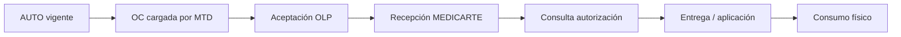
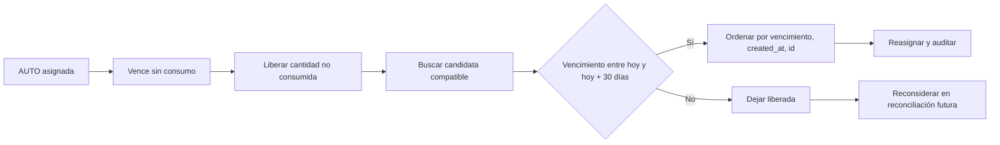
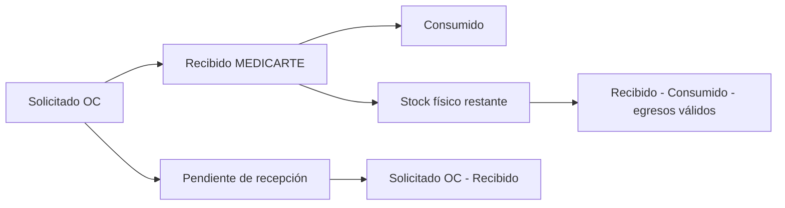

# ADR-043 — Autorización → OC → Recepción → Consumo → Reasignación

Estado: documentación de AS-IS, decisiones de negocio y TO-BE
Fecha: 2026-09-24

## Propósito y alcance

Este documento separa lo demostrado por el código (`AS-IS`), las decisiones de
negocio confirmadas (`DECISIÓN DE NEGOCIO`) y el comportamiento que deberá
implementarse posteriormente (`TO-BE`). No cambia código, esquema ni migraciones.

La trazabilidad operativa que debe conservarse es:



El flujo objetivo cuando vence una AUTO sin consumo es:



El modelo de cantidades es:



## Identidad de una AUTO y recargas

### AS-IS confirmado

La identidad persistida de `authorization_items` es la combinación:

```text
(numero_autorizacion, codigo_medicamento)
```

El importador calcula `authorization_key` como:

```text
numero_autorizacion + "|" + codigo_comercial
```

La escritura está en `apps/api/src/bulk-imports/bulk-import.repository.ts`, en
`upsertAuthorizationInTx()`. La inserción usa `ON CONFLICT
(numero_autorizacion, codigo_medicamento) DO NOTHING`; después bloquea la fila
existente con `FOR UPDATE`, compara el payload normalizado y decide `NO_OP` o
`UPDATE`. El `UPDATE` incrementa `version`, actualiza `updated_at`,
`updated_by`, `last_load_id`, `source_data`, estado, vigencia derivada y demás
campos controlados por la carga.

La restricción de identidad y el índice único se originan en las migraciones de
autorizaciones, y la evolución de la identidad de demanda/lineage está en
`0058_authorization_based_projected_demand.sql`,
`0065_authorization_demand_identity.sql` y
`0067_purchase_order_authorization_sources.sql`. `authorization_key` no es una
segunda identidad independiente: es la clave operacional derivada de la misma
pareja autorización-producto.

Si el contenido semántico no cambia, la recarga es `NO_OP` y no cambia
`version`, `updated_at` ni `last_load_id`. Si cambia, el importador intenta
actualizar la AUTO, pero actualmente bloquea la operación cuando existe una OC
no cancelada ni rechazada asociada por
`purchase_order_authorization_sources`. No hay versionado histórico completo de
cada payload: existe `version` en el registro vivo y auditoría de la operación,
pero no una tabla de versiones de atributos de AUTO.

### DECISIÓN DE NEGOCIO

La identidad estable de una AUTO debe ser `authorization_key`, conforme a la
identidad que el código confirme: autorización (`numero_autorizacion`) más
código comercial (`codigo_medicamento`/`CODIGO_COMERCIAL`). Una recarga con la
misma clave debe actualizar cantidad autorizada, `FECHA_FINAL_VIGENCIA`, estado y
los demás atributos vivos actualizables.

La actualización de la AUTO no debe reconstruir ni modificar una OC histórica.
La relación `purchase_order_authorization_sources` conserva la clave, producto,
cantidad y versión que justificaron la OC cuando fue creada.

### TO-BE

La actualización deberá ser posible sin reescribir la demanda histórica ya
comprometida en una OC. El estado vivo de `authorization_items` y el snapshot de
`purchase_order_authorization_sources` deben tratarse como dos tiempos distintos:

- **AUTO actual:** cantidad, vigencia, estado y atributos vigentes.
- **Demanda histórica de OC:** clave, producto, cantidad, versión y momento
  utilizados al crear la OC.

Ejemplo: si AUTO-X pasa de cantidad 1 a 2 y su vencimiento cambia de
2026-10-10 a 2026-10-20, se actualiza `authorization_items`; una OC ya creada
conserva su snapshot original.

## OC, disponibilidad y asignación

### AS-IS confirmado

La consolidación materializa `projected_demand_lines` y `demand_sources`. La OC
se crea desde esa demanda. `purchase_order_authorization_sources` conserva la
relación OC + AUTO + código comercial + cantidad snapshot y es la evidencia que
usa el fulfillment para hacer visible una autorización a MEDICARTE.

La ruta moderna de Disponibilidad usa `inventory_authorization_allocations`.
`InventoryAvailabilityRepository` calcula disponibilidad por OC/producto/punto,
considera recepciones, consumos y asignaciones, y permite cargar asignaciones por
UI o XLSX. `AuthorizationFulfillmentRepository.ensureAutomaticAllocation()`
puede crear una allocation al consultar/atender una autorización cuando no hay
una activa; obtiene la demanda desde `purchase_order_authorization_sources` y
resuelve el punto mediante la programación activa más reciente.

Por tanto, el código actual sí contiene el segundo paso conceptual:

```text
OC/AUTO → Disponibilidad → inventory_authorization_allocations → fulfillment
```

### DECISIÓN DE NEGOCIO

MTD continuará cargando la OC con:

```text
OC + CLAVE_AUTORIZACION + CODIGO_COMERCIAL + CANTIDAD
```

La relación AUTO → OC representa la demanda lógica original y no debe eliminarse.
La asignación lógica nace con el archivo de OC cargado por MTD. Disponibilidad no
debe volver a decidir qué AUTO originó la OC ni ser una segunda asignación
obligatoria.

El flujo objetivo es:

```text
MTD define OC + AUTO + producto + cantidad
OLP acepta la OC y registra fecha de entrega
MEDICARTE confirma cuánto recibió físicamente
Consulta autorización entrega/aplica solo lo físicamente disponible
```

### TO-BE

`purchase_order_authorization_sources` permanece como relación histórica
fundamental. El módulo Disponibilidad puede permanecer por compatibilidad o
consulta, pero no debe tener responsabilidad de reasignar AUTO ni convertirse en
la autoridad de stock.

## Recepción y existencia física

### AS-IS confirmado

Hay dos rutas distintas:

1. La ruta histórica `deliveries → receipts → receipt_lines` confirma una
   recepción y llama `ReceiptRepository` a
   `InventoryRepository.recordConfirmedReceipt()`. Esa escritura crea/reutiliza
   `inventory_lots` y registra un movimiento `RECEIPT` en
   `inventory_movements`.
2. La ruta moderna directa de OC (`purchase_order_receipts` y
   `purchase_order_receipt_lines`) permite a MEDICARTE enviar solo
   `receivedQuantity`. El propio código de `createPurchaseOrderReceipt()` indica
   que no llama a `recordConfirmedPurchaseOrderReceipt()` porque esa ruta
   pertenece al ledger legacy basado en lotes. Esta ruta guarda evidencia de
   cantidad y actualiza el estado de la OC, pero no crea lote ni movimiento de
   inventario.

La consulta de Disponibilidad suma eventos `RECEIPT` del ledger para determinar
`received_quantity` y resta `authorization_fulfillment_lines` para obtener lo
consumido. Por ello la recepción directa quantity-only puede quedar fuera del
inventario físico que usa fulfillment.

### DECISIÓN DE NEGOCIO

Una OC no crea stock consumible. La cantidad física máxima consumible es:

```text
stock físico restante = MEDICARTE_RECIBIDO - CONSUMIDO - otros egresos físicos válidos
```

Con OC solicitada 10 y recibida 5: solicitado = 10, recibido = 5, pendiente de
recepción = 5 y máximo consumible = 5. Nunca se debe consumir la cantidad
solicitada por el solo hecho de existir la OC.

### TO-BE

La recepción confirmada por MEDICARTE debe alimentar la misma autoridad de
existencia física que consulta fulfillment, conservando cantidad, producto, OC,
punto y, cuando aplique, lote/vencimiento. El contrato quantity-only debe
integrarse de forma explícita con esa autoridad o quedar claramente fuera del
flujo de consumo hasta que exista evidencia física compatible.

## Escasez, vencimiento y reasignación

### AS-IS confirmado

Las AUTO conservan su vínculo lógico con la OC mediante
`purchase_order_authorization_sources`. `reconcileIneligibleTx()` libera o marca
`EXPIRED` las allocations no consumidas cuando la AUTO vence, se bloquea, cambia
su estado o la OC se cancela/rechaza. Se ejecuta de forma perezosa antes de
operaciones de Disponibilidad/importación/asignación; no existe scheduler de
reasignación automática.

La liberación no crea movimiento de inventario ni asignación sustituta. La
cantidad queda disponible para una asignación posterior explícita. Tampoco existe
hoy una prioridad automática por vencimiento dentro de una ventana de 30 días.

### DECISIÓN DE NEGOCIO

Si una AUTO vence sin consumo, la demanda deja de estar reservada
operacionalmente, pero el producto no desaparece. Deben conservarse la relación
original y la trazabilidad:

```text
AUTO original → demanda de OC → venció sin consumo → producto liberado
             → eventualmente AUTO sustituta
```

Las AUTO vinculadas a una OC no adquieren propiedad física anticipada. Si hay 10
AUTO elegibles y solo 5 unidades recibidas, puede consumir primero cualquiera de
las AUTO válidas que efectivamente se atiendan. La operación debe ser atómica y
segura ante concurrencia; la sexta atención falla o se bloquea cuando no quede
existencia física.

### TO-BE de reasignación

Al vencer una AUTO sin consumo, el sistema debe intentar una reasignación
atómica, auditable y sin doble asignación. La candidata debe cumplir:

1. AUTO vigente y habilitada operacionalmente.
2. Sin entrega/aplicación previa.
3. Mismo código comercial y misma cantidad requerida.
4. Compatible con el mismo punto operacional de MEDICARTE.
5. Vencimiento dentro de `HOY <= fecha_vencimiento <= HOY + 30 días`.

El orden determinístico es:

```sql
ORDER BY fecha_final_vigencia ASC, created_at ASC, id ASC
```

La fecha más cercana gana. Si no hay candidata, el producto queda liberado/sin
AUTO sustituta y debe poder reconsiderarse cuando ingrese o se actualice una AUTO
elegible. No se define aún una frecuencia técnica obligatoria: puede ser una
reconciliación periódica o disparada por ingreso/actualización de AUTO.

## Entrega/aplicación y cantidades

### AS-IS confirmado

La entrega/aplicación desde Consulta autorización usa
`AuthorizationFulfillmentRepository`. `ensureAutomaticAllocation()` consulta el
snapshot de OC y puede crear `inventory_authorization_allocations`; `fulfill()`
bloquea las allocations, comprueba existencia física en `inventory_lots`,
selecciona lotes FEFO, crea `authorization_fulfillment_lines` y escribe
movimientos negativos `FULFILLMENT_APPLICATION` o `FULFILLMENT_DELIVERY`.

La ruta actual exige que exista inventario físico suficiente para la allocation,
pero su coherencia con recepción directa quantity-only es incompleta por el GAP
anterior. MEDICARTE no tiene un `inventory.allocate` separado en esta ruta; la
allocation se crea dentro de fulfillment o por el módulo Disponibilidad.

### DECISIÓN DE NEGOCIO

Consulta autorización solo puede consumir producto efectivamente recibido por
MEDICARTE, del código comercial correcto, de una OC compatible y no consumido
previamente. Una unidad ya entregada/aplicada nunca puede reasignarse.

## Invariantes objetivo

- `OC_SOLICITADO >= MEDICARTE_RECIBIDO`.
- `MEDICARTE_RECIBIDO >= CONSUMIDO`.
- Nunca `CONSUMIDO > RECIBIDO`.
- Actualizar una AUTO no modifica el snapshot histórico de una OC.
- La relación AUTO → OC permanece aunque la AUTO venza.
- Una unidad no consumida puede reutilizarse para una AUTO compatible.
- Una unidad consumida no puede reasignarse.
- La reasignación por vencimiento es determinística y auditable.

## Modelo temporal y trazabilidad mínima

| Hecho | Información que debe conservarse |
| --- | --- |
| AUTO actual | cantidad, vigencia, estado y atributos vivos |
| Demanda histórica de OC | clave, producto, cantidad snapshot, versión y fecha de creación |
| Recepción | OC, producto, punto, cantidad realmente recibida y evidencia física disponible |
| Consumo | AUTO atendida, OC, lote si aplica, cantidad, fecha y usuario |
| Reasignación | AUTO original, motivo, AUTO sustituta, producto, cantidad, fecha y usuario/proceso |

No se debe borrar información histórica para representar vencimiento, liberación o
reasignación.

## Known gaps / diferencias entre implementación y modelo objetivo

| Área | Evidencia AS-IS | Diferencia documentada |
| --- | --- | --- |
| Actualización de AUTO con OC existente | `upsertAuthorizationInTx()` bloquea cambios si hay OC no cancelada/rechazada | TO-BE debe actualizar la AUTO viva sin mutar el snapshot de OC |
| Recepción quantity-only | `createPurchaseOrderReceipt()` solo persiste `purchase_order_receipt_lines` y no llama al ledger legacy | La recepción directa no alimenta de forma demostrada `inventory_movements`/`inventory_lots` usados por fulfillment |
| Disponibilidad | `InventoryAvailabilityRepository` usa `inventory_authorization_allocations` y carga UI/XLSX | Sigue siendo una segunda asignación técnica; TO-BE la deja fuera de la responsabilidad de asignar AUTO |
| Fulfillment automático | `ensureAutomaticAllocation()` crea allocations desde el snapshot de OC | El contrato backend actual todavía materializa asignación al atender; debe alinearse con la asignación lógica nacida en la OC |
| Recepción histórica | `recordConfirmedReceipt()` sí crea lotes y movimientos `RECEIPT` | Conviven dos arquitecturas y la quantity-only no tiene la misma evidencia física |
| Liberación/reasignación | `reconcileIneligibleTx()` libera perezosamente y no busca candidata sustituta | No existe reasignación automática, ventana +30 días ni orden determinístico |
| Concurrencia de consumo | Fulfillment usa transacción, locks de autorización/allocation/punto y valida lotes | El TO-BE exige además una reserva/consumo atómico que no elija AUTO propietaria por anticipado en escasez |

Estos GAPs no se presentan como funcionalidades implementadas. La
reconciliación existente detecta inconsistencias, pero no auto-repara ni crea la
reasignación de negocio definida aquí.
