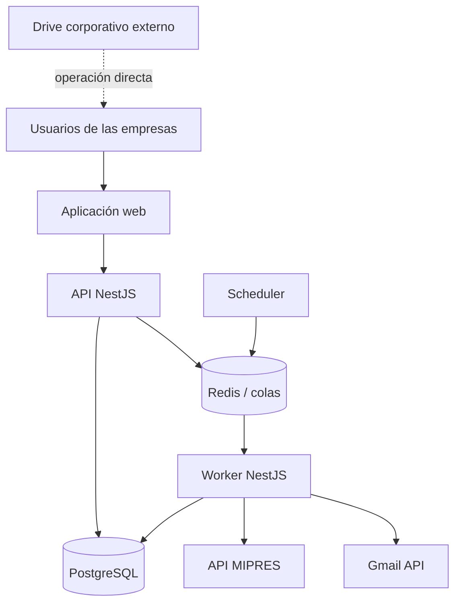
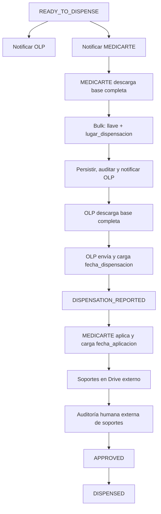
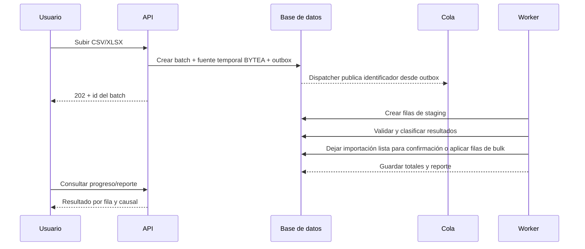
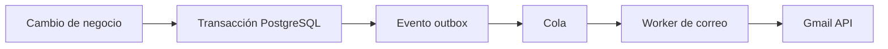

# Arquitectura de la Plataforma de Autorizaciones y Dispensación

**Alcance:** Ingesta de autorizaciones, clasificación PBS/NO PBS, validación MIPRES, coordinación de dispensación/aplicación, auditoría humana de soportes externos, notificaciones y consolidación. El proceso de admisión es externo a la plataforma: comienza con la descarga de la base de registros con auditoría aprobada y `admission_status = READY`.

---

## 1. Decisión ejecutiva

La solución debe ser una **aplicación web responsive** con backend centralizado, base de datos relacional y procesos asíncronos para MIPRES, correos, importaciones, actualizaciones masivas y reintentos. Los soportes permanecen en el Drive corporativo administrado directamente por MEDICARTE.

La unidad mínima del negocio es el **ítem de autorización**, cuya llave única será:

```text
numero_autorizacion + codigo_medicamento
```

El campo físico que alimenta `codigo_medicamento` será `COD_COMERCIAL`.

Se recomienda construirla como un **monolito modular**, no como microservicios. El producto necesita límites internos claros, pero no tiene hoy una escala, equipos independientes ni requisitos de despliegue que justifiquen la complejidad operacional de microservicios.

La aplicación tendrá tres procesos desplegables a partir del mismo código backend:

1. API transaccional.
2. Worker de tareas en segundo plano.
3. Scheduler que crea trabajos periódicos de revalidación y notificación.

La base de datos será la fuente de verdad del proceso. Google Drive será un repositorio corporativo externo, no integrado por archivo. MIPRES y Gmail serán integraciones recuperables: una caída no puede destruir ni revertir el trabajo guardado.

---

## 2. Por qué una aplicación web

Acceso centralizado para MTD, Compensar, OLP y Medicarte; despliegue único; adecuada para tablas, filtros, archivos y auditoría. La función de Facturación queda dentro del alcance operativo de MTD.

---

## 3. Principios de arquitectura

1. **Una sola fuente de verdad:** PostgreSQL conserva estado, responsables e historial de negocio.
2. **El archivo no se procesa directamente contra producción:** toda carga pasa por staging y validación; la importación F2 además exige confirmación.
3. **Idempotencia:** repetir una carga, correo, consulta MIPRES o trabajo no debe duplicar efectos.
4. **Trazabilidad por diseño:** cada transición genera un evento de auditoría inmutable.
5. **Separación de estados:** cobertura, habilitación, direccionamiento, operación y auditoría son dimensiones diferentes; los indicadores derivables no se persisten.
6. **Integraciones desacopladas:** Gmail y MIPRES se consumen mediante adaptadores y colas; Drive permanece fuera del flujo de archivos.
7. **Permiso denegado por defecto:** toda acción y consulta exige rol, empresa y alcance explícito.
8. **No sobrescribir evidencia:** las correcciones operativas generan historial append-only.
9. **Contratos antes que pantallas:** el backend publica una API documentada; ninguna regla crítica vive solo en el frontend.
10. **Observabilidad operacional:** los fallos externos quedan visibles y reintentables, no escondidos en logs.
11. **Regla de cobertura explícita:** un registro es `PBS` cuando su `No.PRESCRIPCION` normalizado está vacío y `NO_PBS` cuando tiene valor (DEC-016). `CUPS_PRINCIPAL` ya no clasifica cobertura y se conserva como evidencia.

---

## 4. Arquitectura de alto nivel



### Contenedores lógicos

| Componente             | Responsabilidad                                                                                                        |
| ---------------------- | ---------------------------------------------------------------------------------------------------------------------- |
| Web                    | Navegación, formularios, tablas, carga de archivos, auditoría y administración. No contiene reglas finales de negocio. |
| API                    | Autenticación, autorización, reglas de dominio, persistencia, consultas y contratos REST.                              |
| Worker                 | Procesamiento de importaciones/bulk updates, clasificación, MIPRES, correo y reintentos.                               |
| Scheduler              | Genera trabajos periódicos: revalidación MIPRES, correos consolidados y tareas de mantenimiento.                       |
| PostgreSQL             | Fuente de verdad transaccional.                                                                                        |
| Redis/BullMQ           | Cola temporal y coordinación de trabajos. No almacena el estado definitivo del negocio.                                |
| Proveedor de identidad | Inicio de sesión, recuperación de cuenta y MFA.                                                                        |
| Google Workspace       | Gmail para envío; Drive corporativo externo administrado directamente por MEDICARTE.                                   |
| MIPRES                 | Fuente externa de direccionamientos y catálogos aplicables.                                                            |

---

## 5. Tecnologías recomendadas

### Stack principal

| Capa              | Tecnología                                          | Criterio                                                                                                             |
| ----------------- | --------------------------------------------------- | -------------------------------------------------------------------------------------------------------------------- |
| Lenguaje          | TypeScript con modo estricto                        | Unifica frontend, backend y contratos; reduce errores de tipos.                                                      |
| Frontend          | Next.js con App Router                              | Aplicación web moderna, rutas, layouts y despliegue en contenedor.                                                   |
| UI                | Tailwind CSS + shadcn/ui                            | Componentes accesibles y personalizables sin quedar atado a un sistema visual cerrado.                               |
| Datos en frontend | TanStack Query y TanStack Table                     | Caché del servidor, paginación, filtros y tablas operativas grandes.                                                 |
| Formularios       | React Hook Form + Zod                               | Validación declarativa y reutilizable.                                                                               |
| Backend           | NestJS REST + OpenAPI                               | Modularidad, inyección de dependencias, guards, validación y soporte de workers/colas.                               |
| ORM               | drizzle                                             | Esquema tipado, migraciones y acceso consistente a PostgreSQL. SQL explícito cuando una consulta lo amerite.         |
| Base de datos     | PostgreSQL administrado                             | Integridad, transacciones, restricciones, JSONB para respuestas externas y capacidades de auditoría.                 |
| Trabajos          | Redis + BullMQ                                      | Reintentos, demoras, concurrencia, trabajos programados e inspección de fallos.                                      |
| Identidad         | Keycloak mediante OIDC                              | No construir autenticación propia; soporta MFA, usuarios externos e integración futura con proveedores corporativos. |
| Soportes externos | Google Drive corporativo administrado por Medicarte | La aplicación conserva solo configuración administrativa; no carga ni cataloga documentos individuales.              |
| Correo            | Gmail API                                           | Envío desde cuenta corporativa con trazabilidad del identificador externo.                                           |
| Excel/CSV         | SheetJS o ExcelJS + parser CSV en streaming         | Lectura controlada, plantillas y reportes. Los archivos grandes deben procesarse en el worker.                       |
| Pruebas           | Vitest/Jest, Supertest, Testcontainers y Playwright | Pruebas unitarias, integración real con PostgreSQL y flujos de interfaz.                                             |
| Calidad           | ESLint, Prettier, commit hooks y CI                 | Reglas repetibles antes de integrar cambios.                                                                         |
| Observabilidad    | OpenTelemetry + Sentry y logs JSON                  | Correlación de solicitudes, trabajos y errores externos.                                                             |
| Empaquetado       | Docker                                              | Mismo artefacto en desarrollo, pruebas y producción.                                                                 |
| Repositorio       | Monorepo pnpm + Turborepo                           | Comparte DTO, tipos, validaciones y configuración sin publicar paquetes internos.                                    |

### Versionamiento

No se deben fijar aquí números menores que envejezcan rápido. Al crear el repositorio se elegirán versiones estables y soportadas, se fijarán en el lockfile y Dependabot/Renovate propondrá actualizaciones controladas. Node.js debe mantenerse en una línea LTS soportada.

### Despliegue recomendado

Para un piloto es válido utilizar un PaaS administrado con servicios separados para web, API, worker, PostgreSQL y Redis. Para producción con información sensible se recomienda infraestructura administrada con red privada, backups, secretos centralizados y registros de auditoría; Google Cloud es una opción coherente por la integración con Workspace, pero no es una obligación arquitectónica.

No se recomienda alojar el núcleo productivo en hosting compartido. El worker, Redis, los reintentos y los procesos largos requieren un entorno controlado.

---

## 6. Estructura propuesta del monorepo

```text
authorization-platform/
├── apps/
│   ├── web/                 # Next.js
│   ├── api/                 # NestJS HTTP
│   └── worker/              # NestJS BullMQ
├── packages/
│   ├── contracts/           # DTO y esquemas compartidos
│   ├── database/            # Drizzle y migraciones
│   ├── domain/              # Tipos y reglas puras
│   ├── ui/                  # Componentes reutilizables
│   └── config/              # ESLint, TSConfig y utilidades
├── docs/
│   ├── adr/
│   ├── api/
│   └── operations/
├── infra/
│   ├── docker/
│   └── deployment/
└── tests/
    └── e2e/
```

### Módulos del backend

| Módulo                  | Alcance                                                                                          |
| ----------------------- | ------------------------------------------------------------------------------------------------ |
| `identity`              | Identidad OIDC, sesión y perfil local.                                                           |
| `organizations`         | Empresas y alcances de acceso.                                                                   |
| `access-control`        | Roles, permisos y políticas por recurso.                                                         |
| `authorization-imports` | Archivo, batch, staging, validación y confirmación.                                              |
| `authorization-items`   | Entidad central y consulta operativa.                                                            |
| `coverage`              | PBS/NO PBS, homologaciones y versiones de catálogo.                                              |
| `mipres`                | Credenciales, consultas, normalización, reintentos y evidencia de respuestas.                    |
| `dispensing`            | Disponibilidad, dispensación y fechas.                                                           |
| `operations`            | Lugar de dispensación, fechas operativas, historial y bulk updates tipados.                      |
| `drive-configuration`   | Referencia administrativa al repositorio corporativo externo; no gestiona archivos por registro. |
| `audit-reviews`         | Revisión, hallazgos, rechazo, corrección y aprobación.                                           |
| `notifications`         | Plantillas, destinatarios, agrupación, envío y deduplicación.                                    |
| `exports`               | Consolidaciones y reportes descargables.                                                         |
| `audit-log`             | Eventos inmutables y consultas de historial.                                                     |
| `admin`                 | Catálogos, usuarios, permisos y parámetros operativos.                                           |

Los módulos no deben acceder directamente a tablas de otro módulo. Deben usar servicios de aplicación o contratos internos. Esto mantiene la posibilidad de extraer un módulo en el futuro sin pagar desde ahora el costo de microservicios.

---

## 7. Modelo de datos inicial

### Núcleo de identidad y acceso

| Entidad                   | Propósito                                                                         |
| ------------------------- | --------------------------------------------------------------------------------- |
| `organizations`           | MTD, OLP, Compensar, Medicarte u otra organización.                               |
| `users`                   | Perfil local relacionado con el `subject` del proveedor de identidad.             |
| `roles`                   | Agrupaciones de permisos.                                                         |
| `permissions`             | Acciones atómicas como `authorization.import` o `audit.approve`.                  |
| `user_organization_roles` | Relación usuario, empresa y rol. Permite que una persona tenga más de un alcance. |

### Ingesta

| Entidad                    | Propósito                                                                        |
| -------------------------- | -------------------------------------------------------------------------------- |
| `import_batches`           | Archivo, hash SHA-256, creador, estado, totales y fechas.                        |
| `import_rows`              | Fila original normalizada, resultado y causal. Conserva evidencia de rechazados. |
| `validation_errors`        | Uno o varios errores tipificados por fila y campo.                               |
| `bulk_update_batches`      | Lote operativo, tipo cerrado, hash, actor, estado y totales.                     |
| `bulk_update_source_files` | Fuente temporal durable `BYTEA`; se nulifica/elimina al finalizar.               |
| `bulk_update_rows`         | Staging, llave, valor propuesto, resultado y causal estable por fila.            |

### Proceso

| Entidad                            | Propósito                                                                                                              |
| ---------------------------------- | ---------------------------------------------------------------------------------------------------------------------- |
| `authorization_items`              | Unidad central: autorización + medicamento + discriminadores necesarios.                                               |
| `authorization_item_organizations` | Relación explícita entre un ítem global y las organizaciones que pueden leerlo según sus permisos. No duplica el ítem. |
| `coverage_evaluations`             | Resultado PBS/NO PBS/SIN_CLASIFICAR y versión del catálogo.                                                            |
| `mipres_checks`                    | Cada intento, consulta, respuesta normalizada, error y fecha siguiente.                                                |
| `mipres_directionamientos`         | Datos vigentes del direccionamiento asociado.                                                                          |
| `operational_field_changes`        | Historial append-only de cambios en lugar/fechas, con antes/después, actor, organización, lote, fila y versión.        |
| `audit_reviews`                    | Auditoría iniciada/finalizada, decisión y auditor.                                                                     |
| `audit_findings`                   | Hallazgos tipificados y estado de subsanación.                                                                         |

### Comunicación y trazabilidad

| Entidad                | Propósito                                                                                                               |
| ---------------------- | ----------------------------------------------------------------------------------------------------------------------- |
| `notification_batches` | Consolidado enviado a una empresa o grupo.                                                                              |
| `notifications`        | Mensaje individual/lógico, plantilla, destinatarios y estado.                                                           |
| `outbox_events`        | Eventos comprometidos en la misma transacción que el cambio de negocio.                                                 |
| `audit_events`         | Historial inmutable de quién, qué, cuándo, desde dónde y sobre qué registro.                                            |
| `export_audit_events`  | Auditoría de exportaciones solicitadas: actor, filtros, formato, fecha y resultado. El archivo generado no se persiste. |

### Restricciones críticas

1. La llave única del ítem es `numero_autorizacion + codigo_medicamento`. Si una autorización requiere varias entregas o subentregas, estas se modelan como registros hijos del ítem; no se duplica el ítem principal.
2. `import_batches.file_hash` permite reconocer el mismo archivo, pero no reemplaza la detección de duplicados por fila.
3. Un solo direccionamiento externo puede necesitar historial; no se sobrescribe la respuesta anterior.
4. Los eventos de auditoría y el historial operativo no admiten actualización ni borrado desde la aplicación.
5. El estado `admission_status = READY` se deriva de reglas de dominio; no debe escribirse libremente desde la interfaz.
6. `authorization_items` guarda los valores vigentes `lugar_dispensacion`, `fecha_dispensacion` y `fecha_aplicacion`; cada cambio crea historial para evitar sobrescrituras silenciosas.
7. Una autorización es un registro global único. MTD puede leer globalmente con permiso; Compensar, OLP y Medicarte requieren relación explícita y permiso vigente.
8. Una actualización explícita F2 iniciada desde `READY_TO_DISPENSE` reemplaza la evidencia y reevalúa las cuatro columnas de negocio (`NUMERO_AUTORIZACION`, `COD_COMERCIAL`, `ESTADO_AUTORIZACION`, `No.PRESCRIPCION`); no es un bulk update operativo.
9. La base de datos impide persistir `READY_TO_DISPENSE` cuando habilitación, cobertura y direccionamiento no cumplen sus prerrequisitos.
10. Cada tipo de bulk fija en backend actor y única columna mutable; el cliente nunca elige un nombre de campo arbitrario.
11. La aplicación no mantiene `attachments` ni una relación archivo-ítem.

`fecha_dispensacion` y `fecha_aplicacion` son fechas calendario (`DATE`, `YYYY-MM-DD`); los timestamps de persistencia, actor y auditoría se almacenan en UTC. `lugar_dispensacion` es texto libre. `fecha_aplicacion` es corregible mientras `audit_status` no sea `APPROVED`; tras la aprobación el campo queda inmutable.

---

## 8. Estado del dominio

No habrá una columna mágica que intente representar todo. El ítem tendrá dimensiones separadas:

| Dimensión           | Valores iniciales                                                    |
| ------------------- | -------------------------------------------------------------------- |
| `enablement_status` | `ENABLED`, `BLOCKED_SOURCE_STATUS`                                   |
| `coverage_type`     | `UNCLASSIFIED`, `PBS`, `NO_PBS`                                      |
| `direction_status`  | `NOT_APPLICABLE`, `PENDING`, `CONFIRMED`, `QUERY_ERROR`              |
| `operation_status`  | `BLOCKED`, `READY_TO_DISPENSE`, `DISPENSATION_REPORTED`, `DISPENSED` |
| `audit_status`      | `NOT_STARTED`, `READY`, `IN_REVIEW`, `REJECTED`, `APPROVED`          |
| `admission_status`  | `NOT_READY`, `READY`                                                 |

Para la interfaz se calculará un `process_summary`, por ejemplo:

`BLOQUEADO`, `SIN_CLASIFICAR`, `PENDIENTE_DIRECCIONAMIENTO`, `PENDIENTE_LUGAR_DISPENSACION`, `LISTO_COORDINACION_OLP`, `PENDIENTE_DISPENSACION`, `PENDIENTE_APLICACION`, `PENDIENTE_AUDITORIA`, `RECHAZADO`, `APROBADO`.

Este resumen es una proyección de lectura; nunca sustituye las dimensiones reales.

`application_site_status` es una proyección (`lugar_dispensacion IS NULL ? PENDING_ASSIGNMENT : ASSIGNED`) y no se persiste. `support_status` se elimina. La existencia de `fecha_dispensacion` y `fecha_aplicacion` deriva `audit_status = READY`; esto solo habilita revisión y nunca equivale a soportes completos ni a `APPROVED`.

### Flujo logístico después de `READY_TO_DISPENSE`

`READY_TO_DISPENSE` indica que el ítem ya superó las reglas previas necesarias para entrar a coordinación logística:

- PBS habilitado: no requiere direccionamiento MIPRES.
- NO PBS habilitado: requiere `direction_status = CONFIRMED`.

Una actualización explícita puede cambiar esas dimensiones. La actualización se autoriza únicamente para un ítem cuyo estado anterior sea `READY_TO_DISPENSE`; luego la regla pura de dominio conserva `READY_TO_DISPENSE` solo cuando los prerrequisitos continúan satisfechos y usa `BLOCKED` en cualquier otra combinación. En Fase 2, `NO_PBS + ENABLED + PENDING` no consulta MIPRES y queda `BLOCKED` hasta una confirmación posterior.

La confirmación de ítems nuevos en Fase 2 puede dejar `operation_status = NULL` mientras Fase 4 materializa la transición operacional y sus notificaciones. La restricción de base de datos solo protege los valores no nulos, y la actualización explícita siempre persiste `READY_TO_DISPENSE` o `BLOCKED`.

A partir de allí:



Las notificaciones de `READY_TO_DISPENSE` y de asignación/cambio de `lugar_dispensacion` son event-driven mediante outbox/worker. No esperan al reporte diario de las 08:00. `application_site_status` se deriva de la nulabilidad del lugar; `support_status` se elimina.

---

## 9. Flujo técnico de cargas



### Estados del batch

`UPLOADED → VALIDATING → READY_TO_CONFIRM → CONFIRMING → COMPLETED`

Estados excepcionales:

`FAILED`, `CANCELLED`.

La importación F2 exige su confirmación definida en SPEC-001. Los bulk updates operativos procesan filas válidas y reportan rechazos parciales sin confirmación que amplíe columnas.

### Actualizaciones operativas masivas

Un único pipeline soporta tres tipos cerrados:

| Tipo                           | Actor     | Encabezados exactos                                               |
| ------------------------------ | --------- | ----------------------------------------------------------------- |
| `ASSIGN_DISPENSATION_LOCATION` | MEDICARTE | `authorization_key`, `lugar_dispensacion`                         |
| `REPORT_DISPENSATION_DATE`     | OLP       | `authorization_key`, `fecha_dispensacion`                         |
| `REPORT_APPLICATION_DATE`      | MEDICARTE | `numero_autorizacion`, `codigo_medicamento`, `fecha_aplicacion`   |

`authorization_key` es la pareja normalizada `numero_autorizacion + codigo_medicamento` entregada por la descarga operativa. La descarga de OLP solo incluye registros con `lugar_dispensacion` asignado; los pendientes de asignación se omiten.

Máximo 20 MB; PostgreSQL conserva temporalmente el binario en una tabla separada `BYTEA`; BullMQ recibe solo identificadores. El worker crea staging, valida existencia, alcance, permiso, estado y valor por fila. Cada actualización válida escribe valor vigente, versión, historial y auditoría en una transacción; el lugar agrega outbox. El resultado informa procesadas, actualizadas, sin cambio y rechazadas con causal estable. No hay atomicidad de archivo completo.

### Catálogo estable de resultados por fila

Fase 2 usa exclusivamente estos códigos, con texto estable y legible:

| Código                          | Uso                                                                                                     |
| ------------------------------- | ------------------------------------------------------------------------------------------------------- |
| `ROW_VALID`                     | Fila validada y elegible para confirmar un ítem nuevo.                                                  |
| `MISSING_REQUIRED_FIELD`        | Falta un encabezado obligatorio o un valor obligatorio (el valor de `No.PRESCRIPCION` puede ser vacío). |
| `INVALID_FIELD_FORMAT`          | El archivo o valor no cumple el formato técnico definido para Fase 2.                                   |
| `DUPLICATE_IN_FILE`             | La llave aparece repetida dentro del archivo.                                                           |
| `EXISTING_ITEM_REVIEW_REQUIRED` | La llave ya existe y requiere verificación humana.                                                      |
| `EXPLICIT_UPDATE_NOT_ALLOWED`   | Una actualización explícita fue intentada fuera de `READY_TO_DISPENSE`.                                 |
| `ITEM_CREATED`                  | La fila válida creó un ítem durante la confirmación.                                                    |
| `ITEM_UPDATED`                  | Una actualización explícita autorizada terminó correctamente.                                           |
| `PROCESSING_ERROR`              | Error técnico estable de procesamiento, sin exponer la excepción interna.                               |

El estado de origen distinto de `5` no es causal de rechazo: deriva `BLOCKED_SOURCE_STATUS` y queda auditado.

### Evidencia de la fuente recibida

El archivo de autorizaciones contiene una hoja (`Hoja1`) y 26 columnas según el diccionario versión 2 (DEC-016). Sus campos relevantes son:

| Concepto lógico            | Columna observada                   | Regla o uso                                                                                                                                    |
| -------------------------- | ----------------------------------- | ---------------------------------------------------------------------------------------------------------------------------------------------- |
| Autorización               | `NUMERO_AUTORIZACION`               | Primer componente de la llave única.                                                                                                           |
| Código de medicamento      | `COD_COMERCIAL`                     | Segundo componente de la llave única. `CUMS` y `COD_CUPS_AUTORIZADO` se conservan como datos de origen independientes.                         |
| Clasificación de cobertura | `No.PRESCRIPCION`                   | Vacío = `PBS`; no vacío = `NO_PBS`. Solo dígitos, longitud mayor a 3; `no_prescripcion` para MIPRES se deriva retirando los últimos 3 dígitos. |
| Estado de origen           | `ESTADO_AUTORIZACION`               | Valor `5` habilita el registro; cualquier valor distinto de `5` lo bloquea.                                                                    |
| Evidencia                  | `CUPS_PRINCIPAL` y las 22 restantes | Se conservan como datos de origen; `CUPS_PRINCIPAL` perdió semántica de negocio desde DEC-016.                                                 |

El archivo de muestra analizado contiene una sola fila, por lo que no permite demostrar que la llave sea única a escala real; esa verificación debe ejecutarse durante cada carga y quedar en el reporte. La regla de cobertura no usa `CUPS_PRINCIPAL` desde DEC-016 y no debe reintroducirse sin una decisión de negocio explícita.

---

## 10. Integración con MIPRES

Se implementará mediante una **capa anticorrupción**:

```text
Dominio interno -> MipresPort -> MipresHttpAdapter -> API MIPRES
                                -> MipresFakeAdapter para pruebas
```

El dominio nunca utilizará directamente nombres, estados o estructuras JSON de MIPRES. El adaptador transforma la respuesta externa a modelos internos versionados.

Esta decisión conserva el ADR de integración MIPRES ya definido para el ecosistema VITA: se separan el **estado oficial reportado por MIPRES** y el **estado técnico de integración**. MIPRES es la fuente oficial de prescripción, direccionamiento, programación, entrega y suministro; la plataforma conserva los datos operativos locales, los pendientes, la sincronización y la auditoría. Digiturno, inventario y otras validaciones operativas quedan fuera de este bounded context y no deben incorporarse a esta integración.

El contrato externo quedó cerrado en DEC-013 (`contracts/MIPRES_DIRECCIONAMIENTOS_CONTRATO.md`): servicio `WSSUMMIPRESNOPBS`, integración exclusivamente de lectura, `GET GenerarToken` y `GET DireccionamientoXPrescripcion`, token operativo gestionado por `MipresTokenProvider`, credenciales en `MIPRES_NIT`/`MIPRES_INITIAL_TOKEN`/`MIPRES_BASE_URL`.

### Regla de entrada a la validación MIPRES

La clasificación PBS/NO PBS se resuelve primero con la presencia de `No.PRESCRIPCION` (DEC-016):

```text
No.PRESCRIPCION vacio
    → coverage_type = PBS
    → direction_status = NOT_APPLICABLE

No.PRESCRIPCION con valor (solo digitos, longitud > 3)
    → coverage_type = NO_PBS
    → validar direccionamiento en MIPRES con no_prescripcion
      (valor original sin sus ultimos 3 digitos)
```

Por tanto, MIPRES no se consulta para clasificar PBS/NO PBS. MIPRES se consulta únicamente para validar el direccionamiento de los ítems que ya fueron clasificados como `NO_PBS` y que están habilitados por `ESTADO_AUTORIZACION = 5`.

### Reglas técnicas

1. Credenciales cifradas y obtenidas desde un gestor de secretos; nunca en frontend ni logs.
2. Timeout por solicitud, reintentos solo para errores recuperables y backoff exponencial con variación.
3. Circuit breaker para evitar saturar un servicio degradado.
4. Identificador de correlación por consulta.
5. Conservación controlada de la respuesta externa necesaria para evidencia, con redacción de secretos.
6. Revalidación programada solo para `NO_PBS + ENABLED + PENDING`.
7. Límite de concurrencia configurable.
8. Trabajo manual “revalidar ahora” sujeto a permiso y rate limit.
9. Estado `QUERY_ERROR` separado de “no existe direccionamiento”. Un fallo técnico no significa ausencia de dato.
10. Catálogos con fecha efectiva, versión, hash y origen.

---

## 11. Google Drive y soportes

Los soportes permanecen en el Drive corporativo y MEDICARTE los administra directamente fuera del flujo de archivos de la aplicación. Drive puede conservarse como referencia/configuración administrativa protegida para orientar al auditor, pero no como integración por registro.

La plataforma:

- no recibe ni descarga soportes;
- no crea `attachments` ni guarda `drive_file_id` por autorización;
- no versiona, cuenta o valida MIME/tipos/cantidad de documentos;
- no calcula `support_status` ni completitud;
- no cambia `audit_status` a partir de actividad en Drive;
- no gobierna retención ni movimiento de archivos externos.

El auditor revisa externamente lo disponible y registra en la plataforma su decisión humana, observaciones y hallazgos.

---

## 12. Notificaciones por correo

El correo no será enviado dentro de la transacción HTTP que cambia el estado.



### Reglas

1. Plantillas versionadas.
2. Destinatarios configurables por organización y tipo de evento.
3. Idempotency key para no duplicar envíos.
4. Guardar asunto, destinatarios, plantilla, parámetros, fecha, resultado e ID de Gmail.
5. Consolidar pendientes de direccionamiento por ventana horaria; no enviar necesariamente un correo por registro.
6. Cola de fallos visible para administración con opción de reintento.
7. No incluir más datos sensibles de los necesarios en asunto o cuerpo.

La delegación de dominio de Google Workspace requiere intervención de un superadministrador y debe limitarse a los scopes estrictamente necesarios.

### Notificaciones logísticas event-driven

#### 1. Registro listo para dispensar

Cuando la transición de dominio produzca `operation_status = READY_TO_DISPENSE`, la misma transacción debe registrar:

```text
AUTHORIZATION_READY_TO_DISPENSE
```

El evento genera dos notificaciones lógicas independientes:

- OLP: informar que existe un registro disponible para coordinación.
- Medicarte: informar que debe definir el punto/dirección donde realizará la aplicación.

Cada destinatario tiene su propia idempotency key y resultado.

#### 2. Lugar de dispensación definido

Cuando MEDICARTE persiste por bulk un lugar válido:

```text
DISPENSATION_LOCATION_ASSIGNED
```

se envía a OLP una segunda notificación con la ubicación necesaria para coordinar el envío del medicamento.

Si MEDICARTE cambia el valor:

```text
DISPENSATION_LOCATION_CHANGED
```

se crea historial, aumenta la versión y se notifica nuevamente a OLP. Un valor idéntico no crea evento.

### Reporte diario

El envío de las 08:00 `America/Bogota` se conserva como **reporte consolidado** de las novedades del día anterior. No sustituye las notificaciones logísticas event-driven.

### Idempotencia logística

Ejemplos:

```text
READY_TO_DISPENSE + authorization_item_id + readiness_version + organization
DISPENSATION_LOCATION_ASSIGNED + authorization_item_id + operational_field_version + OLP
```

---

## 13. Autenticación, empresas, roles y permisos

### Separación necesaria

- **Autenticación:** demuestra quién es la persona. Se delega a Keycloak/OIDC.
- **Autorización:** determina qué puede hacer y sobre qué registros. Vive en la aplicación.

El token no será suficiente para decidir acceso a datos; el backend consultará la membresía y los permisos locales vigentes.

### Roles iniciales

| Rol                  | Acciones principales                                                                                                                           |
| -------------------- | ---------------------------------------------------------------------------------------------------------------------------------------------- |
| `MTD_ADMIN`          | Usuarios, empresas, roles, catálogos, integraciones y parámetros.                                                                              |
| `MTD_OPERATOR`       | Cargar y ver autorizaciones, gestionar direccionamientos y operar/auditar según permisos separados.                                            |
| `COMPENSAR_VIEWER`   | Ver autorizaciones. La descarga del consolidado solo se habilita si se asigna expresamente el permiso.                                         |
| `OLP_OPERATOR`       | Ver y descargar su base completa, consultar `lugar_dispensacion` y reportar masivamente `fecha_dispensacion`.                                  |
| `MEDICARTE_OPERATOR` | Ver y descargar su base completa, actualizar masivamente `lugar_dispensacion` y `fecha_aplicacion`; administra soportes directamente en Drive. |
| `READ_ONLY`          | Consulta limitada según empresa y permisos explícitos.                                                                                         |

La matriz funcional confirmada queda así. Una celda vacía significa que la empresa no tiene esa función por defecto; `según permiso` no debe interpretarse como acceso automático.

| Función                       |    MTD    |   Compensar   |      OLP      |   Medicarte   |
| ----------------------------- | :-------: | :-----------: | :-----------: | :-----------: |
| Cargar autorizaciones         |     ✓     |               |               |               |
| Ver autorizaciones            |     ✓     |       ✓       |       ✓       |       ✓       |
| Gestionar direccionamientos   |     ✓     |               |               |               |
| Ver disponibles               |     ✓     |               |       ✓       |       ✓       |
| Descargar base operativa      | según rol |               |       ✓       |       ✓       |
| Actualizar lugar masivo       |           |               |               |       ✓       |
| Actualizar fecha dispensación |           |               |       ✓       |               |
| Actualizar fecha aplicación   |           |               |               |       ✓       |
| Auditar                       |     ✓     |               |               |               |
| Descargar consolidado         |     ✓     | según permiso | según permiso | según permiso |
| Administración                |     ✓     |               |               |               |

### Permisos atómicos de ejemplo

`imports.create`, `imports.confirm`, `authorizations.read`, `authorizations.read_sensitive`, `mipres.recheck`, `operational_exports.create`, `bulk_updates.dispensation_location`, `bulk_updates.dispensation_date`, `bulk_updates.application_date`, `bulk_updates.read`, `audit.start`, `audit.reject`, `audit.approve`, `exports.create`, `drive_config.manage`, `users.manage`.

La interfaz ocultará acciones no permitidas, pero el backend volverá a verificarlas. Ocultar un botón no es seguridad. Compensar puede consultar autorizaciones, pero no gestiona direccionamientos ni opera soportes salvo que la matriz sea modificada formalmente.

### Controles mínimos

- MFA para administradores y auditores; recomendado para todos.
- Sesiones cortas y renovación controlada.
- Rate limiting en login y acciones sensibles.
- Registro de IP, agente y actor para eventos críticos.
- Suspensión inmediata de usuarios sin borrar historial.
- Política explícita para usuarios que pertenecen a más de una empresa.

---

## 14. API inicial

Prefijo: `/api/v1`.

| Método y ruta                                   | Uso                                                                                             |
| ----------------------------------------------- | ----------------------------------------------------------------------------------------------- |
| `GET /me`                                       | Perfil, organizaciones, roles y permisos efectivos.                                             |
| `POST /imports`                                 | Crear batch y obtener mecanismo de carga.                                                       |
| `GET /imports/:id`                              | Progreso y totales.                                                                             |
| `GET /imports/:id/rows`                         | Filas y causales paginadas.                                                                     |
| `POST /imports/:id/confirm`                     | Confirmar persistencia de filas válidas.                                                        |
| `GET /authorization-items`                      | Bandeja con filtros, paginación y orden.                                                        |
| `GET /authorization-items/:id`                  | Detalle e historial.                                                                            |
| `POST /authorization-items/:id/source-updates`  | Actualización explícita de una llave existente elegible, con control de versión e idempotencia. |
| `POST /authorization-items/:id/mipres-rechecks` | Solicitar revalidación autorizada.                                                              |
| `GET /operational-exports/authorization-items`  | Descargar CSV/XLSX completo; exige `operationType` y aplica actor, etapa y sensibilidad.        |
| `POST /bulk-updates`                            | Crear lote tipado con archivo multipart; responde `202`.                                        |
| `GET /bulk-updates/:id`                         | Consultar estado y totales del lote.                                                            |
| `GET /bulk-updates/:id/rows`                    | Consultar resultado y causal por fila.                                                          |
| `GET /bulk-updates/:id/report`                  | Descargar reporte CSV/XLSX del procesamiento.                                                   |
| `POST /authorization-items/:id/audit-reviews`   | Iniciar revisión.                                                                               |
| `POST /audit-reviews/:id/findings`              | Crear hallazgo.                                                                                 |
| `POST /audit-reviews/:id/reject`                | Rechazar con causal.                                                                            |
| `POST /audit-reviews/:id/approve`               | Aprobar.                                                                                        |
| `GET /exports/authorization-items.csv`          | Generar/descargar consolidado CSV bajo demanda según filtros y permisos.                        |
| `GET /exports/authorization-items.xlsx`         | Generar/descargar consolidado XLSX bajo demanda según filtros y permisos.                       |
| `GET /admin/dead-letter-jobs`                   | Ver trabajos que agotaron reintentos.                                                           |

### Convenciones

- OpenAPI generado y validado en CI.
- Paginación por cursor para tablas grandes.
- Timestamps en ISO 8601 UTC y presentación en `America/Bogota`; fechas operativas calendario usan `YYYY-MM-DD` sin zona horaria.
- Errores con código estable, mensaje, campos y correlation ID.
- `Idempotency-Key` obligatorio para cargas, bulk updates, aprobaciones y otras mutaciones críticas.
- Control de concurrencia optimista mediante versión o `updated_at` para evitar sobrescrituras silenciosas.

---

## 15. Auditoría y eventos

Cada evento debe guardar:

- ID del evento.
- Fecha UTC.
- Actor: usuario, sistema o integración.
- Organización del actor.
- Acción.
- Tipo e ID del recurso.
- Valores relevantes anteriores y nuevos, con redacción de secretos.
- Correlation ID y request/job ID.
- IP y agente cuando aplique.
- Resultado.

Eventos iniciales:

`IMPORT_CREATED`, `IMPORT_ROW_REJECTED`, `AUTHORIZATION_ITEM_CREATED`, `AUTHORIZATION_ITEM_UPDATED`, `SOURCE_STATUS_BLOCKED`, `COVERAGE_CLASSIFIED`, `MIPRES_CHECK_COMPLETED`, `DIRECTION_NOT_FOUND`, `DIRECTION_CONFIRMED`, `AUTHORIZATION_READY_TO_DISPENSE`, `BULK_UPDATE_CREATED`, `BULK_UPDATE_ROW_REJECTED`, `DISPENSATION_LOCATION_ASSIGNED`, `DISPENSATION_LOCATION_CHANGED`, `DISPENSATION_DATE_REPORTED`, `APPLICATION_DATE_REPORTED`, `EPS_NOTIFICATION_SENT`, `OLP_NOTIFICATION_SENT`, `MEDICARTE_NOTIFICATION_SENT`, `AUDIT_REJECTED`, `AUDIT_APPROVED`.

La tabla de eventos de auditoría no sustituye las tablas de negocio ni pretende ser event sourcing. Es un historial inmutable complementario.

En `AUTHORIZATION_ITEM_UPDATED`, `before` y `after` comparan `NUMERO_AUTORIZACION`, `COD_COMERCIAL`, `ESTADO_AUTORIZACION` y `No.PRESCRIPCION` normalizados, y referencian las filas de importación y sus hashes SHA-256. `after` enlaza el registro idempotente creado en la misma transacción. La evidencia cruda permanece en `import_rows` y `authorization_items`; ni la auditoría ni la respuesta idempotente persistida duplican esos datos sensibles.

---

## 16. Consistencia, concurrencia e idempotencia

### Patrón outbox

Cuando una operación de negocio necesita un efecto externo, la API guarda en una única transacción:

1. El cambio de estado.
2. El evento de auditoría.
3. El evento `outbox` pendiente.

El worker publica/procesa después el evento. Así no existe el caso “se guardó el estado pero se perdió para siempre el correo o la consulta”.

### Ejemplos de claves idempotentes

| Operación                          | Clave sugerida                                                 |
| ---------------------------------- | -------------------------------------------------------------- |
| Procesar archivo                   | `import_batch_id + file_hash + processor_version`              |
| Consultar MIPRES                   | `authorization_item_id + query_type + time_window`             |
| Notificar EPS                      | `notification_type + recipient_group + period + item_set_hash` |
| Notificar disponibilidad OLP       | `authorization_item_id + readiness_version + OLP`              |
| Notificar disponibilidad Medicarte | `authorization_item_id + readiness_version + MEDICARTE`        |
| Notificar lugar a OLP              | `authorization_item_id + operational_field_version + OLP`      |
| Procesar bulk update               | `operation_type + organization + file_hash + contract_version` |

Los jobs deben poder ejecutarse más de una vez. La cola entrega trabajo; la base de datos decide si el efecto ya ocurrió.

Una respuesta idempotente persistida no sustituye la autorización del request actual. Antes de devolverla, la API revalida permiso y alcance organizacional, y aplica la redacción de campos sensibles según los permisos vigentes.

---

## 17. Seguridad y privacidad

Este producto procesa información de pacientes y documentos clínico-operativos. Tratarlo como una aplicación administrativa común sería irresponsable.

### Controles obligatorios antes de producción

1. TLS en tránsito y cifrado administrado en reposo.
2. Secretos fuera del repositorio y rotación definida.
3. Backups automáticos de PostgreSQL y prueba real de restauración.
4. Ambientes separados: desarrollo, pruebas y producción.
5. Datos de prueba anonimizados; no copiar producción a computadores de desarrollo.
6. Principio de mínimo privilegio para configuración Drive, Gmail, MIPRES y base de datos.
7. Auditoría de descargas operativas y accesos sensibles, no solo de modificaciones.
8. Protección contra archivos maliciosos.
9. Política de retención, eliminación y respuesta a incidentes.
10. Revisión jurídica y de seguridad sobre tratamiento, residencia y acceso a datos antes del paso a producción.
11. Exportaciones bajo demanda, autorizadas y auditadas; el archivo generado no se conserva como copia persistente.
12. No registrar tokens, documentos completos ni respuestas sensibles en logs.

---

## 18. Observabilidad y operación

### Indicadores técnicos

- Disponibilidad y latencia de API.
- Cargas en progreso/fallidas y tiempo por lote.
- Tamaño y antigüedad de colas.
- Jobs reintentados y jobs agotados.
- Disponibilidad, latencia y error de MIPRES.
- Errores y cuota de Gmail.
- Correos pendientes/fallidos.
- Tiempo y fallos de generación bajo demanda de consolidados CSV/XLSX.
- Fallos de autenticación y autorización.

### Indicadores de negocio

- Autorizaciones recibidas, aceptadas, omitidas y rechazadas por causal.
- Ítems bloqueados por estado de origen.
- PBS, NO PBS y sin clasificar.
- Pendientes de direccionamiento y antigüedad.
- Disponibles para dispensar y tiempo hasta dispensación.
- Pendientes de `lugar_dispensacion`, `fecha_dispensacion` y `fecha_aplicacion`, derivados de los datos.
- Tiempo desde `READY_TO_DISPENSE` hasta asignación del punto por Medicarte.
- Tiempo desde asignación del punto hasta registro de aplicación/dispensación.
- Registros disponibles para revisión humana y antigüedad desde ambas fechas operativas.
- Auditorías aprobadas/rechazadas y causales.
- Tiempo total del proceso por empresa y etapa.
- Registros listos para admisión (`admission_status = READY`).

Debe existir una bandeja administrativa de fallos recuperables. Obligar al equipo técnico a buscar en logs para reintentar un correo o una consulta sería un defecto de producto.

---

## 19. Estrategia de pruebas

### Pirámide práctica

| Nivel       | Qué prueba                                                                                       |
| ----------- | ------------------------------------------------------------------------------------------------ |
| Unitarias   | Reglas puras: estados, clasificación, permisos, causales e idempotencia.                         |
| Integración | Repositorios, restricciones, transacciones, outbox y colas con PostgreSQL/Redis reales efímeros. |
| Contrato    | Adaptadores de MIPRES/Gmail, API pública y esquemas cerrados de bulk update.                     |
| E2E         | Carga → disponibilidad → lugar → dispensación → aplicación → auditoría → consolidado.            |
| Seguridad   | Acceso cruzado, elevación, columnas extra, archivos masivos maliciosos y exportaciones.          |

### Casos que deben existir antes del MVP

1. El mismo archivo se carga dos veces.
2. Dos usuarios cargan simultáneamente el mismo ítem.
3. MIPRES responde timeout, error 500, 401 o respuesta inválida.
4. MIPRES funciona pero no encuentra direccionamiento.
5. Gmail falla después de guardar el cambio.
6. Un bulk update repite job/lote o compite sobre la misma llave.
7. Un usuario de MEDICARTE intenta auditar o reportar `fecha_dispensacion`.
8. Un proceso automático intenta producir `APPROVED` y es rechazado.
9. OLP intenta modificar lugar/fecha de aplicación o agrega columnas extra.
10. El worker procesa dos veces el mismo job.
11. El exportador bajo demanda maneja el volumen esperado sin persistir una copia del archivo ni agotar memoria de forma insegura.
12. `READY_TO_DISPENSE` genera una notificación a OLP y otra a Medicarte sin duplicados.
13. MEDICARTE carga lugar y OLP recibe la dirección después del commit.
14. MEDICARTE modifica el lugar y OLP recibe una nueva versión, conservando historial.
15. OLP carga fecha de dispensación y MEDICARTE carga fecha de aplicación sin poder modificar otros campos.
16. Gmail falla al notificar el lugar: el valor permanece guardado y el job es reintentable.
17. Las descargas completas aplican alcance y redacción de campos sensibles.
18. La plataforma no determina completitud documental ni crea attachments.
19. La descarga de la base para admisiones incluye solo registros con `audit_status = APPROVED` y `admission_status = READY`.

---

## 20. Fases de implementación

La secuencia debe respetar dependencias técnicas y de negocio. Cada fase tiene un **gate de salida**: los agentes no pueden iniciar una fase dependiente hasta que el gate anterior esté satisfecho, salvo trabajo de scaffolding que no fije reglas de negocio pendientes.

### Fase 0 — Cierre de decisiones, contratos y datos

**Objetivo:** eliminar ambigüedades que obligarían a los agentes a inventar reglas.

Entregables obligatorios:

- Repositorio nuevo e independiente en GitHub, estructurado como monorepo.
- Diccionario de datos definitivo del archivo de autorizaciones, con tipo, obligatoriedad, normalización y validaciones.
- Confirmación de la llave `NUMERO_AUTORIZACION + COD_COMERCIAL`.
- Catálogo estable de causales de carga.
- Si ya existe `NUMERO_AUTORIZACION + COD_COMERCIAL`, reportar para verificación humana; permitir actualización explícita únicamente si `operation_status = READY_TO_DISPENSE`.
- Si una actualización explícita cambia la clasificación, recalcular `operation_status` en la misma transacción; no conservar `READY_TO_DISPENSE` cuando falte un prerrequisito.
- Contrato MIPRES de direccionamientos aceptado en DEC-013 (integración de solo lectura con `WSSUMMIPRESNOPBS`); `noPrescripcion` proviene de `No.PRESCRIPCION` sin sus últimos 3 dígitos (DEC-016).
- Direccionamiento válido: `current_date(America/Bogota) < fecha_maxima`; igualdad con `fecha_maxima` no es válida.
- Reportes diarios a las 08:00 `America/Bogota`, con novedades del día anterior y destinatarios parametrizables.
- Drive como repositorio corporativo externo sin carga individual desde la aplicación; exportaciones CSV/XLSX bajo demanda y no persistentes.
- Auditoría humana/visual; la aprobación explícita del auditor produce `APPROVED` y habilita consolidación.
- Al llegar a `READY_TO_DISPENSE`, se notifica de forma event-driven a OLP y Medicarte.
- MEDICARTE actualiza masivamente `lugar_dispensacion` y `fecha_aplicacion`; OLP actualiza masivamente `fecha_dispensacion`.
- Los bulk updates usan llave + un campo, PostgreSQL `BYTEA` temporal, BullMQ con identificadores, staging, idempotencia, auditoría y reporte por fila.
- La primera `fecha_dispensacion` produce `DISPENSATION_REPORTED`; `DISPENSED` ocurre únicamente tras auditoría humana `APPROVED`.
- Límite de 20 MB por importación/actualización masiva; los soportes externos no cuentan como archivos de la aplicación.
- Render como despliegue esperado, Google Cloud como alternativa y región de producción aprobada: Virginia (USA).
- Repositorio nuevo e independiente en GitHub, estructurado como monorepo.

**Gate F0:** las decisiones pendientes que afecten esquema, estados o permisos están documentadas como `ACCEPTED` o explícitamente marcadas como `PENDING` con una prohibición de implementación.

### Fase 1 — Fundación técnica y plataforma ejecutable

**Objetivo:** dejar lista la infraestructura mínima que necesitan las demás fases.

- Monorepo pnpm/Turborepo, TypeScript estricto, Docker y CI.
- Aplicaciones `web`, `api` y `worker`; scheduler como proceso/configuración del backend.
- PostgreSQL + Drizzle + migraciones.
- Redis + BullMQ, incluyendo un job de prueba, reintentos y dead-letter conventions.
- OIDC/Keycloak, `/me`, organizaciones, roles y permisos.
- Esqueleto de auditoría inmutable.
- Patrón outbox transaccional y dispatcher base.
- Convenciones REST `/api/v1`, OpenAPI, errores, correlation ID e idempotencia.
- Observabilidad base: logs JSON, health checks, métricas/trazas y captura de errores.
- Gestión de configuración y secretos por ambiente.

**Gate F1:** CI verde; migración limpia sobre PostgreSQL vacío; login y `/me` operativos; job BullMQ ejecutado extremo a extremo; evento outbox procesado; evento de auditoría persistido; health checks de API/DB/Redis.

### Fase 2 — Ingesta, autorización y clasificación de cobertura

**Objetivo:** completar la primera historia vertical sin depender de MIPRES ni Google Workspace.

- Carga CSV/XLSX y creación de `import_batches`.
- Staging en `import_rows`.
- Normalización y validaciones por campo.
- Detección de duplicados dentro del archivo y contra `authorization_items`.
- Confirmación transaccional y reporte por fila con causal estable.
- Llave existente: reportar para verificación humana; actualización explícita solo si `operation_status = READY_TO_DISPENSE`, con recálculo del estado operacional para preservar invariantes.
- `enablement_status` derivado de `ESTADO_AUTORIZACION`: `5 = ENABLED`; cualquier otro valor = `BLOCKED_SOURCE_STATUS`.
- `coverage_type` derivado en esta fase, no en MIPRES:
  - `No.PRESCRIPCION` vacío → `PBS`; con valor → `NO_PBS` (DEC-016).
  - `No.PRESCRIPCION` no vacío: solo dígitos, longitud > 3; se deriva `no_prescripcion` retirando los últimos 3 dígitos.
  - `CUPS_PRINCIPAL` pasa a evidencia.
- Para `PBS`, `direction_status = NOT_APPLICABLE`.
- Bandeja de autorizaciones, detalle, filtros y trazabilidad de la carga.

**Gate F2:** cargar dos veces el mismo archivo no duplica ítems; dos cargas concurrentes de la misma llave no crean duplicados; cada fila tiene resultado reproducible; PBS/NO PBS se prueba sin llamadas externas.

### Fase 3 — Direccionamientos MIPRES

**Objetivo:** incorporar MIPRES únicamente para los ítems que realmente lo requieren.

- `MipresPort`, `MipresHttpAdapter` y `MipresFakeAdapter`.
- Integración de solo lectura con `WSSUMMIPRESNOPBS` según DEC-013: `GET GenerarToken` (vía `MipresTokenProvider`) y `GET DireccionamientoXPrescripcion`; credenciales en `MIPRES_BASE_URL`/`MIPRES_NIT`/`MIPRES_INITIAL_TOKEN`.
- Confirmar en el diccionario la columna de origen de `noPrescripcion` antes de implementar la consulta.
- Gestión segura de credenciales; token operativo solo en backend, renovable y nunca registrado completo.
- Consulta solo para `NO_PBS + ENABLED`, usando `no_prescripcion` derivado de `No.PRESCRIPCION` sin sus últimos 3 dígitos (DEC-016).
- Normalización de los campos oficiales a `MipresDirection`; los nombres de MIPRES no salen del adaptador.
- Persistencia de `mipres_checks` y del historial de direccionamientos sin sobrescribir evidencia; tokens redactados/eliminados antes de persistir.
- Diferenciación entre `PENDING`, `CONFIRMED` y `QUERY_ERROR`.
- `CONFIRMED` solo cuando existe direccionamiento no anulado con `current_date(America/Bogota) < FecMaxEnt`.
- Regla explícita “sin direccionamiento” y “anulado” distintas de “falló la consulta”.
- Revalidación automática de pendientes y revalidación manual con permiso/rate limit.
- Timeout, backoff, circuit breaker, concurrencia configurable y dead-letter.
- Versionamiento de los catálogos **de MIPRES que realmente se utilicen**; la clasificación PBS/NO PBS no depende de esos catálogos.

**Gate F3:** tests de timeout/401/500/respuesta inválida/sin direccionamiento/direccionamiento anulado/direccionamiento vigente/igualdad de `FecMaxEnt`; un reintento no duplica checks ni altera incorrectamente el estado; la evidencia histórica no contiene tokens.

### Fase 4 — Disponibilidad y notificaciones

**Objetivo:** convertir estados técnicos en acciones operativas y comunicaciones confiables.

- Regla de derivación de `operation_status` y `READY_TO_DISPENSE`, centralizada en dominio.
- Evento de pendiente de direccionamiento para EPS cuando corresponda.
- Al producir `READY_TO_DISPENSE`, crear `AUTHORIZATION_READY_TO_DISPENSE`.
- Enviar notificación event-driven a OLP y a Medicarte.
- Descarga completa permitida para MEDICARTE.
- Pipeline reusable de bulk update y operación `ASSIGN_DISPENSATION_LOCATION`.
- Valor vigente en `authorization_items` e historial en `operational_field_changes`; estado de sitio derivado.
- Al asignar/cambiar: evento de lugar + notificación event-driven a OLP.
- Plantillas versionadas y destinatarios configurables para EPS, OLP y Medicarte.
- Handlers de outbox para Gmail.
- Consolidación diaria a las 08:00 de novedades del día calendario anterior en `America/Bogota`, destinatarios parametrizables, deduplicación, idempotency keys y bandeja administrativa de fallos.
- Historial de notificaciones y `gmail_message_id`.

El patrón outbox **no nace en esta fase**; debe existir desde Fase 1. Aquí se implementan los eventos y handlers específicos del negocio.

**Gate F4:** disponibilidad notifica una vez por versión; asignar/cambiar lugar notifica a OLP; columnas extra/actor incorrecto se rechazan; una caída de Gmail no revierte datos y los fallos quedan reintentables.

### Fase 5 — Dispensación y aplicación masivas

**Objetivo:** habilitar la operación masiva de OLP y MEDICARTE con historial, sin administrar soportes en la aplicación.

- OLP descarga base completa con `lugar_dispensacion` y carga llave + `fecha_dispensacion`.
- MEDICARTE carga llave + `fecha_aplicacion`.
- Ambos reutilizan el pipeline, causales, reporte, control de versión e historial de F4.
- `DISPENSED` ocurre únicamente cuando auditoría = `APPROVED`.
- MEDICARTE administra directamente soportes en Drive; no hay endpoints, entidades, validaciones ni estados de attachments.

**Gate F5:** cada actor modifica solo su campo; reintentos y concurrencia preservan historial; acceso cruzado y columnas extra se rechazan; no existe flujo individual de soportes.

### Fase 6 — Auditoría, consolidación y preparación de admisión

**Objetivo:** cerrar el ciclo operativo interno.

- Bandeja de auditoría MTD/Facturación.
- Inicio de revisión, hallazgos, rechazo, subsanación y aprobación.
- Revisión humana externa de soportes; ninguna completitud automática.
- `audit_status = READY` cuando existen `fecha_dispensacion` y `fecha_aplicacion`; esto no implica suficiencia documental.
- Exportaciones/consolidados CSV/XLSX bajo demanda con filtros y permisos, sin conservar copia persistente; auditar la operación.
- Indicadores operativos.
- Solo `audit_status = APPROVED` es elegible para consolidación.
- Derivación de `admission_status = READY` únicamente desde reglas de dominio; nunca por edición libre de UI.
- El alcance de la aplicación termina aquí: la descarga de la base de registros con auditoría aprobada y `admission_status = READY` inicia el proceso de admisión, que se ejecuta fuera de la plataforma.

**Gate F6:** ambas fechas habilitan revisión; solo una persona autorizada aprueba/rechaza y registra actor, fecha, observaciones y hallazgos; ningún proceso automático aprueba; exportaciones no bloquean la API.

### Orden obligatorio de dependencias

```text
F0
 ↓
F1
 ↓
F2
 ↓
F3
 ↓
F4
 ↓
F5
 ↓
F6
```

Dentro de una fase se permite paralelizar frontend, backend, pruebas e infraestructura solo cuando existe un contrato compartido aprobado. No se permite que distintos agentes creen DTO, enums o reglas equivalentes de forma independiente.

### Estimación de planificación

La estimación original de **12 a 16 semanas** para una sola persona sigue siendo razonable como orden de magnitud mientras existan integraciones reales, seguridad, QA y decisiones de negocio pendientes. El uso de agentes de IA puede reducir trabajo mecánico y permitir paralelismo, pero no elimina los gates de integración, revisión, pruebas ni las decisiones que requieren validación humana.

---

## 21. ADR — Registros de decisiones arquitectónicas

### ADR-001 — Aplicación web responsive

**Estado:** Aceptado propuesto.  
**Contexto:** Varias organizaciones deben trabajar sobre un proceso común con tablas, archivos, permisos y auditoría.  
**Decisión:** Crear una aplicación web responsive. No crear aplicación móvil nativa en el MVP.  
**Consecuencias:** Un despliegue de interfaz y acceso desde navegador. Las funciones móviles especializadas se evaluarán después como PWA o aplicación nativa.

### ADR-002 — Monolito modular

**Estado:** Aceptado propuesto.  
**Contexto:** Existen dominios claros, pero no hay evidencia de escala o equipos que exija microservicios.  
**Decisión:** Un backend NestJS dividido en módulos, con API y worker desplegables por separado desde el mismo repositorio.  
**Consecuencias:** Menor complejidad transaccional y operativa. Los límites internos deben revisarse en código para evitar un monolito desordenado.

### ADR-003 — PostgreSQL como fuente de verdad

**Estado:** Aceptado propuesto.  
**Contexto:** El proceso requiere integridad, concurrencia, historial, reportes y relaciones.  
**Decisión:** PostgreSQL administrado. Redis y Drive no contienen el estado autoritativo.  
**Consecuencias:** Se obtienen transacciones y restricciones fuertes; exige migraciones, backups y disciplina de consultas.

### ADR-004 — Procesamiento asíncrono con BullMQ

**Estado:** Aceptado propuesto.  
**Contexto:** Importaciones, actualizaciones masivas, MIPRES y correos pueden tardar o fallar temporalmente.
**Decisión:** Ejecutarlos en workers mediante BullMQ/Redis y usar outbox transaccional; exportaciones normales son on-demand.
**Consecuencias:** La API responde rápido y los fallos se recuperan; hay que operar Redis, diseñar idempotencia y exponer jobs agotados.

### ADR-005 — Drive corporativo externo para soportes

**Estado:** Aceptado por requisito.  
**Contexto:** Los soportes permanecen en Google Drive y MEDICARTE los administra por fuera de la aplicación.
**Decisión:** Conservar únicamente una referencia/configuración administrativa; no cargar, descargar, versionar ni catalogar archivos por registro.
**Consecuencias:** Se eliminan attachments, conciliación Drive/DB y validación automática de completitud.

### ADR-006 — Gmail API y notificaciones desacopladas

**Estado:** Aceptado por requisito.  
**Contexto:** Las notificaciones salen desde cuenta corporativa y no deben bloquear transacciones.  
**Decisión:** Gmail API, plantillas versionadas, outbox, idempotencia y envíos consolidados cuando aplique.  
**Consecuencias:** Trazabilidad y reintento confiable; requiere configuración de Google Workspace y monitoreo de cuotas.

### ADR-007 — Identidad externa y autorización local

**Estado:** Aceptado propuesto.  
**Contexto:** Habrá usuarios de empresas diferentes y roles propios del negocio.  
**Decisión:** Keycloak/OIDC autentica; PostgreSQL mantiene organizaciones, membresías, roles y permisos.  
**Consecuencias:** No se almacenan contraseñas en la aplicación; se añade un componente operativo y deben sincronizarse suspensión/alta de usuarios.

### ADR-008 — Capa anticorrupción para MIPRES

**Estado:** Aceptado propuesto.  
**Contexto:** MIPRES tiene contratos, nombres y disponibilidad fuera del control del producto.  
**Decisión:** Todo acceso pasa por un puerto/adaptador que normaliza contratos externos a modelos internos.  
**Consecuencias:** El dominio queda estable y testeable; hay código adicional de mapeo y versionamiento.

### ADR-009 — Estados ortogonales y resumen calculado

**Estado:** Aceptado por diseño de negocio.  
**Contexto:** PBS, direccionamiento, datos operativos y auditoría no son etapas mutuamente excluyentes.
**Decisión:** Persistir dimensiones independientes solo cuando aportan estado; derivar `application_site_status`, eliminar `support_status` y calcular resumen de UI.
**Consecuencias:** Evita combinaciones imposibles; las transiciones deben estar centralizadas en servicios de dominio.

### ADR-011 — Monorepo TypeScript

**Estado:** Aceptado propuesto.  
**Contexto:** Web, API y worker comparten contratos y validaciones.  
**Decisión:** pnpm/Turborepo con aplicaciones separadas y paquetes internos.  
**Consecuencias:** Cambios coordinados y CI común; se deben mantener límites de dependencias para evitar acoplamiento circular.

### ADR-012 — API REST versionada

**Estado:** Aceptado propuesto.  
**Contexto:** La web necesita contratos claros; el dominio es principalmente transaccional.
**Decisión:** REST `/api/v1` con OpenAPI. No introducir GraphQL en el MVP.  
**Consecuencias:** Contratos simples y fáciles de integrar; algunos listados requerirán filtros y proyecciones específicas.

### ADR-013 — Ingesta por staging

**Estado:** Aceptado.
**Decisión:** Importaciones y bulk updates validan en staging antes de escribir datos de negocio; las filas conservan resultado y causal.

### ADR-014 — Outbox transaccional

**Estado:** Aceptado.
**Decisión:** Toda mutación con efecto asíncrono persiste cambio, auditoría y outbox en la misma transacción.

### ADR-015 — Drizzle

**Estado:** Aceptado.
**Decisión:** Drizzle mantiene el esquema y acceso tipado a PostgreSQL mediante migraciones revisables.

### ADR-016 — Auditoría inmutable

**Estado:** Aceptado.
**Decisión:** `audit_events` es append-only y complementa, sin sustituir, revisiones humanas e historiales de negocio.

### ADR-017 — Proveedor de despliegue portable

**Estado:** Aceptado.  
**Decisión:** Render es el destino esperado; Google Cloud es alternativa. Mantener Docker y portabilidad entre proveedores. La región de producción aprobada en Render es Virginia, USA; se acepta expresamente la residencia y el procesamiento allí y la ausencia de región Colombia no bloquea producción (revisión 2026-08-31, DEC-009).

### ADR-018 — Exportaciones bajo demanda

**Estado:** Aceptado.  
**Decisión:** Generar CSV/XLSX a solicitud del usuario, con autorización y auditoría, sin almacenar persistentemente el archivo generado. Puede usarse streaming o almacenamiento temporal efímero con limpieza posterior.

### ADR-019 — Repositorio GitHub independiente en monorepo

**Estado:** Aceptado.  
**Contexto:** La plataforma constituye un producto independiente y no debe acoplarse a `vita-back`/`vita-core`.  
**Decisión:** Crear un repositorio nuevo en GitHub con estructura monorepo para `web`, `api`, `worker`, paquetes compartidos, infraestructura, pruebas y `.agent`.  
**Consecuencias:** CI/CD unificado, contratos compartidos y límites internos obligatorios entre módulos.

### ADR-020 — Lugar de dispensación como dato logístico versionado

**Estado:** Aceptado.  
**Contexto:** OLP necesita conocer dónde enviar el medicamento y Medicarte es quien define el lugar donde realizará la aplicación.  
**Decisión:** `READY_TO_DISPENSE` notifica a OLP y MEDICARTE; MEDICARTE carga masivamente `lugar_dispensacion`, que queda vigente con historial y notifica a OLP.
**Consecuencias:** `application_site_status` se deriva; no existe formulario individual y OLP ve el valor en su descarga completa.

### ADR-021 — Invariante operacional de actualización explícita

**Estado:** Aceptado.

Cuando una actualización explícita permitida reemplaza la evidencia y reevalúa la clasificación de un ítem, la pareja normalizada `NUMERO_AUTORIZACION + COD_COMERCIAL` debe seguir coincidiendo con la llave existente. La regla de dominio vuelve a evaluar sus prerrequisitos. `ENABLED + PBS + NOT_APPLICABLE` y `ENABLED + NO_PBS + CONFIRMED` producen `READY_TO_DISPENSE`; cualquier otra combinación produce `BLOCKED`. Fase 2 no consulta MIPRES, por lo que `NO_PBS + ENABLED + PENDING` permanece bloqueado hasta la validación posterior.

### ADR-022 — Actualizaciones operativas masivas tipadas

**Estado:** Aceptado.

Un único pipeline parametrizado soporta lugar, fecha de dispensación y fecha de aplicación. Cada tipo fija actor y única columna mutable en backend. Reutiliza archivo máximo 20 MB, fuente temporal PostgreSQL `BYTEA`, outbox, BullMQ con identificadores, staging, causales, idempotencia y auditoría por fila. Los valores vigentes viven en `authorization_items` y el historial en `operational_field_changes`.

### ADR-023 — Blueprint reproducible de Render

**Estado:** Preparado, aprobado para producción por la región Virginia aceptada en ADR-017/DEC-009.

**Contexto:** Web, API, worker, identidad, colas y bases requieren despliegues coordinados, red privada y secretos fuera del repositorio.

**Decisión:** Mantener `render.yaml` como Infrastructure as Code con Web/API/Worker/Keycloak en Docker, PostgreSQL separado para aplicación e identidad, Render Key Value persistente con `noeviction`, migración pre-deploy serializada desde las imágenes API/Worker e import declarativo del realm en una imagen Keycloak 26.3. Todos los recursos usan `virginia`, única selección técnica del Blueprint actual.

**Consecuencias:** El despliegue es repetible y las conexiones administradas se resuelven por referencias de Render. Los dominios públicos quedan acoplados a los nombres de servicio hasta configurar dominios personalizados; cambios en `NEXT_PUBLIC_*` exigen reconstruir Web. El import de startup no sobrescribe un realm existente. Virginia es la región de producción aprobada por ADR-017/DEC-009, por lo que este Blueprint autoriza producción sin bloqueo regional.

### DEC-012 — Alcance multi-organización de autorizaciones

**Estado:** Resuelto.

Una autorización es un registro global único y no se replica por organización. El backend decide el acceso usando identidad local, organización seleccionada, membresía, permisos y la relación explícita `authorization_item_organizations`.

MTD tiene lectura global cuando cuenta con `authorizations.read`. Compensar, OLP y Medicarte leen únicamente autorizaciones relacionadas con su organización y con permiso vigente. Las acciones específicas de OLP y Medicarte quedan fuera de Fase 2.

La relación se crea al confirmar un ítem dentro del alcance inicial de organizaciones activas. Organizaciones futuras requieren relación explícita. La UI puede ocultar acciones, pero nunca sustituye la autorización del backend.

---

## 22. Decisiones de negocio cerradas y pendientes

### Cerradas

| ID      | Decisión                    | Definición                                                                                                                                                                    |
| ------- | --------------------------- | ----------------------------------------------------------------------------------------------------------------------------------------------------------------------------- |
| DEC-001 | Vigencia MIPRES             | Válido solo si `current_date(America/Bogota) < fecha_maxima`.                                                                                                                 |
| DEC-002 | Evidencia F2 de existentes  | Revisión humana; solo se reemplaza en `READY_TO_DISPENSE`. El bloqueo posterior no aplica a bulk updates operativos tipados.                                                  |
| DEC-003 | `DISPENSED`                 | Solo después de `audit_status = APPROVED`.                                                                                                                                    |
| DEC-004 | Registro de dispensación    | OLP carga `fecha_dispensacion`; queda `DISPENSATION_REPORTED` hasta aprobación humana.                                                                                        |
| DEC-005 | Reportes                    | Todos los días a las 08:00 `America/Bogota`, con novedades del día anterior; destinatarios parametrizables.                                                                   |
| DEC-006 | Auditoría                   | Revisión humana/visual. La aprobación explícita del auditor produce `APPROVED`; no hay aprobación automática.                                                                 |
| DEC-007 | Drive y exportaciones       | Soportes administrados directamente por MEDICARTE fuera de la aplicación; exportaciones on-demand no persistentes.                                                            |
| DEC-008 | Capacidad                   | Máximo 20 MB por importación o actualización masiva; soportes externos fuera del conteo.                                                                                      |
| DEC-009 | Despliegue                  | Render esperado, Google Cloud alternativo, región de producción aprobada: Virginia (USA).                                                                                     |
| DEC-012 | Alcance multi-organización  | Ítem global único; lectura MTD global y lectura de otras organizaciones mediante relación explícita y permisos.                                                               |
| DEC-013 | MIPRES direccionamientos    | Integración de solo lectura con `WSSUMMIPRESNOPBS`: `GenerarToken` + `DireccionamientoXPrescripcion`; vigencia por `FecMaxEnt` en `America/Bogota`; anulado nunca es vigente. |
| DEC-014 | Invariante de actualización | Una actualización permitida recalcula `operation_status` y solo conserva `READY_TO_DISPENSE` cuando sus prerrequisitos continúan satisfechos.                                 |
| DEC-015 | Bulk updates operativos     | Pipeline tipado reusable; descargas completas y cargas de llave + un campo autorizado.                                                                                        |
| DEC-016 | Clasificación de cobertura  | `No.PRESCRIPCION` vacío = `PBS`, con valor = `NO_PBS`; MIPRES recibe el valor sin sus últimos 3 dígitos; `CUPS_PRINCIPAL` pasa a evidencia.                                   |

### Repositorio

| ID      | Decisión    | Definición                                                                                                            |
| ------- | ----------- | --------------------------------------------------------------------------------------------------------------------- |
| DEC-010 | Repositorio | Repositorio nuevo e independiente en GitHub, estructurado como monorepo. No se integra en `vita-back` ni `vita-core`. |

DEC-001 a DEC-016 están cerradas. No quedan decisiones `PENDING`.

### Nueva decisión cerrada

| ID      | Decisión               | Definición                                                                                                                                                 |
| ------- | ---------------------- | ---------------------------------------------------------------------------------------------------------------------------------------------------------- |
| DEC-011 | Coordinación logística | Al entrar en `READY_TO_DISPENSE` se notifica a OLP y MEDICARTE. MEDICARTE carga `lugar_dispensacion`; asignar/modificar notifica a OLP después del commit. |

DEC-011 y DEC-015 modifican el flujo posterior a disponibilidad, sin alterar PBS/NO PBS ni vigencia MIPRES. DEC-007 redefine soportes como externos.

### Decisiones pendientes

No hay actualmente decisiones `PENDING`. El detalle técnico del contrato MIPRES aceptado está en `contracts/MIPRES_DIRECCIONAMIENTOS_CONTRATO.md`; `noPrescripcion` proviene de la columna `No.PRESCRIPCION` del archivo de importación sin sus últimos 3 dígitos (DEC-016).

---

## 23. Criterios de aceptación del MVP

El MVP está listo solo cuando:

1. Un usuario autorizado carga un archivo y obtiene resultado por fila con causal estable.
2. La misma carga o job repetido no crea duplicados.
3. Los ítems quedan separados por dimensiones de estado y con historial visible.
4. PBS/NO PBS es reproducible indicando la presencia de `No.PRESCRIPCION` y la versión de la regla/procesador aplicada; no depende de un catálogo MIPRES.
5. MIPRES diferencia “sin direccionamiento” de “falló la consulta”.
6. Los pendientes se revalidan sin intervención manual y existe reintento controlado.
7. Las notificaciones EPS/OLP no se duplican y su fallo es visible.
8. MEDICARTE solo accede a su alcance y actualiza masivamente lugar/fecha de aplicación; OLP solo actualiza fecha de dispensación.
9. Las cargas usan exactamente llave + un campo, máximo 20 MB, staging, idempotencia, auditoría e informe por fila.
10. El auditor puede aprobar o rechazar con observaciones/hallazgos sin que la plataforma calcule completitud documental.
11. El consolidado solo incorpora registros `APPROVED`, respeta permisos/filtros y se exporta bajo demanda en CSV o XLSX sin conservar copia del archivo.
12. Todo cambio y descarga sensible queda auditado.
13. Un usuario de una empresa no puede ejecutar acciones ni ver campos fuera de su alcance.
14. Backups, restauración, secretos, alertas y trabajos fallidos han sido probados.
15. Cada transición a `READY_TO_DISPENSE` genera las notificaciones lógicas a OLP y Medicarte sin duplicados.
16. MEDICARTE puede asignar/modificar `lugar_dispensacion` y cada versión queda auditada.
17. OLP recibe el lugar vigente por notificación y en su descarga completa.
18. OLP carga `fecha_dispensacion`, MEDICARTE carga `fecha_aplicacion` y ninguna carga modifica otra columna.
19. La plataforma no carga soportes, no crea attachments y ningún automatismo produce `APPROVED`.
20. La base para admisiones se descarga con auditoría aprobada y `admission_status = READY`; el proceso de admisión posterior vive fuera de la plataforma.

---

## 24. Próximo paso recomendado

Fase 0 está cerrada sin bloqueos. Los siguientes pasos son:

1. Actualizar el código de clasificación y el esquema para `No.PRESCRIPCION` (DEC-016) antes del adaptador MIPRES real.
2. Implementar F3 conforme a DEC-013/SPEC-003/ADR-008.
3. Implementar F4 conforme a ADR-022/SPEC-013 sin reintroducir formularios individuales.
4. Publicar contratos OpenAPI y migraciones del modelo operativo.

Después, producir en este orden:

1. Registro de decisiones pendientes/cerradas.
2. Modelo entidad-relación inicial y migraciones base.
3. Máquina de transiciones por dimensión.
4. Contrato OpenAPI inicial y paquetes compartidos.
5. Esqueleto ejecutable de web/API/worker con PostgreSQL, Redis/BullMQ, OIDC, auditoría y outbox.
6. Prototipo de bandejas apoyado en los contratos ya definidos.
7. Primera historia vertical de negocio: cargar un CSV pequeño, validarlo, persistirlo y descargar/consultar su reporte.

La primera historia vertical no debe depender de MIPRES ni Google Workspace. Su objetivo es probar de extremo a extremo frontend, API, base de datos, cola, permisos, auditoría e idempotencia antes de introducir integraciones externas.

---

## 25. Referencias técnicas oficiales

- [NestJS: colas](https://docs.nestjs.com/techniques/queues)
- [NestJS: programación de tareas](https://docs.nestjs.com/techniques/task-scheduling)
- [NestJS: rate limiting](https://docs.nestjs.com/security/rate-limiting)
- [NestJS: health checks](https://docs.nestjs.com/recipes/terminus)
- [Next.js: App Router](https://nextjs.org/docs/app)
- [PostgreSQL: Row-Level Security](https://www.postgresql.org/docs/current/ddl-rowsecurity.html)
- [Google Workspace: credenciales y delegación de dominio](https://developers.google.com/workspace/guides/create-credentials)
