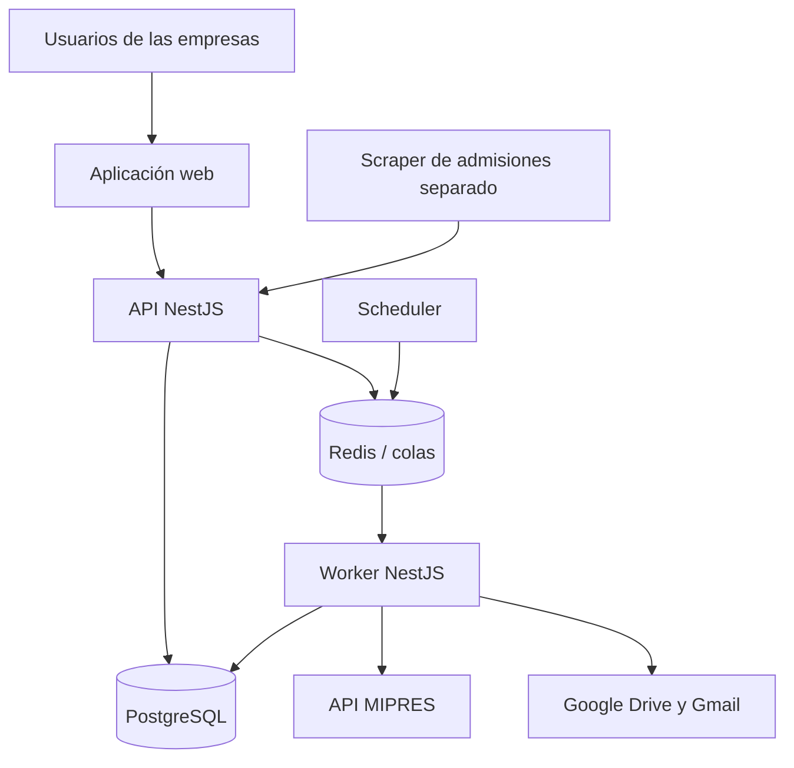
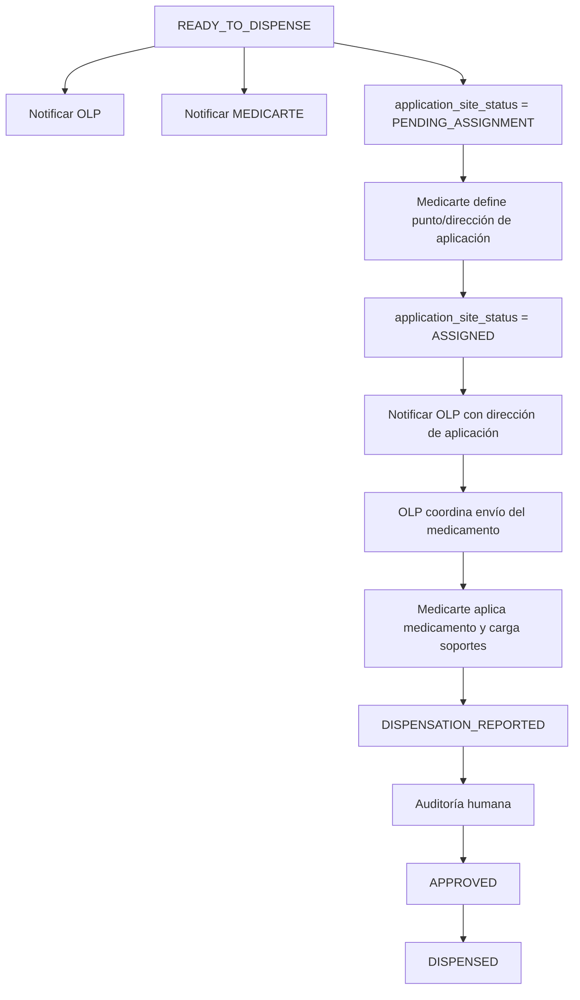
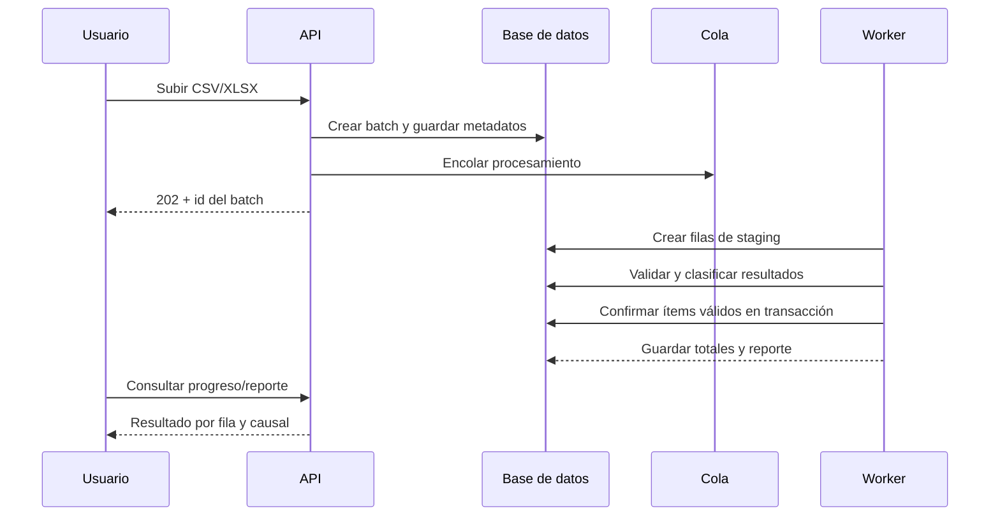
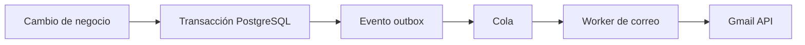

# Arquitectura de la Plataforma de Autorizaciones y Dispensación

**Alcance:** Ingesta de autorizaciones, clasificación PBS/NO PBS, validación MIPRES, disponibilidad para dispensación, soportes, auditoría, notificaciones y consolidación. El proceso de admisión por scraping queda desacoplado.

---

## 1. Decisión ejecutiva

La solución debe ser una **aplicación web responsive** con backend centralizado, base de datos relacional, almacenamiento de soportes en una unidad compartida de Google Drive y procesos asíncronos para MIPRES, correos, clasificación, exportaciones y reintentos.

La unidad mínima del negocio es el **ítem de autorización**, cuya llave única será:

```text
numero_autorizacion + codigo_medicamento
```

El campo físico que alimenta `codigo_medicamento` será `COD_COMERCIAL`.

Se recomienda construirla como un **monolito modular**, no como microservicios. El producto necesita límites internos claros, pero no tiene hoy una escala, equipos independientes ni requisitos de despliegue que justifiquen la complejidad operacional de microservicios.

La aplicación tendrá tres procesos desplegables a partir del mismo código backend:

1. API transaccional.
2. Worker de tareas en segundo plano.
3. Scheduler que crea trabajos periódicos de revalidación y notificación.

La base de datos será la fuente de verdad del proceso. Google Drive será el repositorio de archivos, no la base de datos del sistema. MIPRES y Gmail serán integraciones externas recuperables: una caída de cualquiera de ellas no puede destruir ni revertir el trabajo ya guardado.

---

## 2. Por qué una aplicación web

Acceso centralizado para MTD, Compensar, OLP y Medicarte; despliegue único; adecuada para tablas, filtros, archivos y auditoría. La función de Facturación queda dentro del alcance operativo de MTD.

---

## 3. Principios de arquitectura

1. **Una sola fuente de verdad:** PostgreSQL conserva estado, responsables, historial y referencias a archivos.
2. **El archivo no se procesa directamente contra producción:** toda carga pasa por staging, validación y confirmación.
3. **Idempotencia:** repetir una carga, correo, consulta MIPRES o trabajo no debe duplicar efectos.
4. **Trazabilidad por diseño:** cada transición genera un evento de auditoría inmutable.
5. **Separación de estados:** cobertura, habilitación, direccionamiento, operación, soportes y auditoría son dimensiones diferentes.
6. **Integraciones desacopladas:** Gmail, Drive, MIPRES y el futuro scraper se consumen mediante adaptadores y colas.
7. **Permiso denegado por defecto:** toda acción y consulta exige rol, empresa y alcance explícito.
8. **No borrar evidencia:** los soportes reemplazados conservan versiones; las correcciones generan nuevos registros.
9. **Contratos antes que pantallas:** el backend publica una API documentada; ninguna regla crítica vive solo en el frontend.
10. **Observabilidad operacional:** los fallos externos quedan visibles y reintentables, no escondidos en logs.
11. **Regla de cobertura explícita:** un registro es `NO_PBS` únicamente cuando su valor normalizado de `CUPS_PRINCIPAL` es exactamente `MEDICAMENTOS NO POS`. Los demás valores se clasifican como `PBS`, conforme a la regla confirmada para esta herramienta.

---

## 4. Arquitectura de alto nivel



### Contenedores lógicos

| Componente             | Responsabilidad                                                                                                        |
| ---------------------- | ---------------------------------------------------------------------------------------------------------------------- |
| Web                    | Navegación, formularios, tablas, carga de archivos, auditoría y administración. No contiene reglas finales de negocio. |
| API                    | Autenticación, autorización, reglas de dominio, persistencia, consultas y contratos REST.                              |
| Worker                 | Procesamiento de archivos, clasificación, MIPRES, Drive, correo, exportaciones y reintentos.                           |
| Scheduler              | Genera trabajos periódicos: revalidación MIPRES, correos consolidados y tareas de mantenimiento.                       |
| PostgreSQL             | Fuente de verdad transaccional.                                                                                        |
| Redis/BullMQ           | Cola temporal y coordinación de trabajos. No almacena el estado definitivo del negocio.                                |
| Proveedor de identidad | Inicio de sesión, recuperación de cuenta y MFA.                                                                        |
| Google Workspace       | Archivos en unidad compartida y envío desde cuenta corporativa.                                                        |
| MIPRES                 | Fuente externa de direccionamientos y catálogos aplicables.                                                            |
| Scraper de admisiones  | Proceso independiente que consume registros `READY_FOR_ADMISSION`.                                                     |

---

## 5. Tecnologías recomendadas

### Stack principal

| Capa              | Tecnología                                          | Criterio                                                                                                             |
| ----------------- | --------------------------------------------------- | -------------------------------------------------------------------------------------------------------------------- |
| Lenguaje          | TypeScript con modo estricto                        | Unifica frontend, backend y contratos; reduce errores de tipos.                                                      |
| Frontend          | Next.js con App Router                              | Aplicación web moderna, rutas, layouts y despliegue en contenedor.                                                   |
| UI                | Tailwind CSS + shadcn/ui                            | Componentes accesibles y personalizables sin quedar atado a un sistema visual cerrado.                               |
| Datos en frontend | TanStack Query y TanStack Table                     | Caché del servidor, paginación, filtros y tablas operativas grandes.                                                 |
| Formularios       | React Hook Form + Zod                               | Validación declarativa y reutilizable.                                                                               |
| Backend           | NestJS REST + OpenAPI                               | Modularidad, inyección de dependencias, guards, validación y soporte de workers/colas.                               |
| ORM               | drizzle                                             | Esquema tipado, migraciones y acceso consistente a PostgreSQL. SQL explícito cuando una consulta lo amerite.         |
| Base de datos     | PostgreSQL administrado                             | Integridad, transacciones, restricciones, JSONB para respuestas externas y capacidades de auditoría.                 |
| Trabajos          | Redis + BullMQ                                      | Reintentos, demoras, concurrencia, trabajos programados e inspección de fallos.                                      |
| Identidad         | Keycloak mediante OIDC                              | No construir autenticación propia; soporta MFA, usuarios externos e integración futura con proveedores corporativos. |
| Archivos          | Google Drive API sobre una unidad compartida        | Los documentos quedan bajo propiedad organizacional, no en el Drive personal de un usuario.                          |
| Correo            | Gmail API                                           | Envío desde cuenta corporativa con trazabilidad del identificador externo.                                           |
| Excel/CSV         | SheetJS o ExcelJS + parser CSV en streaming         | Lectura controlada, plantillas y reportes. Los archivos grandes deben procesarse en el worker.                       |
| Pruebas           | Vitest/Jest, Supertest, Testcontainers y Playwright | Pruebas unitarias, integración real con PostgreSQL y flujos de interfaz.                                             |
| Calidad           | ESLint, Prettier, commit hooks y CI                 | Reglas repetibles antes de integrar cambios.                                                                         |
| Observabilidad    | OpenTelemetry + Sentry y logs JSON                  | Correlación de solicitudes, trabajos y errores externos.                                                             |
| Empaquetado       | Docker                                              | Mismo artefacto en desarrollo, pruebas y producción.                                                                 |
| Repositorio       | Monorepo pnpm + Turborepo                           | Comparte DTO, tipos, validaciones y configuración sin publicar paquetes internos.                                    |

### Versionamiento

No se deben fijar aquí números menores que envejezcan rápido. Al crear el repositorio se elegirán versiones estables y soportadas, se fijarán en el lockfile y Dependabot/Renovate propondrá actualizaciones controladas. Node.js debe mantenerse en una línea LTS soportada.

### Despliegue recomendado

Para un piloto es válido utilizar un PaaS administrado con servicios separados para web, API, worker, PostgreSQL y Redis. Para producción con información sensible se recomienda infraestructura administrada con red privada, backups, secretos centralizados y registros de auditoría; Google Cloud es una opción coherente por la integración con Workspace, pero no es una obligación arquitectónica.

No se recomienda alojar el núcleo productivo en hosting compartido. El worker, Redis, los reintentos y los procesos largos requieren un entorno controlado.

---

## 6. Estructura propuesta del monorepo

```text
authorization-platform/
├── apps/
│   ├── web/                 # Next.js
│   ├── api/                 # NestJS HTTP
│   └── worker/              # NestJS BullMQ
├── packages/
│   ├── contracts/           # DTO y esquemas compartidos
│   ├── database/            # Drizzle y migraciones
│   ├── domain/              # Tipos y reglas puras
│   ├── ui/                  # Componentes reutilizables
│   └── config/              # ESLint, TSConfig y utilidades
├── docs/
│   ├── adr/
│   ├── api/
│   └── operations/
├── infra/
│   ├── docker/
│   └── deployment/
└── tests/
    └── e2e/
```

### Módulos del backend

| Módulo                  | Alcance                                                                                                      |
| ----------------------- | ------------------------------------------------------------------------------------------------------------ |
| `identity`              | Identidad OIDC, sesión y perfil local.                                                                       |
| `organizations`         | Empresas y alcances de acceso.                                                                               |
| `access-control`        | Roles, permisos y políticas por recurso.                                                                     |
| `authorization-imports` | Archivo, batch, staging, validación y confirmación.                                                          |
| `authorization-items`   | Entidad central y consulta operativa.                                                                        |
| `coverage`              | PBS/NO PBS, homologaciones y versiones de catálogo.                                                          |
| `mipres`                | Credenciales, consultas, normalización, reintentos y evidencia de respuestas.                                |
| `dispensing`            | Disponibilidad, dispensación y fechas.                                                                       |
| `application-sites`     | Punto/dirección de aplicación definido por Medicarte, versionado, permisos y coordinación logística con OLP. |
| `documents`             | Carga, versión, metadatos y Drive.                                                                           |
| `audit-reviews`         | Revisión, hallazgos, rechazo, corrección y aprobación.                                                       |
| `notifications`         | Plantillas, destinatarios, agrupación, envío y deduplicación.                                                |
| `exports`               | Consolidaciones y reportes descargables.                                                                     |
| `admission-handoff`     | Cola/API para el scraper externo.                                                                            |
| `audit-log`             | Eventos inmutables y consultas de historial.                                                                 |
| `admin`                 | Catálogos, usuarios, permisos y parámetros operativos.                                                       |

Los módulos no deben acceder directamente a tablas de otro módulo. Deben usar servicios de aplicación o contratos internos. Esto mantiene la posibilidad de extraer un módulo en el futuro sin pagar desde ahora el costo de microservicios.

---

## 7. Modelo de datos inicial

### Núcleo de identidad y acceso

| Entidad                   | Propósito                                                                         |
| ------------------------- | --------------------------------------------------------------------------------- |
| `organizations`           | MTD, OLP, Compensar, Medicarte u otra organización.                               |
| `users`                   | Perfil local relacionado con el `subject` del proveedor de identidad.             |
| `roles`                   | Agrupaciones de permisos.                                                         |
| `permissions`             | Acciones atómicas como `authorization.import` o `audit.approve`.                  |
| `user_organization_roles` | Relación usuario, empresa y rol. Permite que una persona tenga más de un alcance. |

### Ingesta

| Entidad             | Propósito                                                                        |
| ------------------- | -------------------------------------------------------------------------------- |
| `import_batches`    | Archivo, hash SHA-256, creador, estado, totales y fechas.                        |
| `import_rows`       | Fila original normalizada, resultado y causal. Conserva evidencia de rechazados. |
| `validation_errors` | Uno o varios errores tipificados por fila y campo.                               |

### Proceso

| Entidad                            | Propósito                                                                                                              |
| ---------------------------------- | ---------------------------------------------------------------------------------------------------------------------- |
| `authorization_items`              | Unidad central: autorización + medicamento + discriminadores necesarios.                                               |
| `authorization_item_organizations` | Relación explícita entre un ítem global y las organizaciones que pueden leerlo según sus permisos. No duplica el ítem. |
| `coverage_evaluations`             | Resultado PBS/NO PBS/SIN_CLASIFICAR y versión del catálogo.                                                            |
| `mipres_checks`                    | Cada intento, consulta, respuesta normalizada, error y fecha siguiente.                                                |
| `mipres_directionamientos`         | Datos vigentes del direccionamiento asociado.                                                                          |
| `application_site_assignments`     | Historial versionado del punto/dirección de aplicación definido por Medicarte, con actor, organización y vigencia.     |
| `dispensations`                    | Declaración de dispensación/aplicación, cantidades, fecha y actor.                                                     |
| `attachments`                      | Metadatos del archivo, tipo, versión, `drive_file_id`, hash y responsable.                                             |
| `audit_reviews`                    | Auditoría iniciada/finalizada, decisión y auditor.                                                                     |
| `audit_findings`                   | Hallazgos tipificados y estado de subsanación.                                                                         |
| `admission_jobs`                   | Entrega controlada al scraper y su resultado independiente.                                                            |

### Comunicación y trazabilidad

| Entidad                | Propósito                                                                                                               |
| ---------------------- | ----------------------------------------------------------------------------------------------------------------------- |
| `notification_batches` | Consolidado enviado a una empresa o grupo.                                                                              |
| `notifications`        | Mensaje individual/lógico, plantilla, destinatarios y estado.                                                           |
| `outbox_events`        | Eventos comprometidos en la misma transacción que el cambio de negocio.                                                 |
| `audit_events`         | Historial inmutable de quién, qué, cuándo, desde dónde y sobre qué registro.                                            |
| `export_audit_events`  | Auditoría de exportaciones solicitadas: actor, filtros, formato, fecha y resultado. El archivo generado no se persiste. |

### Restricciones críticas

1. La llave única del ítem es `numero_autorizacion + codigo_medicamento`. Si una autorización requiere varias entregas o subentregas, estas se modelan como registros hijos del ítem; no se duplica el ítem principal.
2. `import_batches.file_hash` permite reconocer el mismo archivo, pero no reemplaza la detección de duplicados por fila.
3. Un solo direccionamiento externo puede necesitar historial; no se sobrescribe la respuesta anterior.
4. Solo puede existir una versión vigente por tipo de soporte e ítem, pero se conservan versiones anteriores.
5. Los eventos de auditoría no admiten actualización ni borrado desde la aplicación.
6. La aprobación para admisión se deriva de reglas; no debe escribirse libremente desde la interfaz.
7. El punto de aplicación debe persistirse como entidad/versionado de negocio; no puede existir únicamente dentro del correo enviado a OLP.
8. Solo una versión del punto de aplicación puede estar vigente por ítem; una modificación conserva la anterior y genera nueva notificación logística.
9. Una autorización es un registro global único. MTD puede leer globalmente con permiso; Compensar, OLP y Medicarte requieren relación explícita y permiso vigente.
10. Una actualización explícita iniciada desde `READY_TO_DISPENSE` reemplaza la evidencia y reevalúa las cuatro columnas de negocio; la pareja normalizada `NUMERO_AUTORIZACION + COD_COMERCIAL` debe coincidir con la llave existente. Solo conserva `READY_TO_DISPENSE` si `ENABLED + PBS + NOT_APPLICABLE` o `ENABLED + NO_PBS + CONFIRMED`; cualquier otra combinación queda `BLOCKED` en la misma transacción.
11. La base de datos impide persistir `READY_TO_DISPENSE` cuando las dimensiones de habilitación, cobertura y direccionamiento no cumplen esos prerrequisitos.

---

## 8. Estado del dominio

No habrá una columna mágica que intente representar todo. El ítem tendrá dimensiones separadas:

| Dimensión                 | Valores iniciales                                                    |
| ------------------------- | -------------------------------------------------------------------- |
| `enablement_status`       | `ENABLED`, `BLOCKED_SOURCE_STATUS`                                   |
| `coverage_type`           | `UNCLASSIFIED`, `PBS`, `NO_PBS`                                      |
| `direction_status`        | `NOT_APPLICABLE`, `PENDING`, `CONFIRMED`, `QUERY_ERROR`              |
| `operation_status`        | `BLOCKED`, `READY_TO_DISPENSE`, `DISPENSATION_REPORTED`, `DISPENSED` |
| `application_site_status` | `PENDING_ASSIGNMENT`, `ASSIGNED`                                     |
| `support_status`          | `PENDING`, `INCOMPLETE`, `COMPLETE`, `CORRECTION_REQUIRED`           |
| `audit_status`            | `NOT_STARTED`, `READY`, `IN_REVIEW`, `REJECTED`, `APPROVED`          |
| `admission_status`        | `NOT_READY`, `READY`, `HANDED_OFF`, `COMPLETED`, `ERROR`             |

Para la interfaz se calculará un `process_summary`, por ejemplo:

`BLOQUEADO`, `SIN_CLASIFICAR`, `PENDIENTE_DIRECCIONAMIENTO`, `PENDIENTE_PUNTO_APLICACION`, `LISTO_COORDINACION_OLP`, `PENDIENTE_DISPENSACION`, `PENDIENTE_SOPORTES`, `PENDIENTE_AUDITORIA`, `RECHAZADO`, `APROBADO`.

Este resumen es una proyección de lectura; nunca sustituye las dimensiones reales.

### Flujo logístico después de `READY_TO_DISPENSE`

`READY_TO_DISPENSE` indica que el ítem ya superó las reglas previas necesarias para entrar a coordinación logística:

- PBS habilitado: no requiere direccionamiento MIPRES.
- NO PBS habilitado: requiere `direction_status = CONFIRMED`.

Una actualización explícita puede cambiar esas dimensiones. La actualización se autoriza únicamente para un ítem cuyo estado anterior sea `READY_TO_DISPENSE`; luego la regla pura de dominio conserva `READY_TO_DISPENSE` solo cuando los prerrequisitos continúan satisfechos y usa `BLOCKED` en cualquier otra combinación. En Fase 2, `NO_PBS + ENABLED + PENDING` no consulta MIPRES y queda `BLOCKED` hasta una confirmación posterior.

La confirmación de ítems nuevos en Fase 2 puede dejar `operation_status = NULL` mientras Fase 4 materializa la transición operacional y sus notificaciones. La restricción de base de datos solo protege los valores no nulos, y la actualización explícita siempre persiste `READY_TO_DISPENSE` o `BLOCKED`.

A partir de allí:



Las dos notificaciones logísticas (`READY_TO_DISPENSE` y asignación del punto de aplicación) son **event-driven** y se procesan mediante outbox/worker. No deben esperar al consolidado diario de las 08:00, porque habilitan acciones operativas de OLP y Medicarte. El reporte diario continúa existiendo como resumen de novedades del día anterior.

---

## 9. Flujo técnico de la carga



### Estados del batch

`UPLOADED → VALIDATING → READY_TO_CONFIRM → CONFIRMING → COMPLETED`

Estados excepcionales:

`FAILED`, `CANCELLED`.

Para cargas pequeñas puede configurarse confirmación automática. Para producción se recomienda mostrar primero el resumen y exigir confirmación cuando una carga actualice registros existentes.

### Catálogo estable de resultados por fila

Fase 2 usa exclusivamente estos códigos, con texto estable y legible:

| Código                          | Uso                                                                       |
| ------------------------------- | ------------------------------------------------------------------------- |
| `ROW_VALID`                     | Fila validada y elegible para confirmar un ítem nuevo.                    |
| `MISSING_REQUIRED_FIELD`        | Falta una de las cuatro columnas de negocio o su valor.                   |
| `INVALID_FIELD_FORMAT`          | El archivo o valor no cumple el formato técnico definido para Fase 2.     |
| `DUPLICATE_IN_FILE`             | La llave aparece repetida dentro del archivo.                             |
| `EXISTING_ITEM_REVIEW_REQUIRED` | La llave ya existe y requiere verificación humana.                        |
| `EXPLICIT_UPDATE_NOT_ALLOWED`   | Una actualización explícita fue intentada fuera de `READY_TO_DISPENSE`.   |
| `ITEM_CREATED`                  | La fila válida creó un ítem durante la confirmación.                      |
| `ITEM_UPDATED`                  | Una actualización explícita autorizada terminó correctamente.             |
| `PROCESSING_ERROR`              | Error técnico estable de procesamiento, sin exponer la excepción interna. |

El estado de origen distinto de `5` no es causal de rechazo: deriva `BLOCKED_SOURCE_STATUS` y queda auditado.

### Evidencia de la fuente recibida

El archivo `AUTORIZACIONES SEPTIEMBRE PASO A MTD.xlsx` contiene una hoja (`Hoja1`), 25 columnas según el diccionario recibido, y en la copia analizada un registro de datos. Sus campos relevantes son:

| Concepto lógico            | Columna observada                         | Regla o uso                                                                                                            |
| -------------------------- | ----------------------------------------- | ---------------------------------------------------------------------------------------------------------------------- |
| Autorización               | `NUMERO_AUTORIZACION`                     | Primer componente de la llave única.                                                                                   |
| Código de medicamento      | `COD_COMERCIAL`                           | Segundo componente de la llave única. `CUMS` y `COD_CUPS_AUTORIZADO` se conservan como datos de origen independientes. |
| Clasificación de cobertura | `CUPS_PRINCIPAL`                          | `MEDICAMENTOS NO POS` exacto normalizado = `NO_PBS`; cualquier otro valor = `PBS`.                                     |
| Estado de origen           | `ESTADO_AUTORIZACION`                     | Valor `5` habilita el registro; cualquier valor distinto de `5` lo bloquea.                                            |
| Columnas restantes         | Las 21 columnas adicionales suministradas | Se conservan como datos de origen; Fase 2 no les asigna reglas semánticas no documentadas.                             |

En el registro recibido, `CUPS_PRINCIPAL = MEDICAMENTOS POS` y `ESTADO_AUTORIZACION = 5`; por la regla confirmada, ese registro se clasifica como `PBS` y queda habilitado por estado de origen. El archivo de muestra no permite demostrar todavía que la llave sea única a escala real porque solo contiene una fila; esa verificación debe ejecutarse durante cada carga y quedar en el reporte.

La comparación de `CUPS_PRINCIPAL` debe aplicar únicamente normalización técnica —recorte de espacios, mayúsculas y espacios repetidos— y después igualdad exacta. No se debe usar una búsqueda parcial que convierta valores como `MEDICAMENTOS NO POS - ALTO COSTO` en coincidencias sin una decisión de negocio explícita.

---

## 10. Integración con MIPRES

Se implementará mediante una **capa anticorrupción**:

```text
Dominio interno -> MipresPort -> MipresHttpAdapter -> API MIPRES
                                -> MipresFakeAdapter para pruebas
```

El dominio nunca utilizará directamente nombres, estados o estructuras JSON de MIPRES. El adaptador transforma la respuesta externa a modelos internos versionados.

Esta decisión conserva el ADR de integración MIPRES ya definido para el ecosistema VITA: se separan el **estado oficial reportado por MIPRES** y el **estado técnico de integración**. MIPRES es la fuente oficial de prescripción, direccionamiento, programación, entrega y suministro; la plataforma conserva los datos operativos locales, los soportes, los pendientes, la sincronización y la auditoría. Digiturno, inventario y otras validaciones operativas quedan fuera de este bounded context y no deben incorporarse a esta integración.

### Regla de entrada a la validación MIPRES

La clasificación PBS/NO PBS se resuelve primero con el valor de `CUPS_PRINCIPAL` de la autorización:

```text
normalizar(CUPS_PRINCIPAL) == "MEDICAMENTOS NO POS"
    → coverage_type = NO_PBS
    → validar direccionamiento en MIPRES

cualquier otro valor
    → coverage_type = PBS
    → direction_status = NOT_APPLICABLE
```

Por tanto, MIPRES no se consulta para clasificar PBS/NO PBS. MIPRES se consulta únicamente para validar el direccionamiento de los ítems que ya fueron clasificados como `NO_PBS` y que están habilitados por `ESTADO_AUTORIZACION = 5`.

### Reglas técnicas

1. Credenciales cifradas y obtenidas desde un gestor de secretos; nunca en frontend ni logs.
2. Timeout por solicitud, reintentos solo para errores recuperables y backoff exponencial con variación.
3. Circuit breaker para evitar saturar un servicio degradado.
4. Identificador de correlación por consulta.
5. Conservación controlada de la respuesta externa necesaria para evidencia, con redacción de secretos.
6. Revalidación programada solo para `NO_PBS + ENABLED + PENDING`.
7. Límite de concurrencia configurable.
8. Trabajo manual “revalidar ahora” sujeto a permiso y rate limit.
9. Estado `QUERY_ERROR` separado de “no existe direccionamiento”. Un fallo técnico no significa ausencia de dato.
10. Catálogos con fecha efectiva, versión, hash y origen.

---

## 11. Google Drive y soportes

Los soportes se guardarán en una **unidad compartida**. Esto evita que los archivos queden atados a la cuenta personal de un empleado.

### Estructura lógica sugerida

```text
Autorizaciones-Alto-Costo/
└── 2026/
    └── 08/
        └── {authorization_item_id}/
            ├── formula/
            └── soporte-aplicacion/
```

La ruta es solo organización humana. La aplicación debe localizar archivos por `drive_file_id`, no por nombre o ruta.

### Metadatos obligatorios en PostgreSQL

- Tipo de soporte.
- `authorization_item_id`.
- ID del archivo en Drive.
- Nombre original y nombre seguro.
- MIME detectado.
- Tamaño.
- Hash SHA-256.
- Versión.
- Usuario y organización que lo cargó.
- Fecha de carga.
- Estado de análisis antivirus.
- Motivo de reemplazo.
- Versión vigente o reemplazada.

### Seguridad

1. PDF como formato inicial permitido, validando contenido real y no solo extensión.
2. Límite de tamaño configurable.
3. Escaneo antivirus antes de marcar el archivo como utilizable.
4. No crear enlaces públicos.
5. Descarga mediante la API después de volver a autorizar al usuario.
6. Permisos del Drive limitados al servicio y administradores; los usuarios operativos no necesitan acceso directo a carpetas.
7. Política de retención y eliminación definida antes de producción.

---

## 12. Notificaciones por correo

El correo no será enviado dentro de la transacción HTTP que cambia el estado.



### Reglas

1. Plantillas versionadas.
2. Destinatarios configurables por organización y tipo de evento.
3. Idempotency key para no duplicar envíos.
4. Guardar asunto, destinatarios, plantilla, parámetros, fecha, resultado e ID de Gmail.
5. Consolidar pendientes de direccionamiento por ventana horaria; no enviar necesariamente un correo por registro.
6. Cola de fallos visible para administración con opción de reintento.
7. No incluir más datos sensibles de los necesarios en asunto o cuerpo.

La delegación de dominio de Google Workspace requiere intervención de un superadministrador y debe limitarse a los scopes estrictamente necesarios.

### Notificaciones logísticas event-driven

#### 1. Registro listo para dispensar

Cuando la transición de dominio produzca `operation_status = READY_TO_DISPENSE`, la misma transacción debe registrar:

```text
AUTHORIZATION_READY_TO_DISPENSE
```

El evento genera dos notificaciones lógicas independientes:

- OLP: informar que existe un registro disponible para coordinación.
- Medicarte: informar que debe definir el punto/dirección donde realizará la aplicación.

Cada destinatario tiene su propia idempotency key y resultado.

#### 2. Punto de aplicación definido

Cuando Medicarte guarde una dirección válida:

```text
application_site_status = ASSIGNED
APPLICATION_SITE_ASSIGNED
```

se envía a OLP una segunda notificación con la ubicación necesaria para coordinar el envío del medicamento.

Si Medicarte cambia la dirección:

```text
APPLICATION_SITE_CHANGED
```

se crea una nueva versión y se notifica nuevamente a OLP. El sistema nunca debe editar silenciosamente la dirección anterior.

### Reporte diario

El envío de las 08:00 `America/Bogota` se conserva como **reporte consolidado** de las novedades del día anterior. No sustituye las notificaciones logísticas event-driven.

### Idempotencia logística

Ejemplos:

```text
READY_TO_DISPENSE + authorization_item_id + readiness_version + organization
APPLICATION_SITE_ASSIGNED + authorization_item_id + application_site_version + OLP
```

---

## 13. Autenticación, empresas, roles y permisos

### Separación necesaria

- **Autenticación:** demuestra quién es la persona. Se delega a Keycloak/OIDC.
- **Autorización:** determina qué puede hacer y sobre qué registros. Vive en la aplicación.

El token no será suficiente para decidir acceso a datos; el backend consultará la membresía y los permisos locales vigentes.

### Roles iniciales

| Rol                  | Acciones principales                                                                                                                                                                                                         |
| -------------------- | ---------------------------------------------------------------------------------------------------------------------------------------------------------------------------------------------------------------------------- |
| `MTD_ADMIN`          | Usuarios, empresas, roles, catálogos, integraciones y parámetros.                                                                                                                                                            |
| `MTD_OPERATOR`       | Cargar y ver autorizaciones, gestionar direccionamientos, ver disponibles, cargar soportes, auditar y descargar consolidado.                                                                                                 |
| `COMPENSAR_VIEWER`   | Ver autorizaciones. La descarga del consolidado solo se habilita si se asigna expresamente el permiso.                                                                                                                       |
| `OLP_OPERATOR`       | Ver autorizaciones y disponibles, consultar el punto de aplicación asignado y coordinar el envío. La descarga del consolidado solo se habilita si se asigna expresamente el permiso.                                         |
| `MEDICARTE_OPERATOR` | Ver autorizaciones y disponibles, definir/modificar el punto de aplicación, registrar dispensación/aplicación y cargar/corregir soportes. La descarga del consolidado solo se habilita si se asigna expresamente el permiso. |
| `READ_ONLY`          | Consulta limitada según empresa y permisos explícitos.                                                                                                                                                                       |

La matriz funcional confirmada queda así. Una celda vacía significa que la empresa no tiene esa función por defecto; `según permiso` no debe interpretarse como acceso automático.

| Función                     | MTD |   Compensar   |      OLP      |   Medicarte   |
| --------------------------- | :-: | :-----------: | :-----------: | :-----------: |
| Cargar autorizaciones       |  ✓  |               |               |               |
| Ver autorizaciones          |  ✓  |       ✓       |       ✓       |       ✓       |
| Gestionar direccionamientos |  ✓  |               |               |               |
| Ver disponibles             |  ✓  |               |       ✓       |       ✓       |
| Definir punto de aplicación |     |               |               |       ✓       |
| Ver punto de aplicación     |  ✓  |               |       ✓       |       ✓       |
| Cargar soportes             |  ✓  |               |               |       ✓       |
| Auditar                     |  ✓  |               |               |               |
| Descargar consolidado       |  ✓  | según permiso | según permiso | según permiso |
| Administración              |  ✓  |               |               |               |

### Permisos atómicos de ejemplo

`imports.create`, `imports.confirm`, `authorizations.read`, `authorizations.read_sensitive`, `mipres.recheck`, `application_site.assign`, `application_site.read`, `dispensing.register`, `attachments.upload`, `attachments.read`, `audit.start`, `audit.reject`, `audit.approve`, `exports.create`, `users.manage`.

La interfaz ocultará acciones no permitidas, pero el backend volverá a verificarlas. Ocultar un botón no es seguridad. Compensar puede consultar autorizaciones, pero no gestiona direccionamientos ni opera soportes salvo que la matriz sea modificada formalmente.

### Controles mínimos

- MFA para administradores y auditores; recomendado para todos.
- Sesiones cortas y renovación controlada.
- Rate limiting en login y acciones sensibles.
- Registro de IP, agente y actor para eventos críticos.
- Suspensión inmediata de usuarios sin borrar historial.
- Política explícita para usuarios que pertenecen a más de una empresa.

---

## 14. API inicial

Prefijo: `/api/v1`.

| Método y ruta                                            | Uso                                                                                             |
| -------------------------------------------------------- | ----------------------------------------------------------------------------------------------- |
| `GET /me`                                                | Perfil, organizaciones, roles y permisos efectivos.                                             |
| `POST /imports`                                          | Crear batch y obtener mecanismo de carga.                                                       |
| `GET /imports/:id`                                       | Progreso y totales.                                                                             |
| `GET /imports/:id/rows`                                  | Filas y causales paginadas.                                                                     |
| `POST /imports/:id/confirm`                              | Confirmar persistencia de filas válidas.                                                        |
| `GET /authorization-items`                               | Bandeja con filtros, paginación y orden.                                                        |
| `GET /authorization-items/:id`                           | Detalle e historial.                                                                            |
| `POST /authorization-items/:id/source-updates`           | Actualización explícita de una llave existente elegible, con control de versión e idempotencia. |
| `POST /authorization-items/:id/mipres-rechecks`          | Solicitar revalidación autorizada.                                                              |
| `GET /authorization-items/:id/application-site`          | Consultar punto de aplicación vigente e historial autorizado.                                   |
| `PUT /authorization-items/:id/application-site`          | Medicarte asigna/modifica el punto de aplicación.                                               |
| `POST /authorization-items/:id/dispensations`            | Registrar dispensación.                                                                         |
| `POST /authorization-items/:id/attachments`              | Cargar soporte.                                                                                 |
| `GET /authorization-items/:id/attachments/:attachmentId` | Descargar soporte autorizado.                                                                   |
| `POST /authorization-items/:id/audit-reviews`            | Iniciar revisión.                                                                               |
| `POST /audit-reviews/:id/findings`                       | Crear hallazgo.                                                                                 |
| `POST /audit-reviews/:id/reject`                         | Rechazar con causal.                                                                            |
| `POST /audit-reviews/:id/approve`                        | Aprobar.                                                                                        |
| `GET /exports/authorization-items.csv`                   | Generar/descargar consolidado CSV bajo demanda según filtros y permisos.                        |
| `GET /exports/authorization-items.xlsx`                  | Generar/descargar consolidado XLSX bajo demanda según filtros y permisos.                       |
| `GET /admin/dead-letter-jobs`                            | Ver trabajos que agotaron reintentos.                                                           |

### Convenciones

- OpenAPI generado y validado en CI.
- Paginación por cursor para tablas grandes.
- Fechas en ISO 8601 UTC; presentación en `America/Bogota`.
- Errores con código estable, mensaje, campos y correlation ID.
- `Idempotency-Key` obligatorio para cargas, dispensaciones, aprobaciones y otras mutaciones críticas.
- Control de concurrencia optimista mediante versión o `updated_at` para evitar sobrescrituras silenciosas.

---

## 15. Auditoría y eventos

Cada evento debe guardar:

- ID del evento.
- Fecha UTC.
- Actor: usuario, sistema o integración.
- Organización del actor.
- Acción.
- Tipo e ID del recurso.
- Valores relevantes anteriores y nuevos, con redacción de secretos.
- Correlation ID y request/job ID.
- IP y agente cuando aplique.
- Resultado.

Eventos iniciales:

`IMPORT_CREATED`, `IMPORT_ROW_REJECTED`, `AUTHORIZATION_ITEM_CREATED`, `AUTHORIZATION_ITEM_UPDATED`, `SOURCE_STATUS_BLOCKED`, `COVERAGE_CLASSIFIED`, `MIPRES_CHECK_COMPLETED`, `DIRECTION_NOT_FOUND`, `DIRECTION_CONFIRMED`, `AUTHORIZATION_READY_TO_DISPENSE`, `APPLICATION_SITE_ASSIGNED`, `APPLICATION_SITE_CHANGED`, `EPS_NOTIFICATION_SENT`, `OLP_NOTIFICATION_SENT`, `MEDICARTE_NOTIFICATION_SENT`, `DISPENSATION_RECORDED`, `ATTACHMENT_UPLOADED`, `AUDIT_REJECTED`, `AUDIT_APPROVED`, `ADMISSION_HANDOFF_CREATED`.

La tabla de eventos de auditoría no sustituye las tablas de negocio ni pretende ser event sourcing. Es un historial inmutable complementario.

En `AUTHORIZATION_ITEM_UPDATED`, `before` y `after` comparan `NUMERO_AUTORIZACION`, `COD_COMERCIAL`, `CUPS_PRINCIPAL` y `ESTADO_AUTORIZACION` normalizados, y referencian las filas de importación y sus hashes SHA-256. `after` enlaza el registro idempotente creado en la misma transacción. La evidencia cruda permanece en `import_rows` y `authorization_items`; ni la auditoría ni la respuesta idempotente persistida duplican esos datos sensibles.

---

## 16. Consistencia, concurrencia e idempotencia

### Patrón outbox

Cuando una operación de negocio necesita un efecto externo, la API guarda en una única transacción:

1. El cambio de estado.
2. El evento de auditoría.
3. El evento `outbox` pendiente.

El worker publica/procesa después el evento. Así no existe el caso “se guardó el estado pero se perdió para siempre el correo o la consulta”.

### Ejemplos de claves idempotentes

| Operación                          | Clave sugerida                                                 |
| ---------------------------------- | -------------------------------------------------------------- |
| Procesar archivo                   | `import_batch_id + file_hash + processor_version`              |
| Consultar MIPRES                   | `authorization_item_id + query_type + time_window`             |
| Notificar EPS                      | `notification_type + recipient_group + period + item_set_hash` |
| Notificar disponibilidad OLP       | `authorization_item_id + readiness_version + OLP`              |
| Notificar disponibilidad Medicarte | `authorization_item_id + readiness_version + MEDICARTE`        |
| Notificar dirección a OLP          | `authorization_item_id + application_site_version + OLP`       |
| Cargar soporte                     | `authorization_item_id + support_type + file_hash`             |
| Crear admisión                     | `authorization_item_id + admission_contract_version`           |

Los jobs deben poder ejecutarse más de una vez. La cola entrega trabajo; la base de datos decide si el efecto ya ocurrió.

Una respuesta idempotente persistida no sustituye la autorización del request actual. Antes de devolverla, la API revalida permiso y alcance organizacional, y aplica la redacción de campos sensibles según los permisos vigentes.

---

## 17. Seguridad y privacidad

Este producto procesa información de pacientes y documentos clínico-operativos. Tratarlo como una aplicación administrativa común sería irresponsable.

### Controles obligatorios antes de producción

1. TLS en tránsito y cifrado administrado en reposo.
2. Secretos fuera del repositorio y rotación definida.
3. Backups automáticos de PostgreSQL y prueba real de restauración.
4. Ambientes separados: desarrollo, pruebas y producción.
5. Datos de prueba anonimizados; no copiar producción a computadores de desarrollo.
6. Principio de mínimo privilegio para Drive, Gmail, MIPRES y base de datos.
7. Auditoría de lectura/descarga de soportes, no solo de modificaciones.
8. Protección contra archivos maliciosos.
9. Política de retención, eliminación y respuesta a incidentes.
10. Revisión jurídica y de seguridad sobre tratamiento, residencia y acceso a datos antes del paso a producción.
11. Exportaciones bajo demanda, autorizadas y auditadas; el archivo generado no se conserva como copia persistente.
12. No registrar tokens, documentos completos ni respuestas sensibles en logs.

---

## 18. Observabilidad y operación

### Indicadores técnicos

- Disponibilidad y latencia de API.
- Cargas en progreso/fallidas y tiempo por lote.
- Tamaño y antigüedad de colas.
- Jobs reintentados y jobs agotados.
- Disponibilidad, latencia y error de MIPRES.
- Errores y cuota de Drive/Gmail.
- Correos pendientes/fallidos.
- Tiempo y fallos de generación bajo demanda de consolidados CSV/XLSX.
- Fallos de autenticación y autorización.

### Indicadores de negocio

- Autorizaciones recibidas, aceptadas, omitidas y rechazadas por causal.
- Ítems bloqueados por estado de origen.
- PBS, NO PBS y sin clasificar.
- Pendientes de direccionamiento y antigüedad.
- Disponibles para dispensar y tiempo hasta dispensación.
- Pendientes de asignación de punto de aplicación y antigüedad.
- Tiempo desde `READY_TO_DISPENSE` hasta asignación del punto por Medicarte.
- Tiempo desde asignación del punto hasta registro de aplicación/dispensación.
- Soportes incompletos por tipo.
- Auditorías aprobadas/rechazadas y causales.
- Tiempo total del proceso por empresa y etapa.
- Registros listos y entregados a admisión.

Debe existir una bandeja administrativa de fallos recuperables. Obligar al equipo técnico a buscar en logs para reintentar un correo o una consulta sería un defecto de producto.

---

## 19. Estrategia de pruebas

### Pirámide práctica

| Nivel       | Qué prueba                                                                                       |
| ----------- | ------------------------------------------------------------------------------------------------ |
| Unitarias   | Reglas puras: estados, clasificación, permisos, causales e idempotencia.                         |
| Integración | Repositorios, restricciones, transacciones, outbox y colas con PostgreSQL/Redis reales efímeros. |
| Contrato    | Adaptadores de MIPRES, Drive, Gmail y API pública usando respuestas registradas y simuladores.   |
| E2E         | Carga → validación → direccionamiento → soportes → auditoría → consolidado.                      |
| Seguridad   | Acceso cruzado entre empresas, elevación de privilegios, archivos inválidos y exportaciones.     |

### Casos que deben existir antes del MVP

1. El mismo archivo se carga dos veces.
2. Dos usuarios cargan simultáneamente el mismo ítem.
3. MIPRES responde timeout, error 500, 401 o respuesta inválida.
4. MIPRES funciona pero no encuentra direccionamiento.
5. Gmail falla después de guardar el cambio.
6. Drive acepta el archivo pero falla la escritura de metadatos, y viceversa.
7. Un usuario de Medicarte intenta auditar.
8. Un auditor intenta aprobar con soportes incompletos.
9. Se reemplaza un soporte rechazado sin borrar la versión anterior.
10. El worker procesa dos veces el mismo job.
11. El exportador bajo demanda maneja el volumen esperado sin persistir una copia del archivo ni agotar memoria de forma insegura.
12. El scraper repite una solicitud de admisión.
13. `READY_TO_DISPENSE` genera una notificación a OLP y otra a Medicarte sin duplicados.
14. Medicarte asigna el punto de aplicación y OLP recibe la dirección.
15. Medicarte modifica la dirección y OLP recibe una nueva versión, conservando historial.
16. Un usuario de OLP intenta modificar el punto de aplicación y es rechazado.
17. Gmail falla al notificar la dirección: la asignación permanece guardada y el job es reintentable.

---

## 20. Fases de implementación

La secuencia debe respetar dependencias técnicas y de negocio. Cada fase tiene un **gate de salida**: los agentes no pueden iniciar una fase dependiente hasta que el gate anterior esté satisfecho, salvo trabajo de scaffolding que no fije reglas de negocio pendientes.

### Fase 0 — Cierre de decisiones, contratos y datos

**Objetivo:** eliminar ambigüedades que obligarían a los agentes a inventar reglas.

Entregables obligatorios:

- Repositorio nuevo e independiente en GitHub, estructurado como monorepo.
- Diccionario de datos definitivo del archivo de autorizaciones, con tipo, obligatoriedad, normalización y validaciones.
- Confirmación de la llave `NUMERO_AUTORIZACION + COD_COMERCIAL`.
- Catálogo estable de causales de carga.
- Si ya existe `NUMERO_AUTORIZACION + COD_COMERCIAL`, reportar para verificación humana; permitir actualización explícita únicamente si `operation_status = READY_TO_DISPENSE`.
- Si una actualización explícita cambia la clasificación, recalcular `operation_status` en la misma transacción; no conservar `READY_TO_DISPENSE` cuando falte un prerrequisito.
- Contrato MIPRES de direccionamientos y credenciales de sandbox. Mientras DEC-013 esté `PENDING`, la integración HTTP real queda prohibida.
- Direccionamiento válido: `current_date(America/Bogota) < fecha_maxima`; igualdad con `fecha_maxima` no es válida.
- Reportes diarios a las 08:00 `America/Bogota`, con novedades del día anterior y destinatarios parametrizables.
- Drive/carpeta destino parametrizable para cargas futuras; soportes sin borrado automático por antigüedad; máximo 20 MB; exportaciones CSV/XLSX bajo demanda y no persistentes.
- Auditoría humana/visual; la aprobación explícita del auditor produce `APPROVED` y habilita consolidación.
- Al llegar a `READY_TO_DISPENSE`, se notifica de forma event-driven a OLP y Medicarte.
- Medicarte define el punto/dirección de aplicación; la asignación o cambio se persiste/versiona y notifica a OLP.
- Medicarte registra la dispensación al cargar soportes (`DISPENSATION_REPORTED`); `DISPENSED` ocurre únicamente tras auditoría `APPROVED`.
- Límite de 20 MB por archivo y capacidad esperada de hasta 2.500 archivos por mes.
- Render como despliegue esperado, Google Cloud como alternativa y región requerida Colombia.
- Repositorio nuevo e independiente en GitHub, estructurado como monorepo.

**Gate F0:** las decisiones pendientes que afecten esquema, estados o permisos están documentadas como `ACCEPTED` o explícitamente marcadas como `PENDING` con una prohibición de implementación.

### Fase 1 — Fundación técnica y plataforma ejecutable

**Objetivo:** dejar lista la infraestructura mínima que necesitan las demás fases.

- Monorepo pnpm/Turborepo, TypeScript estricto, Docker y CI.
- Aplicaciones `web`, `api` y `worker`; scheduler como proceso/configuración del backend.
- PostgreSQL + Drizzle + migraciones.
- Redis + BullMQ, incluyendo un job de prueba, reintentos y dead-letter conventions.
- OIDC/Keycloak, `/me`, organizaciones, roles y permisos.
- Esqueleto de auditoría inmutable.
- Patrón outbox transaccional y dispatcher base.
- Convenciones REST `/api/v1`, OpenAPI, errores, correlation ID e idempotencia.
- Observabilidad base: logs JSON, health checks, métricas/trazas y captura de errores.
- Gestión de configuración y secretos por ambiente.

**Gate F1:** CI verde; migración limpia sobre PostgreSQL vacío; login y `/me` operativos; job BullMQ ejecutado extremo a extremo; evento outbox procesado; evento de auditoría persistido; health checks de API/DB/Redis.

### Fase 2 — Ingesta, autorización y clasificación de cobertura

**Objetivo:** completar la primera historia vertical sin depender de MIPRES ni Google Workspace.

- Carga CSV/XLSX y creación de `import_batches`.
- Staging en `import_rows`.
- Normalización y validaciones por campo.
- Detección de duplicados dentro del archivo y contra `authorization_items`.
- Confirmación transaccional y reporte por fila con causal estable.
- Llave existente: reportar para verificación humana; actualización explícita solo si `operation_status = READY_TO_DISPENSE`, con recálculo del estado operacional para preservar invariantes.
- `enablement_status` derivado de `ESTADO_AUTORIZACION`: `5 = ENABLED`; cualquier otro valor = `BLOCKED_SOURCE_STATUS`.
- `coverage_type` derivado en esta fase, no en MIPRES:
  - `normalizar(CUPS_PRINCIPAL) == "MEDICAMENTOS NO POS"` → `NO_PBS`.
  - cualquier otro valor → `PBS`.
- Para `PBS`, `direction_status = NOT_APPLICABLE`.
- Bandeja de autorizaciones, detalle, filtros y trazabilidad de la carga.

**Gate F2:** cargar dos veces el mismo archivo no duplica ítems; dos cargas concurrentes de la misma llave no crean duplicados; cada fila tiene resultado reproducible; PBS/NO PBS se prueba sin llamadas externas.

### Fase 3 — Direccionamientos MIPRES

**Objetivo:** incorporar MIPRES únicamente para los ítems que realmente lo requieren.

- `MipresPort`, `MipresHttpAdapter` y `MipresFakeAdapter`.
- Gestión segura de credenciales.
- Consulta solo para `NO_PBS + ENABLED`.
- Persistencia de `mipres_checks` y del historial de direccionamientos sin sobrescribir evidencia.
- Diferenciación entre `PENDING`, `CONFIRMED` y `QUERY_ERROR`.
- `CONFIRMED` solo cuando `current_date(America/Bogota) < fecha_maxima`.
- Regla explícita “sin direccionamiento” distinta de “falló la consulta”.
- Revalidación automática de pendientes y revalidación manual con permiso/rate limit.
- Timeout, backoff, circuit breaker, concurrencia configurable y dead-letter.
- Versionamiento de los catálogos **de MIPRES que realmente se utilicen**; la clasificación PBS/NO PBS no depende de esos catálogos.

**Gate F3:** tests de timeout/401/500/respuesta inválida/sin direccionamiento/direccionamiento válido; un reintento no duplica checks ni altera incorrectamente el estado.

### Fase 4 — Disponibilidad y notificaciones

**Objetivo:** convertir estados técnicos en acciones operativas y comunicaciones confiables.

- Regla de derivación de `operation_status` y `READY_TO_DISPENSE`, centralizada en dominio.
- Evento de pendiente de direccionamiento para EPS cuando corresponda.
- Al producir `READY_TO_DISPENSE`, crear `AUTHORIZATION_READY_TO_DISPENSE`.
- Enviar notificación event-driven a OLP y a Medicarte.
- Inicializar `application_site_status = PENDING_ASSIGNMENT`.
- UI/API para que Medicarte defina/modifique el punto de aplicación.
- Persistencia versionada de `application_site_assignments`.
- Al asignar: `APPLICATION_SITE_ASSIGNED` + notificación event-driven a OLP con la dirección.
- Al modificar: `APPLICATION_SITE_CHANGED` + nueva notificación a OLP.
- Plantillas versionadas y destinatarios configurables para EPS, OLP y Medicarte.
- Handlers de outbox para Gmail.
- Consolidación diaria a las 08:00 de novedades del día calendario anterior en `America/Bogota`, destinatarios parametrizables, deduplicación, idempotency keys y bandeja administrativa de fallos.
- Historial de notificaciones y `gmail_message_id`.

El patrón outbox **no nace en esta fase**; debe existir desde Fase 1. Aquí se implementan los eventos y handlers específicos del negocio.

**Gate F4:** `READY_TO_DISPENSE` notifica una sola vez por versión a OLP y Medicarte; asignar/cambiar el punto notifica a OLP con la versión correcta; una caída de Gmail no revierte estados ni direcciones; los fallos quedan visibles y reintentables.

### Fase 5 — Dispensación y soportes

**Objetivo:** habilitar la operación de Medicarte y el manejo documental sin perder versiones.

- Bandeja de disponibles según permisos.
- Precondición para registrar aplicación/dispensación: `application_site_status = ASSIGNED`.
- Medicarte registra la dispensación al cargar los soportes requeridos.
- Ese registro produce `DISPENSATION_REPORTED`.
- `DISPENSED` ocurre únicamente cuando auditoría = `APPROVED`.
- Tipos de soporte: fórmula y soporte de aplicación.
- Google Drive Shared Drive mediante adaptador; ID de destino parametrizable por MTD Admin para nuevas cargas.
- Metadatos en PostgreSQL, hash SHA-256, versiones, reemplazos y versión vigente.
- Validación MIME real, límite de 20 MB por archivo y antivirus.
- Descarga siempre mediada por API y autorización.
- Corrección/reemplazo sin eliminar evidencia anterior.
- Notificaciones de faltantes si la regla de negocio lo exige.

**Gate F5:** no hay enlaces públicos; reemplazar soporte conserva historial; fallo Drive/DB deja una situación conciliable; acceso cruzado entre empresas es rechazado.

### Fase 6 — Auditoría, consolidación y preparación de admisión

**Objetivo:** cerrar el ciclo operativo interno.

- Bandeja de auditoría MTD/Facturación.
- Inicio de revisión, hallazgos, rechazo, subsanación y aprobación.
- Validación de soportes requeridos antes de aprobar.
- Exportaciones/consolidados CSV/XLSX bajo demanda con filtros y permisos, sin conservar copia persistente; auditar la operación.
- Indicadores operativos.
- Solo `audit_status = APPROVED` es elegible para consolidación.
- Derivación de `admission_status = READY`/`READY_FOR_ADMISSION` únicamente desde reglas de dominio; nunca por edición libre de UI.

**Gate F6:** un auditor no puede aprobar un ítem inválido según los criterios aprobados; exportaciones no bloquean la API; todas las lecturas/descargas sensibles definidas quedan auditadas.

### Fase 7 — Handoff al scraper de admisiones

**Objetivo:** integrar el proceso externo sin acoplarlo al núcleo.

- Contrato versionado de API/cola de `READY_FOR_ADMISSION`.
- `admission_jobs` y estados independientes.
- Claim/lease con expiración para evitar doble procesamiento.
- Idempotencia de creación de admisión.
- Resultado, reintentos, errores y conciliación.
- El scraper mantiene sus propios estados internos y reporta el resultado al núcleo.

**Gate F7:** consumir dos veces el mismo trabajo no crea dos admisiones; un lease abandonado puede recuperarse; los fallos del scraper no alteran la aprobación ya registrada.

### Orden obligatorio de dependencias

```text
F0
 ↓
F1
 ↓
F2
 ↓
F3
 ↓
F4
 ↓
F5
 ↓
F6
 ↓
F7
```

Dentro de una fase se permite paralelizar frontend, backend, pruebas e infraestructura solo cuando existe un contrato compartido aprobado. No se permite que distintos agentes creen DTO, enums o reglas equivalentes de forma independiente.

### Estimación de planificación

La estimación original de **12 a 16 semanas** para una sola persona sigue siendo razonable como orden de magnitud mientras existan integraciones reales, seguridad, QA y decisiones de negocio pendientes. El uso de agentes de IA puede reducir trabajo mecánico y permitir paralelismo, pero no elimina los gates de integración, revisión, pruebas ni las decisiones que requieren validación humana.

---

## 21. ADR — Registros de decisiones arquitectónicas

### ADR-001 — Aplicación web responsive

**Estado:** Aceptado propuesto.  
**Contexto:** Varias organizaciones deben trabajar sobre un proceso común con tablas, archivos, permisos y auditoría.  
**Decisión:** Crear una aplicación web responsive. No crear aplicación móvil nativa en el MVP.  
**Consecuencias:** Un despliegue de interfaz y acceso desde navegador. Las funciones móviles especializadas se evaluarán después como PWA o aplicación nativa.

### ADR-002 — Monolito modular

**Estado:** Aceptado propuesto.  
**Contexto:** Existen dominios claros, pero no hay evidencia de escala o equipos que exija microservicios.  
**Decisión:** Un backend NestJS dividido en módulos, con API y worker desplegables por separado desde el mismo repositorio.  
**Consecuencias:** Menor complejidad transaccional y operativa. Los límites internos deben revisarse en código para evitar un monolito desordenado.

### ADR-003 — PostgreSQL como fuente de verdad

**Estado:** Aceptado propuesto.  
**Contexto:** El proceso requiere integridad, concurrencia, historial, reportes y relaciones.  
**Decisión:** PostgreSQL administrado. Redis y Drive no contienen el estado autoritativo.  
**Consecuencias:** Se obtienen transacciones y restricciones fuertes; exige migraciones, backups y disciplina de consultas.

### ADR-004 — Procesamiento asíncrono con BullMQ

**Estado:** Aceptado propuesto.  
**Contexto:** Importaciones, MIPRES, archivos, correos y exportaciones pueden tardar o fallar temporalmente.  
**Decisión:** Ejecutarlos en workers mediante BullMQ/Redis y usar outbox transaccional.  
**Consecuencias:** La API responde rápido y los fallos se recuperan; hay que operar Redis, diseñar idempotencia y exponer jobs agotados.

### ADR-005 — Google Drive compartido para archivos

**Estado:** Aceptado por requisito.  
**Contexto:** Los soportes deben quedar en Google Drive.  
**Decisión:** Usar Drive API sobre una unidad compartida; guardar metadatos, hash y versiones en PostgreSQL.  
**Consecuencias:** Propiedad organizacional y acceso central; dependencia de cuotas/API y necesidad de permisos mínimos. Los links públicos quedan prohibidos.

### ADR-006 — Gmail API y notificaciones desacopladas

**Estado:** Aceptado por requisito.  
**Contexto:** Las notificaciones salen desde cuenta corporativa y no deben bloquear transacciones.  
**Decisión:** Gmail API, plantillas versionadas, outbox, idempotencia y envíos consolidados cuando aplique.  
**Consecuencias:** Trazabilidad y reintento confiable; requiere configuración de Google Workspace y monitoreo de cuotas.

### ADR-007 — Identidad externa y autorización local

**Estado:** Aceptado propuesto.  
**Contexto:** Habrá usuarios de empresas diferentes y roles propios del negocio.  
**Decisión:** Keycloak/OIDC autentica; PostgreSQL mantiene organizaciones, membresías, roles y permisos.  
**Consecuencias:** No se almacenan contraseñas en la aplicación; se añade un componente operativo y deben sincronizarse suspensión/alta de usuarios.

### ADR-008 — Capa anticorrupción para MIPRES

**Estado:** Aceptado propuesto.  
**Contexto:** MIPRES tiene contratos, nombres y disponibilidad fuera del control del producto.  
**Decisión:** Todo acceso pasa por un puerto/adaptador que normaliza contratos externos a modelos internos.  
**Consecuencias:** El dominio queda estable y testeable; hay código adicional de mapeo y versionamiento.

### ADR-009 — Estados ortogonales y resumen calculado

**Estado:** Aceptado por diseño de negocio.  
**Contexto:** PBS, direccionamiento, dispensación, soportes y auditoría no son etapas mutuamente excluyentes.  
**Decisión:** Persistir dimensiones separadas y calcular un resumen de proceso para la UI.  
**Consecuencias:** Evita combinaciones imposibles; las transiciones deben estar centralizadas en servicios de dominio.

### ADR-010 — Scraper de admisiones desacoplado

**Estado:** Aceptado por alcance.  
**Contexto:** La admisión depende de navegación automatizada en un sistema externo y puede fallar independientemente.  
**Decisión:** El núcleo expone una API/cola de `READY_FOR_ADMISSION`; el scraper reclama trabajos y reporta resultados.  
**Consecuencias:** Una caída del scraper no bloquea el proceso principal. Se requiere idempotencia, lease y conciliación.

### ADR-011 — Monorepo TypeScript

**Estado:** Aceptado propuesto.  
**Contexto:** Web, API y worker comparten contratos y validaciones.  
**Decisión:** pnpm/Turborepo con aplicaciones separadas y paquetes internos.  
**Consecuencias:** Cambios coordinados y CI común; se deben mantener límites de dependencias para evitar acoplamiento circular.

### ADR-012 — API REST versionada

**Estado:** Aceptado propuesto.  
**Contexto:** La web y el scraper necesitan contratos claros; el dominio es principalmente transaccional.  
**Decisión:** REST `/api/v1` con OpenAPI. No introducir GraphQL en el MVP.  
**Consecuencias:** Contratos simples y fáciles de integrar; algunos listados requerirán filtros y proyecciones específicas.

### ADR-017 — Proveedor de despliegue portable

**Estado:** Aceptado.  
**Decisión:** Render es el destino esperado; Google Cloud es alternativa. Mantener Docker y región requerida Colombia. Si un servicio no puede desplegarse de forma compatible con esa región, producción queda bloqueada hasta decisión explícita.

### ADR-018 — Exportaciones bajo demanda

**Estado:** Aceptado.  
**Decisión:** Generar CSV/XLSX a solicitud del usuario, con autorización y auditoría, sin almacenar persistentemente el archivo generado. Puede usarse streaming o almacenamiento temporal efímero con limpieza posterior.

### ADR-019 — Repositorio GitHub independiente en monorepo

**Estado:** Aceptado.  
**Contexto:** La plataforma constituye un producto independiente y no debe acoplarse a `vita-back`/`vita-core`.  
**Decisión:** Crear un repositorio nuevo en GitHub con estructura monorepo para `web`, `api`, `worker`, paquetes compartidos, infraestructura, pruebas y `.agent`.  
**Consecuencias:** CI/CD unificado, contratos compartidos y límites internos obligatorios entre módulos.

### ADR-020 — Punto de aplicación como etapa logística explícita

**Estado:** Aceptado.  
**Contexto:** OLP necesita conocer dónde enviar el medicamento y Medicarte es quien define el lugar donde realizará la aplicación.  
**Decisión:** `READY_TO_DISPENSE` notifica a OLP y Medicarte; luego Medicarte persiste/versiona el punto de aplicación y esta acción notifica a OLP. Se introduce `application_site_status = PENDING_ASSIGNMENT | ASSIGNED`.  
**Consecuencias:** La dirección es parte del dominio, tiene historial/auditoría, permisos propios e idempotencia por versión. La aplicación/dispensación no debe registrarse mientras el punto siga pendiente.

### ADR-021 — Invariante operacional de actualización explícita

**Estado:** Aceptado.

Cuando una actualización explícita permitida reemplaza la evidencia y reevalúa la clasificación de un ítem, la pareja normalizada `NUMERO_AUTORIZACION + COD_COMERCIAL` debe seguir coincidiendo con la llave existente. La regla de dominio vuelve a evaluar sus prerrequisitos. `ENABLED + PBS + NOT_APPLICABLE` y `ENABLED + NO_PBS + CONFIRMED` producen `READY_TO_DISPENSE`; cualquier otra combinación produce `BLOCKED`. Fase 2 no consulta MIPRES, por lo que `NO_PBS + ENABLED + PENDING` permanece bloqueado hasta la validación posterior.

### DEC-012 — Alcance multi-organización de autorizaciones

**Estado:** Resuelto.

Una autorización es un registro global único y no se replica por organización. El backend decide el acceso usando identidad local, organización seleccionada, membresía, permisos y la relación explícita `authorization_item_organizations`.

MTD tiene lectura global cuando cuenta con `authorizations.read`. Compensar, OLP y Medicarte leen únicamente autorizaciones relacionadas con su organización y con permiso vigente. Las acciones específicas de OLP y Medicarte quedan fuera de Fase 2.

La relación se crea al confirmar un ítem dentro del alcance inicial de organizaciones activas. Organizaciones futuras requieren relación explícita. La UI puede ocultar acciones, pero nunca sustituye la autorización del backend.

---

## 22. Decisiones de negocio cerradas y pendientes

### Cerradas

| ID      | Decisión                    | Definición                                                                                                                                    |
| ------- | --------------------------- | --------------------------------------------------------------------------------------------------------------------------------------------- |
| DEC-001 | Vigencia MIPRES             | Válido solo si `current_date(America/Bogota) < fecha_maxima`.                                                                                 |
| DEC-002 | Actualización de existentes | Revisión humana; solo puede actualizarse si `operation_status = READY_TO_DISPENSE`. Bloqueada desde `DISPENSATION_REPORTED` en adelante.      |
| DEC-003 | `DISPENSED`                 | Solo después de `audit_status = APPROVED`.                                                                                                    |
| DEC-004 | Registro de dispensación    | Medicarte registra al cargar soportes; queda `DISPENSATION_REPORTED` hasta aprobación.                                                        |
| DEC-005 | Reportes                    | Todos los días a las 08:00 `America/Bogota`, con novedades del día anterior; destinatarios parametrizables.                                   |
| DEC-006 | Auditoría                   | Revisión humana/visual. La aprobación explícita del auditor produce `APPROVED`; no hay aprobación automática.                                 |
| DEC-007 | Drive y exportaciones       | Soportes sin borrado automático por antigüedad; exportaciones CSV/XLSX bajo demanda y sin copia persistente.                                  |
| DEC-008 | Capacidad                   | Máximo 20 MB por archivo; hasta 2.500 archivos por mes como volumen esperado.                                                                 |
| DEC-009 | Despliegue                  | Render esperado, Google Cloud alternativo, región requerida Colombia.                                                                         |
| DEC-012 | Alcance multi-organización  | Ítem global único; lectura MTD global y lectura de otras organizaciones mediante relación explícita y permisos.                               |
| DEC-014 | Invariante de actualización | Una actualización permitida recalcula `operation_status` y solo conserva `READY_TO_DISPENSE` cuando sus prerrequisitos continúan satisfechos. |

### Repositorio

| ID      | Decisión    | Definición                                                                                                            |
| ------- | ----------- | --------------------------------------------------------------------------------------------------------------------- |
| DEC-010 | Repositorio | Repositorio nuevo e independiente en GitHub, estructurado como monorepo. No se integra en `vita-back` ni `vita-core`. |

Con DEC-010 resuelta, las decisiones DEC-001 a DEC-012 y DEC-014 quedan cerradas a nivel arquitectónico y de negocio. DEC-013 mantiene pendiente el contrato externo y sandbox MIPRES, con prohibición explícita de implementar la integración real hasta recibir evidencia oficial.

### Nueva decisión cerrada

| ID      | Decisión                             | Definición                                                                                                                                                                                                          |
| ------- | ------------------------------------ | ------------------------------------------------------------------------------------------------------------------------------------------------------------------------------------------------------------------- |
| DEC-011 | Coordinación logística de aplicación | Al entrar en `READY_TO_DISPENSE` se notifica a OLP y Medicarte. Medicarte define/versiona el punto de aplicación; esa asignación o modificación notifica a OLP. La aplicación posterior requiere un punto asignado. |

DEC-011 modifica el flujo posterior a disponibilidad, pero no altera las reglas ya cerradas de PBS/NO PBS, vigencia MIPRES, soportes ni auditoría.

### Contrato externo pendiente

| ID      | Estado  | Definición                                                                                                                 |
| ------- | ------- | -------------------------------------------------------------------------------------------------------------------------- |
| DEC-013 | PENDING | Faltan endpoint, autenticación, esquema, fixtures aprobados y acceso seguro al sandbox MIPRES. Fase 3 real está bloqueada. |

---

## 23. Criterios de aceptación del MVP

El MVP está listo solo cuando:

1. Un usuario autorizado carga un archivo y obtiene resultado por fila con causal estable.
2. La misma carga o job repetido no crea duplicados.
3. Los ítems quedan separados por dimensiones de estado y con historial visible.
4. PBS/NO PBS es reproducible indicando el valor fuente normalizado de `CUPS_PRINCIPAL` y la versión de la regla/procesador aplicada; no depende de un catálogo MIPRES.
5. MIPRES diferencia “sin direccionamiento” de “falló la consulta”.
6. Los pendientes se revalidan sin intervención manual y existe reintento controlado.
7. Las notificaciones EPS/OLP no se duplican y su fallo es visible.
8. Medicarte solo accede a su alcance, puede registrar la dispensación y cargar/corregir soportes; el registro deja `DISPENSATION_REPORTED` y nunca `DISPENSED` antes de la aprobación de auditoría.
9. Fórmula y soporte de aplicación quedan versionados en Drive, referenciados en la base de datos y limitados a 20 MB por archivo; cambiar el destino de Drive no pierde la referencia histórica.
10. Facturación puede aprobar o rechazar con hallazgos tipificados sin borrar evidencia.
11. El consolidado solo incorpora registros `APPROVED`, respeta permisos/filtros y se exporta bajo demanda en CSV o XLSX sin conservar copia del archivo.
12. Todo cambio y descarga sensible queda auditado.
13. Un usuario de una empresa no puede ejecutar acciones ni ver campos fuera de su alcance.
14. Backups, restauración, secretos, alertas y trabajos fallidos han sido probados.
15. El scraper puede consumir un registro aprobado dos veces sin crear dos admisiones.
16. Cada transición a `READY_TO_DISPENSE` genera las notificaciones lógicas a OLP y Medicarte sin duplicados.
17. Medicarte puede asignar/modificar el punto de aplicación y cada versión queda auditada.
18. OLP recibe la dirección vigente después de cada asignación/modificación.
19. La aplicación/dispensación no puede registrarse si `application_site_status != ASSIGNED`.

---

## 24. Próximo paso recomendado

Antes de construir funcionalidades de negocio, ejecutar la **Fase 0** y cerrar los artefactos que alimentan a los agentes:

1. Congelar en pruebas las decisiones DEC-001 a DEC-009.
2. Crear el repositorio nuevo e independiente en GitHub con estructura monorepo.
3. Resolver DEC-013: confirmar contrato MIPRES y entregar credenciales de pruebas por un canal seguro.
4. Crear modelo entidad-relación definitivo.
5. Crear máquina de transiciones por dimensión incluyendo `DISPENSATION_REPORTED`.
6. Publicar contrato OpenAPI inicial.
7. Construir el esqueleto del repositorio elegido.
8. Ejecutar la primera historia vertical de importación.

Después, producir en este orden:

1. Registro de decisiones pendientes/cerradas.
2. Modelo entidad-relación inicial y migraciones base.
3. Máquina de transiciones por dimensión.
4. Contrato OpenAPI inicial y paquetes compartidos.
5. Esqueleto ejecutable de web/API/worker con PostgreSQL, Redis/BullMQ, OIDC, auditoría y outbox.
6. Prototipo de bandejas apoyado en los contratos ya definidos.
7. Primera historia vertical de negocio: cargar un CSV pequeño, validarlo, persistirlo y descargar/consultar su reporte.

La primera historia vertical no debe depender de MIPRES ni Google Workspace. Su objetivo es probar de extremo a extremo frontend, API, base de datos, cola, permisos, auditoría e idempotencia antes de introducir integraciones externas.

---

## 25. Referencias técnicas oficiales

- [NestJS: colas](https://docs.nestjs.com/techniques/queues)
- [NestJS: programación de tareas](https://docs.nestjs.com/techniques/task-scheduling)
- [NestJS: rate limiting](https://docs.nestjs.com/security/rate-limiting)
- [NestJS: health checks](https://docs.nestjs.com/recipes/terminus)
- [Next.js: App Router](https://nextjs.org/docs/app)
- [PostgreSQL: Row-Level Security](https://www.postgresql.org/docs/current/ddl-rowsecurity.html)
- [Google Drive API: unidades compartidas](https://developers.google.com/workspace/drive/api/guides/about-shareddrives)
- [Google Drive API: manejo de errores](https://developers.google.com/workspace/drive/api/guides/handle-errors)
- [Google Workspace: credenciales y delegación de dominio](https://developers.google.com/workspace/guides/create-credentials)
